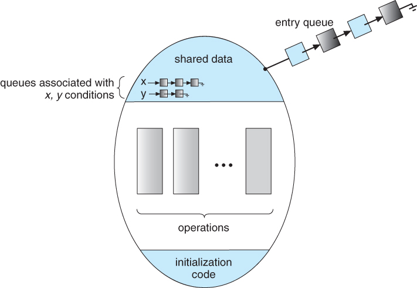

# 프로세스 간 동기화

# 프로세스 간 통신 (IPC, Inter-Process Communication)
> 같은 컴퓨터 내에 있는 프로세스 뿐만 아니라 네트워크로 연결된 다른 컴퓨터에 있는 프로세스와의 통신도 포함된다.

### 프로세스 간 통신의 종류

1. 프로세스 내부 데이터 통신  
    하나의 프로세스 내에 2개 이상의 스레드가 존재하는 경우의 통신을 말하며, `전역 변수나 파일`을 이용해 데이터를 주고 받는다.
    
2. 프로세스 간 데이터 통신  
    
    같은 컴퓨터에 있는 여러 프로세스끼리 통신하는 경우에, `공용 파일` 또는 운영체제가 제공하는 `파이프`를 사용한다.
    
3. 네트워크를 이용한 데이터 통신
    
    여러 컴퓨터가 네트워크로 연결되어 있을 때, 소켓을 이용하여 통신한다. `소켓`을 이용하는 프로세스 간 통신을 네트워킹이라고 한다. 
    다른 컴퓨터에 있는 함수를 호출하여 통신하는 `원격 프로시저 호출(RPC)`도 여기에 해당한다.
    

### 통신 방향에 따른 분류

1. **양방향 통신 duplex communication**
    
    일반적인 통신은 모두 양방향 통신으로 소켓 통신이 이에 해당한다.
    
2. **반양방향 통신 half-duplex communication**
    
    동시 전송은 불가능하고 특정 시점에 한쪽 방향으로만 전송할 수 있는 구조이다. 무전기를 예로 들 수 있다.
    
3. **단방향 통신 simplex communication**
    
    한쪽 방향으로만 데이터를 전송할 수 있는 구조이며, `전역 변수와 파이프`가 단방향 통신에 해당한다.
    

### 통신 구현 방식에 따른 분류
프로세스 간 통신은 동기화 기능이 있느냐 없느냐에 따라 분류할 수 있다.

1. **대기가 있는 통신 blocking communication 
( =동기화 통신 synchronous communication)**
    
    동기화를 지원하는 통신 방식, 데이터를 받는 쪽은 데이터가 도착할 때까지 자동으로 `대기 상태`에 머무른다. `파이프와 소켓`을 이용한 통신이 대표적 예이다.
    
2. **대기가 없는 통신 non-blocking communication
( = 비동기화 통신 asynchronous communication)**
    
    동기화를 지원하지 않는 통신 방식, 데이터를 받는 쪽은 `바쁜 대기`를 사용하여 데이터가 도착했는지 여부를 직접 확인한다. `전역 변수와 파일`을 이용한 통신이 대표적 예이다.
    

## 대기

### spin lock
- **Busy Waiting (바쁜 대기) 혹은 Spinning**
    
    경쟁 상태를 해결하기 위한 SW 알고리즘은 임계 구역에 진입하기 전 while문으로 임계 구역에 들어가도 되는지 들어갈때가지 확인한다. 이렇게 자원을 소모하는 비교문과 반복문을 이용해서 대기하는 것을 Busy Waiting (바쁜 대기) 이라고 한다.
    
임계 구역 진입 전까지 바쁜 대기 (Spinning)를 하고 있는 것으로 상호 배제를 해결하는 것을 스핀락이라고 한다.  
비록 임계 구역 진입때까지 무의미한 비교문과 반복문을 수행하지만 특정 상황에 대해 장점이 있다.
- 만약 문맥 전환 (context switch)를 하는 데 비용(시간)이 많이 들 경우와 기다리는 시간이 짧을 경우
    - 임계 구역에 진입했는데 진입이 불가능할 경우 다른 프로세스로 문맥 전환을 하는 것 보다 프로세스에 할당된 시간까지 기다리고 문맥 전환을 하는 것이 더 유용하다.
- 구현이 간단하다.

>👉 **바쁜 대기 busy waiting**  
상태 변화를 살펴보기 위해 **반복문을 무한 실행**하며 기다리는 것을 말한다.
시스템 차원에서 큰 자원 낭비인 바쁜 대기는 안 좋은 프로그램의 전형적인 예`이다.
바쁜 대기 문제를 해결하기 위해서는 데이터가 도착했음을 알려주는 **동기화 synchronization**를 사용한다.

### Block & Wakeup (sleep lock)
프로세스/스레드를 대기 큐에 blocked 상태로 대기 시킨 뒤, 자원에 접근이 가능해질 때, 순차적으로 프로세스/스레드를 깨워 준비 큐로 이동시키는 방식을 말한다.

### 장단점
일반적으로 Block/wakeup 방식이 더 적절하지만, 특정한 경우에 오버헤드가 발생할 수 있다.

- Critical Section의 길이가 길다면, Block/wakeup 방식이 적절하다
- 그러나 Critical Section의 길이가 매우 짧다면, Block/wakeup을 수행하기 위한 오버헤드가 busy-wait 오버헤드보다 더 커질 수 있다.

## 통신 방식 종류

### 전역 변수를 이용한 통신

직접적으로 관련이 있는 프로세스 간에 사용한다. 예를 들면 부모 프로세스가 전역 변수를 선언한 후, 자식 프로세스를 만들면 부모 프로세스와 자식 프로세스가 통신을 할 수 있다.

전역 변수를 이용해 양방향으로 통신하기 위해서는 2개의 전역 변수를 활용한다. 이 때 동기화 문제가 발생할 수 있다.

### 파일을 이용한 통신

open/write/read/close 연산으로 구성된다.

파일을 이용한 통신은 부모-자식 관계 프로세스 간 통신에 많이 사용된다. 
운영체제가 프로세스 동기화를 제공하지 않기 때문에 프로세스가 알아서 동기화를 해야 한다. 주로 부모 프로세스가 wait() 함수를 이용하여 자식 프로세스의 작업이 끝날 때까지 기다렸다가 작업을 시작한다.

### 파이프를 이용한 통신

파이프는 운영체제가 제공하는 동기화 통신 방식으로 동기화 문제를 해결한다.

파이프를 이용한 통신은 전역 변수를 이용한 통신과 마찬가지로 **단방향 통신**이다. 양방향 통신을 하려면 2개의 파이프를 사용해야 한다.
파이프는 이름 없는 파이프와 이름 있는 파이프로 나뉘는데, 일반적으로 말하는 파이프는 이름 없는 파이프를 가리킨다. 부모와 자식 프로세스 혹은 같은 부모를 가진 자식 프로세스와 같이 서로 관련 있는 프로세스 간 통신에 사용된다.

이름 있는 파이프의 경우 **FIFO**라 불리는 특수 파일을 이용하며, 서로 관련 없는 프로세스 간 통신에 사용된다.

### 소켓을 이용한 통신

여러 컴퓨터에 있는 프로세스 간 통신을 네트워킹이라고 한다. 네트워킹 상황에서의 통신은 원격 프로시저 호출이나 소켓을 이용한다. 

프로시저 호출이 한 컴퓨터에 있는 함수를 호출하는 것이므로, 원격 프로시저 호출은 다른 컴퓨터에 있는 함수를 호출하는 것이다. 일반적으로 원격 프로시저 호출은 소켓을 이용하여 구현한다.

소켓은 프로세스 동기화를 지원하므로 바쁜 대기를 하지 않고, 소켓 하나로 양방향 통신이 구현 가능하다.

---

# 공유 자원과 임계구역

프로세스는 시스템 내에서 독립적으로 실행되기도 하고 데이터를 주고 받으며 협업하기도 한다. 
협업을 위해 프로세스 간 통신을 통해 데이터를 주고 받는 경우에는 동기화 문제가 발생할 수 있다.

### 공유 자원

여러 프로세스가 공동으로 이용하는 변수, 메모리, 파일 등을 말한다.

### 경쟁 조건 race condition

2개 이상의 프로세스가 공유 자원을 병행적으로 읽거나 쓰는 상황을 ‘경쟁 조건이 발생했다’ 고 한다.
경쟁 조건이 발생하면 공유 자원 접근 순서에 따라 실행 결과가 달라질 수 있다.

### 임계구역 critical section

공유 자원 접근 순서에 따라 실행 결과가 달라지는 프로그램의 영역을 말한다.
프로세스 실행 상황에서는 공유할 수 없는 자원을 다루는 영역이라고 볼 수 있다. 즉, 임계 구역에서는 프로세스들이 동시에 작업하면 안 된다.

# 임계구역 문제 해결 조건

1. **상호 배제 mutual exclusion**
    
    임계구역 내에는 한 번에 하나의 프로세스만 있어야 한다.
    
2. **한정 대기 bounded waiting**
    
    어떤 프로세스도 무한 대기infinite postpone하지 않아야 한다.
    
3. **진행의 융통성 progress flexibiltiy**
    
    한 프로세스가 다른 프로세스의 진행을 방해해서는 안된다. 
    예를 들어, 매번 두 프로세스가 번갈아 가면서 진행되어야 하는 경우에, 한 프로세스가 2번 연달아 실행하고자 할 때, 다른 프로세스가 실행되지 않아 진행하고자 하는 프로세스가 수행되지 않는 문제가 발생할 수 있고, 이를 방지해야 한다.
    

# 임계구역 해결 방안

## 하드웨어적 해결방법

test_and_set 혹은 compare_and_swap 과 같은 instruction을 활용한다.

***Mutual Exclusion with Test&Set***

- 하드웨어적으로 atomic 하게 lock을 건다. 하나의 instruction으로 수행하여, 중도에 context-switching이 발생하는 것을 방지한다.

```c
Synchronization variable:
    boolean lock = false;

Process P1
    do {
        while(Test_and_Set(lock)); // lock이 0이라면, 1로 set하고 0을 리턴한다.
        // 
        ---**- ciritical section** ----
        //
        lock = false;
        ---- remainder section ----
    }
```

---

## 소프트웨어적 해결방법

단순한 방법은 `잠금 lock`을 이용하는 것이다.

## lock 구현

임계 구역에 들어가기 전 그리고 공유 데이터에 접근하기 전에 lock을 설정하고, 공유 데이터에 접근한 뒤에 unlock을 수행한다.

락이 걸린 경우에는 공유 데이터 접근 권한을 얻기 위해 대기한다.

락을 걸고, 해제하는 함수는 수행 중 컨텍스트 스위칭의 발생을 피하기 위해서 Atomic function으로 구현하거나, 수행 중 인터럽트 발생을 비활성화 시킨다.

- Lock by disabling interrupts
    - 멀티 프로세서 환경에서는 인터럽트 제어가 어려우므로 제대로 동작하지 않는다.
- Lock by using test_and_set (혹은 compare_and_swap) instruction
    - busy-waiting 을 통해 락을 체크하므로 자원의 낭비가 발생한다.

## 피터슨 알고리즘

임계구역 문제를 해결하기 위해 게리 피터슨이 제안한 알고리즘으로, **각각의 프로세스가 개별적인 lock 변수**를 가진다. 또한, **turn** 이라는 변수를 활용하여 동시에 락을 설정했을 경우엔 다른 프로세스에게 양보할 수 있도록 한다.

임계구역 해결의 세 가지 조건을 모두 만족하지만 여러 프로세스가 하나의 임계구역을 사용하려면 공유 변수를 추가하고 코드를 변경해야 한다.

```c
do {
    flag[i] = true;
    turn = j; // 다른 프로세스가 대기 중이라면 양보하게 된다.
    while(flag[j] && turn == j); // 다른 프로세스가 플래그를 꽂고, 수행할 차례라면
    //
    ---- critical section ----
    //
    flag[i] = false;
    ---- remainder section ----
} while(1);

```

**busy-waiting 문제**가 존재한다.

## 데커 알고리즘

테오도뤼스 데커가 제안한 알고리즘으로, 임계구역 해결의 세 가지 조건을 모두 소프트웨어적으로 만족하는 알고리즘이다.
피터슨 알고리즘과 마찬가지로 busy-waiting 문제와 2개 이상의 프로세스에 적용하려면 변수를 추가해야 하고, 알고리즘의 구현이 복잡해진다는 문제점을 갖는다.

```c
// Processs1
lock1 = true;
while(lock2 == true)
{
    if (turn==2) {
        lock1 = false;
        while(turn==2);
        lock1 = true;
    }
}
---- critical section ----
turn = 2;
lock1 = false;
```

# 세마포어 Semaphore

에츠허르 데이크스트라가 제안한 **lock 구현을 추상화**시킨 알고리즘이다. 일종의 추상 자료구조라고 볼 수도 있다.

스위치를 켜고 끄는 동작과 유사하다.

비효율적인 spin lock 형태보다는 **sleep lock**을 적용해서 구현한다. 이를 위해 세마포어는 프로세스가 **대기할 큐**를 가진다.

### Semaphore S

- **integer variable**을 갖는다.
- P(S) [공유 자원 획득] 와 V(S) [공유 자원 반납] 의 두 가진 atomic 연산에 의해서만 접근이 가능하다.

### 1. Counting semaphore

도메인이 0 이상인 임의의 정수값, 주로 자원의 수를 나타낸다.

### 2. Binary semaphore

0 또는 1의 값만 가질 수 있다. 주로 mutual exclusion(lock/unlock)을 구현할 때 사용한다.

### 세마포어의 기본 연산

```c
P(S):
    while(S<=0) do no-operation, just wait();
    S--; // 공유 자원 획득 (lock 걸기)
V(S):
    S++; // 공유 자원 반납 (lock 해제)
```

### busy-waiting 방식

```c
// Synchronization variable
Semaphore mutex; // 1로 초기화한다. 뮤텍스를 구현하는 세마포어

// Process P1
do {
    P(mutex); // mutex가 양수라면, 수를 감소시키고 임계 영역을 수행, 아니면 wait(busy-waiting)
    ---- critical section ----
    V(mutex); // mutex를 1 증가
    ---- remainder section ----
} while(1)
```

### block/wakeup 방식

- block : 커널이 block을 호출한 프로세스를 suspend 시키고, 이 프로세스의 PCB를 Semaphore에 대한 대기 큐에 줄 세운다.
- wakeup(P) : block 된 프로세스 P를 깨운다. 이 프로세스의 PCB를 준비ready 큐로 옮긴다.

```c
typedef struct
{
    int value; // 세마포어
    struct process *L; // wait 큐
} Semaphore

P(S):
    S.value--; // 공유자원을 얻기 위한 준비
    if (S.value < 0) // 세마포어가 음수라면
    {
        add this process to S.L; // 접근 가능 자원이 없으므로 대기 큐로
        block();
    }

V(S):
    S.value++; // 공유 자원 반납
    if (S.value <= 0) { // 세마포어가 0 이하라면(대기가 존재)
        remove a process P from S.L; // 대기 큐에서 프로세스 하나 가져옴
        wakeup(P); // 깨운다, 준비큐로 보낸다.
    }
```

# 모니터 Monitor

세마포어는 코딩하기 까다롭고, 디버깅이 어려우며, 한 번의 실수로 인해 치명적 영향을 끼칠 수 있다는 문제점을 갖는데 모니터가 이를 해결한다.

```c
// 세마포어의 문제점 예시 1.
V(mutex) // 순서 잘못, mutex 깨짐
Critical Section
P(mutex)

// 2.
P(mutex)
Critical Section
P(mutex) // lock 해제 불가 -> 데드락 발생
```

모니터는 고수준 차원의 동기화 구조를 갖는다. 프로그래밍 언어 차원에서 제어하게 되며, 객체 지향적 코딩 방식에 해당한다.

모니터 객체 내부에 공유 데이터, 데이터에 접근하기 위한 프로시저 함수를 구현하는 형태로 제공된다. 즉, 공유 자원을 내부적으로 숨기고 공유 자원에 접근하기 위한 인터페이스만 제공함으로써 자원을 보호하고 프로세스 간 동기화를 제공하다.

- 모니터는 정보를 은폐하는 방식을 사용하는데 다른 외부 프로시저가 접근하지 못하도록 한다.
    - **모니터 내의 공유 데이터는 모니터 내부의 procedure에 의해서만 액세스가 가능하므로 모니터 외부의 프로세스는 모니터 내부 데이터를 직접 액세스 할 수 없으며 이를 정보 은닉의 개념이라고 한다.**

```c
monitor monitor-name
{
    shared variable declarations

    procedure body P1(...) {

    }
    
    procedure body P2(...) {

    }
    
    procedure body P3(...) {

    }
    
    {
        initialization code
    }
}
```


위 그림과 같이 프로세스가 모니터 내부에서 대기할 수 있도록 condition variable 을 제공한다.

```c
condition x, y;
// 위 condition variable은 wait와 signal 연산에 의해서만 접근이 가능하다
x.wait();
x.signal();
```

- x.wait()를 실행한 프로세스는 다른 프로세스가 x.signal()을 수행해 줄 때까지 suspend(중단)된다.
- x.signal()은 suspend되어 있는 하나의 프로세스를 resume 한다. suspend된 프로세스가 없으면 아무 일도 발생하지 않는다.

# 동기화와 관련된 문제들

## 생산자-소비자 문제 (Bounded-Buffer Problem)

임계구역과 관련된 전통적인 문제 중 하나이다.  


생산자 프로세스와 소비자 프로세스는 서로 독립적으로 작업을 한다.
생산자 프로세스는 데이터를 생성해 버퍼에 넣는 작업을 한다. input(buf)
소비자 프로세스는 데이터를 버퍼에서 가져와서 소비한다. output(buf)
버퍼는 작업을 계속하기 위해 원형 버퍼circular buffer 를 사용하며, 버퍼의 상태를 확인하기 위해서 sum이라는 전역 변수를 사용한다.

```c
// 세마포어를 이용한 해결법
Synchronization variables:
Semaphore full = 0, empty = n, mutex = 1; // n은 버퍼의 크기, mutex는 버퍼를 위한 lock 역할

Producer:
do {
    ...
    produce an item in X
    ...

    P(empty);
    P(mutex);
    ...
    add x to buffer
    ...
    V(mutex);
    V(full); // 이용 가능 자원 증가

} while(1);

Consumer:
do {
    P(full);
    P(mutex);
    ...
    remove an item from buffer to y
    ...
    V(mutex);
    V(empty); // 버퍼 빈 공간 증가

    ...
    consume the item in y
    ...
} while(1);
```

```c
// 모니터를 이용한 해결
monitor bounded_buffer
{
    int buffer[N];
    condition full, empty; // condition variable은 값을 가지지 않고, 대기 큐를 가진다.

    void prodcue(int x) 
    {
        if there is no empty buffer
            empty.wait();
        add x to an empty buffer
        full.signal(); // 만약 대기 중 프로세스가 있다면, 깨운다 
    }

    void consume(int *x)
    {
        if there is no full buffer
            full.wait();
        remove an item from buffer and store it to *x // -> for consume
        empty.signal(); // 빈 버퍼가 생겼음을 알려서 데이터 생산(적재) 수행하도록
    }
}
```

## 생각하는 철학자들의 식사
  
출처 : [https://devowen.com/248](https://devowen.com/248)

```c
Synchronization variables:
semaphore chopstick[5]; // 배열 전체는 1로 초기화

Philosopher i
do {
    P(chopstick[i]);
    P(chopstick[(i+1)%5]);
    ...
    eat();
    ...
    V(chopstick[i]);
    V(chopstick[(i+5)%5]);
    ...
    think();
    ...
} while(1);
```

- 위 코드와 같이 실행한다면, 철학자들이 굶어 죽을 가능성이 있다. (deadlock으로 인한 starvation, 기아 상태)
    - 모든 철학자가 동시에 왼쪽 젓가락을 집는 경우
- 해결 방안
    - 4명의 철학자만이 테이블에 동시에 앉을 수 있도록 해서 데드락을 방지한다.
    - 비대칭 - 짝수(홀수) 철학자는 왼쪽(오른쪽) 젓가락부터 집도록 한다.
    - 젓가락 2개를 모두 집을 수 있는 경우에만, 젓가락을 집도록 한다.

```c
// 모니터로 구현한 문제 해결 코드
monitor dining_philosopher
{
    enum {thinking, hungry, eating} state[5]; // 철학자들의 상태
    condition self[5];
    
    void pickup(int i)
    {
        state[i] = hungry;
        test(i);
        if (state[i] != eating)
            self[i].wait();
    }

    void putdown(int i) 
    {
        state[i] = thinking;

        // 왼쪽, 오른쪽 철학자들이 그들이 원하면 먹을 수 있도록 챙겨준다.
        test((i+4)%5);
        test((i+1)%5);
    }

    void test(int i)
    {
        if ((state[(i+4)%5]!=eating) && (state[i] == hungry) && (state[(i+1)%5])!=eating))
        {
            state[i] = eating;
            self[i].signal(); // 철학자 i 를 깨운다.
        }
    }
    
    void init()
    {
        for (int i=0; i<5; i++)
            state[i] = thinking;
    }
}

Each Philosopher:
{
    pickup(i);
    eat();
    putdown(i);
    think();
} while(1)
```

---
- 참조 목록
    
    - [[운영체제] 상호배제 & 세마포어 & 모니터](http://itnovice1.blogspot.com/2019/08/mutual-exclusion.html)
    - <쉽게 배우는 운영체제> 조성호 저, 한빛아카데미
    - kocw, 이화여대 운영체제 반효경 교수님 강의 (2015ver)