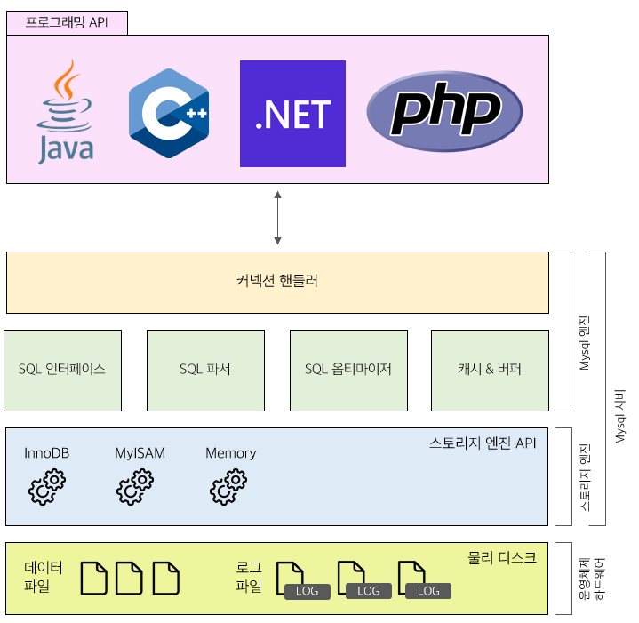
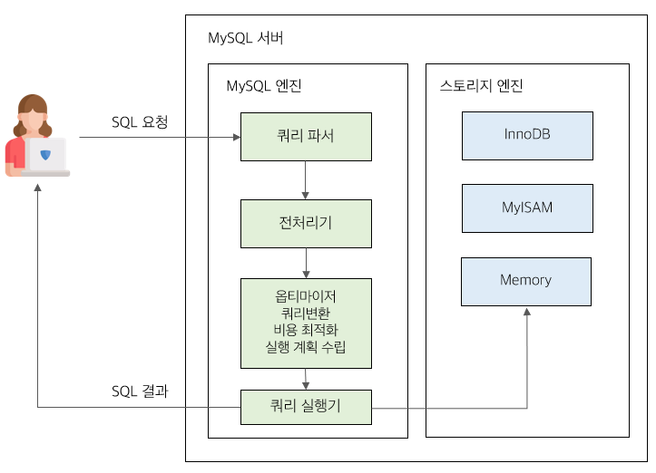
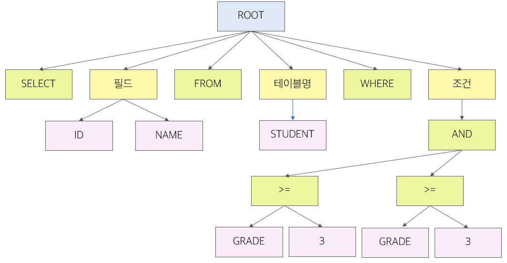

### SQL 튜닝

### 1. SQL 개념과 종류

#### 1.1 SQL (Structured Query Language)

```
💡 Structured Query Languge (구조적 질의 언어) 의 약자로 관계형 데이터베이스 시스템에서 (RDBMS) 자료를 관리하고 처리하기 위한 언어
```


#### 1.2 SQL 종류

> **DDL (Data Definition Language, 데이터 정의 언어)**
> 

　　`테이블을 정의`하기 위해 사용하는 언어로 CREATE, ALTER, DROP 이 존재

> **DML (Data Manipulation Language, 데이터 조작 언어)**
> 

​		테이블에 `데이터를 추가, 수정, 삭제, 조회`를 하기 위해 사용하는 언어로 INSERT, UPDATE, 

​		DELETE, SELECT 가 존재

> **DCL (Data Control Language, 데이터 제어 언어)**

　　데이터의 `접근 권한을 다루기 위해 사용`하는 언어로 GRANT, REVOKE 가 존재


### 2. SQL 최적화의 필요성

​	SQL 응답이 느려질 수록 사용자의 만족도는 떨어지기 때문에 쿼리 튜닝이 필요

#### 2.1 응답 시간 제한

```
💡 0.1초 : 사용자가 즉각적인 응답처럼 느낄 수 있음                                     1초 : 사용자가 지연을 감지할 수 있고 컴퓨터가 결과를 만들고 있다는 것을 느낄 수 있음
10초 : 사용자가 결과를 빠르게 나오기를 원하는 응답속도
```


### 3. MySQL 아키텍처

 


#### 3.1 MySQL 엔진



MySQL 엔진은 클라이언트로부터 접속, 쿼리 요청을 처리하는 `커넥션 핸들러`, `SQL 파서` 및 전 처리기, 쿼리 최적화 실행을 도와주는 `옵티마이저`로 구성되어 있다. MySQL 엔진은 요청된 SQL문장을 분석하거나 최적화를 한다. 


#### 3.1.1 커넥션 핸들러 API

```
💡 스토리 엔진에 쓰기 또는 읽기를 요청하는 것을 핸들러 요청이라고 하고 여기서 사용되는 API를 핸들러 API라고 한다.
```


#### 3.1.2 쿼리 파서

```
💡 사용자 요청으로 들어온 쿼리 문장을 토큰(MySQL이 인식할 수 있는 최소 단위의 어휘나 기호)로 분리해 트리 형태의 구조로 만들어 내는 작업이다. 쿼리 문장의 문법 오류는 쿼리 파서 과정에서 발견되고 오류 메세지를 제공한다.
```

```sql
SELECT ID, NAME FROM STUDENT WHERE GRADE >= 3 AND MAJOR = '컴공';
```




#### 3.1.3 전처리기

```
💡 파서 트리를 기반으로 쿼리 문장에 구조적인 문제점이 있는지 확인한다. 테이블, 칼럼, 내장 함수의 존재 여부와 권한에 대한 검사는 전처리기에서 이루어진다.
```


#### 3.1.4 옵티마이저

```
💡 사용자의 요청으로 들어온 쿼리 문장을 저렴한 비용으로 가장 빠르게 처리할지 계획을 하는 역할을 담당한다. 옵티마이저가 좋은 선택을 할 수 있도록 개발자는 쿼리를 작성해야 한다.
```


#### 3.1.5 실행 엔진

```
💡 옵티마이저에 의해 만들어진 계획대로 각 핸들러에게 요청해서 받은 결과를 다른 핸들러의 요청의 입력으로 연결하는 역할을 수행한다.
```


> **실행 엔진 시나리오**

```
💡 예제 ) 개발자는 학점이 4 이상인 학생의 수를 GROUP BY를 활용하여 출력하도록 SQL을 작성하였다. 옵티마이저는 해당 요청을 받고 GROUP BY를 처리하기 위해 임시 테이블을 사용하기로 했다.
```

1. 실행 엔진이 핸들러에게 임시 테이블을 만들라고 요청
2. 실행 엔진은 WHERE 절과 일치하는(학점이 4가 넘는) 레코드를 읽어오라고 핸들러에게 요청
3. 읽어온 레코드들을 1번에서 만든 임시 테이블에 저장하라고 핸들러에게 요청
4. 실행 엔진은 COUNT 함수를 이용하여 임시 테이블에 저장된 데이터의 수를 측정한 후 결과를 사용자에게 넘김


#### 3.1.6 핸들러(스토리지 엔진)

```
💡 MySQL 서버의 가장 밑단에서 MySQL 실행 엔진의 요청에 따라 데이터를 디스크로 저장하고 디스크로부터 읽어 오는 역할을 한다. 결국 스토리지 엔진이 되며 InnoDB에 저장된 테이블을 사용하는 경우 InnoDB 스토리지 엔진을 사용한다.
```

