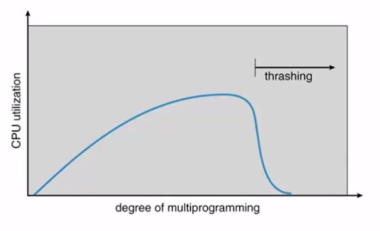
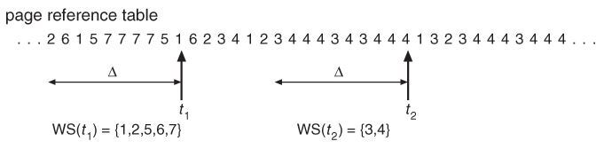
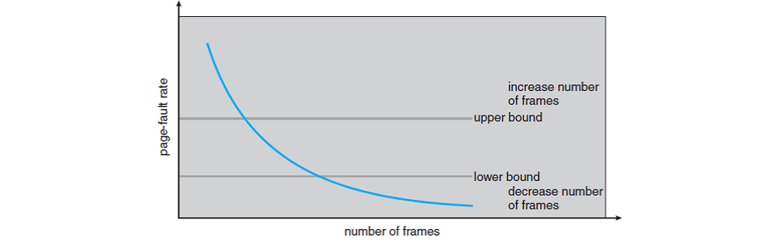

# Virtual Memory 가상 메모리

## 스레싱 thrashing

프로세스의 원활한 수행에 필요한 최소한의 page frame 수를 할당받지 못한 경우에 발생한다.  
잦은 페이지 부재가 발생해서 하드 디스크의 입출력이 많아지므로 작업이 멈춘 것 같은 상태가 된다.

- 페이지 부재 비율이 높아진다. (swap in / swap out 발생)
- CPU 활용률이 떨어진다.
- 낮은 처리량
- 특히 과거 OS는 MPD(degree of MultiProgramming)를 높여야 한다고 판단해 또 다른 프로세스를 시스템에 추가한다.
  - 이로 인해 프로세스 당 할당된 frame의 수가 더욱 감소한다.
- 메모리의 크기가 일정할 경우 멀티프로그램의 수와 밀접한 관계가 있다. 즉, 멀티프로그래밍의 정도가 너무 높으면 스레싱이 발생한다.
  

## 프레임 할당

스레싱은 각 프로세스에 프레임을 할당하는 문제와도 연관된다. 실행 중인 여러 프로세스에 프레임을 얼마나 나누어주느냐에 따라 시스템의 성능이 달라지므로, 이를 적절히 할당하는 정책이 필요하다.

### 필요성

- CPU가 메모리를 참조하는 명령어를 수행할 때, 명령어, 데이터 등 여러 페이지를 동시에 참조하게 된다.
  - 즉, 명령어 수행을 위해 할당되어야 하는 최소한의 frame 수가 존재한다.
- Loop을 구성하는 page 들은 함께 할당되는 것이 유리하다.
  - 최소한의 할당이 없다면 매 순회마다 page fault가 발생할 수 있다.

### Allocation Scheme 할당 방식

- Equal allocation 균등 할당 : 모든 프로세스에 똑같은 갯수의 frame 할당
- Proportional allocation 비례 할당 : 프로세스의 크기에 비례하여 frame 할당
- Priority allocation : 프로세스의 priority에 따라 다르게 frame 할당

## Global/Local replacement

### Global replacement

- Page replacement 가 일어날 때, 현재 프로세스가 아닌 다른 프로세스의 페이지가 Victim 이 될 수 있다.
- 우선 순위가 높은 프로세스에게 작은 프로세스를 희생하면서 할당된 프레임 수를 늘려줄 수 있다.
- 즉, 프로세스 별 할당량을 조절하는 또 다른 방법이다.
- FIFO, LRU, LFU 등의 알고리즘을 전역 교체로 사용할 수 있다.
- Working set, PFF 알고리즘을 사용할 수 있다.
- 현재 대부분 OS가 Global Replacement 를 사용한다.

### Local replacement

- Page replacement 가 일어날 때, 현재 프로세스에 할당된 프레임 내에서만 Victim 페이지가 선택된다.
- FIFO, LRU, LFU 등의 알고리즘을 프로세스 별로 운영할 수 있다.
- 균등 할당, 비례 할당, 우선순위 할당이 지역 교체에 해당한다.

## 정적 할당 static allocation

프로세스 실행 초기에 프레임을 나눠준 후 그 크기를 고정한다.

- 균등 할당 방식과 비례 할당 방식이 여기에 속한다.
- 정적 할당 방식은 프로세스를 실행하는 초기에 프레임을 할당하기 때문에 프로세스를 실행하는 동안 메모리 요구를 반영하지 못하는 단점을 갖는다.

## 동적 할당 dynamic allocation

프로세스를 실행하는 동안 변화하는 요청을 수용하는 방식이다.

- 작업 집합 모델 방식, 페이지 부재 빈도를 활용하는 방식이 있다.

### 지역 참조 Locality of reference

- 프로세스는 특정 시간 동안 일정 장소만을 집중적으로 참조하는 경향을 갖는다.
- 이 때 집중적으로 참조되는 해당 page들의 집합을 locality set 이라고 한다.

## 작업 집합 모델 working set algorithm

작업 집합 모델은 위와 같은 지역성 이론을 바탕으로 하여 프로세스가 일정 시간동안 원활히 수행되기 위해서 한꺼번에 메모리에 올라야 하는 page들의 집합을 Working Set이라고 정의한다.

- 작업 집합 모델을 이용해 thrashing을 방지하고, MultiProgramming degree 또한 결정한다.
- 프로세스를 수행할 때, working set 전체가 메모리에 올라와 있지 않다면 프로세스에 할당된 모든 frame을 반납하고 swap out을 수행해 suspend 된다.
  - 즉, MPD를 줄이게 된다.

### Working set window

wsw 를 이용해 Working set을 결정할 수 있다.  
과거 데이터를 기반으로 주어진 윈도우의 크기 시간(time interval)동안 참조된 서로 다른 페이지들의 집합으로 결정한다. 즉, 윈도우 크기 시간 동안 참조된 페이지를 메모리에 유지하고 버리는 방식이다.

- working set을 제대로 탐지하기 위해 윈도우 사이즈를 잘 결정해야 한다.
- 윈도우 사이즈가 너무 작으면 locality set을 모두 수용하지 못할 우려가 존재한다.
- 사이즈가 너무 크면 여러 규모의 locality set을 수용하게 될 수도 있다.

## Page Fault Frequendy Scheme

페이지 부재 빈도를 활용하는 방식은 메모리에 적재할 페이지의 양을 동적으로 결정하는 방식이다.  
페이지 부재 횟수를 기록하여 페이지 부재 비율을 계산하며, 설정된 페이지 부재 상한과 하한을 기준으로 프레임 할당 수를 결정한다.

- 페이지 부재 비율이 상한값을 넘으면 프레임을 더 할당한다.
- 페이지 부재 비율이 하한값 아래이면 할당 프레임 수를 줄인다.
- 빈 frame이 없는 경우에는 일부 프로세스를 swap out 할 수 있다.

### Page size

- 만약 페이지 크기를 감소시키면, 전체 페이지 수가 증가하고 페이지 테이블 크기가 증가한다.
- 내부 단편화는 감소하지만, 디스크 전송에서 효율이 감소한다.
- 필요한 정보만 메모리에 올라와 메모리 이용 효율이 좋지만, locality 활용 측면에서는 좋지 않다.
- 최근에는 하드웨어 기술의 발달로 page 크기를 크게 설정하는 경향이 있다.
