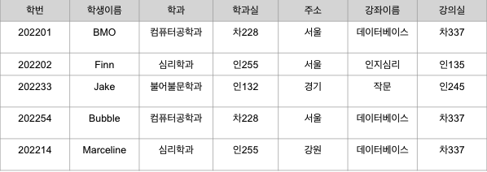
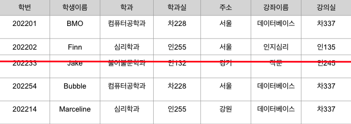
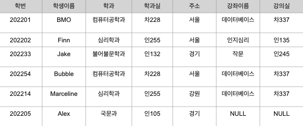
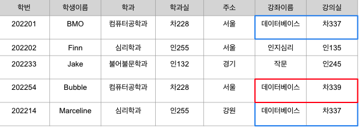
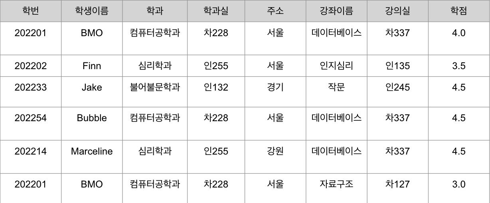
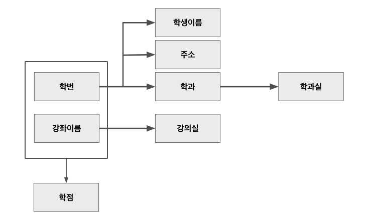

## 이상현상 Anomaly
💡 잘못 설계된 테이블로 데이터 조작(삽입, 삭제, 수정)을 하면 일어난다.  

수강정보 테이블에 학생, 학과, 강좌 정보를 한꺼번에 쓴 테이블...
### 😈 삭제이상
튜플 삭제 시 같이 저장된 다른 정보까지 연쇄적으로 삭제되는 현상

학과, 강의 정보 릴레이션이 따로 없다면 Jake의 수강정보를 지웠는데 불문과 정보와 작문강좌에 대한 정보 모두 없어진다.

### 😈 삽입이상
튜플 삽입 시 특정 속성에 해당하는 값이 없어 NULL값을 입력해야하는 현상

강의를 듣고있는 학생수를 알아내기 위해 count를 할 시 강좌정보가 NULL인 튜플도 포함되어버린다. 

### 😈 수정이상
튜플 수정 시 조건을 잘못 주어서 중복된 데이터의 일부만 수정되어 데이터의 불일치 문제가 일어나는 현상

"데이터베이스" 강의실에 대한 정보가 한 학생의 튜플만 업데이트 된다면... 데이터 불일치 문제가 일어난다.

## 함수 종속성

어떤 `속성A`의 값을 알면 다른 `속성 B`의 값이 유일하게 정해지는 의존 관계
A→B: A는 B의 결정자. 
⚠️ 결정자는 단일 속성일 수도, 복합 속성일 수도 있다!

표현) x → y : y는 x의 함수 = y는 x에 함수적으로 종속 = y는 x의 종속 속성 = x는 y의 결정자

학번 -> 학생이름
학번 -> 주소
학번 -> 학과
학과 -> 학과실
강좌이름 -> 강의실
(학번, 강좌이름) -> 학점
### 함수 종속성 다이어그램

### 함수 종속성 규칙

- 부분집합 규칙: if $Y \subseteq X$, then X → Y
- 증가 규칙: If X → Y, then XZ → YZ
- 이행 규칙: If X → Y and Y → Z, then X → Z
- 결합 규칙: If X → Y and X → Z, then X → YZ
- 분해 규칙: If X → YZ, then X → Y and X → Z
- 유사이행 규칙: If X → Y and WY → Z, then WX → Z

예시
- 부분집합 규칙: (학과, 주소) -> 학과
- 증가 규칙: (학번, 강좌이름) -> (학생이름, 강좌이름)
- 이행 규칙: 학번 -> 학과실
- 결합 규칙: 학번 -> (학생이름, 주소), 학번 -> (학생이름, 주소, 학과)
- 분해 규칙: 학번 -> 학생이름, 학번 -> 주소
- 유사이행 규칙: (강좌이름, 학번) -> 성적

## $\therefore$ 정리
✅ 이상현상은 한 개의 릴레이션에 두 개 이상의 정보가 포함되어 있을 때 나타난다.
✅ 기본키는 릴레이션의 모든 속성에 대해 결정자다. 이상현상은 기본키가 아니면서 결정자인 속성이 있을 때 발생한다.

이상현상을 해결하는 방법 👉 **정규화**