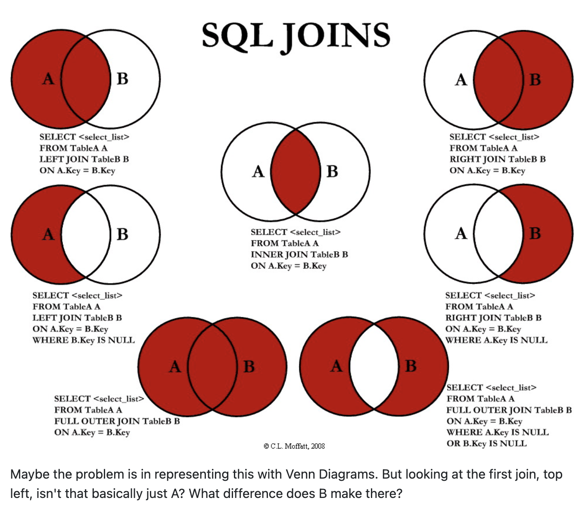

# SQL Join
두 개의 테이블 또는 그 이상의 테이블 데이터를 함께 가져오고자 할 때 이용하는 메커니즘


### customer 테이블
필드  |타입   |Null   |Key   | Default  
--|---|---|---|--
customer_id  | smallint(5) unsigned   | NO   |PRI   |NULL  
store_id  |tinyint(3) unsigned   | NO   |MUL   | NULL  
first_name  | varchar(45)   | NO   |   | NULL  
last_name | varchar(45)   | NO   |MUL   | NULL  
email | varchar(50)   | YES   |   | NULL  
address_id  | smallint(5) unsigned  | NO  |MUL   |NULL  
active  | tinyint(1)   | NO   |   |1  
create_date  | datetime   | NO   |   | NULL  
last_update  | timestamp  | YES   |   | CURRENT_TIMESTAMP  

### address 테이블
필드  |타입   |Null   |Key   | Default  
--|---|---|---|--
address_id  | smallint(5) unsigned   | NO   |PRI   |NULL  
address  |varchar(50) unsigned   | NO   |   | NULL  
address2  | varchar(50)   | YES   |   | NULL  
district | varchar(20)   | NO   |   | NULL  
city_id  | smallint(5) unsigned  | NO  |MUL   |NULL  
postal_code  | varchar(10)   | YES   |   | NULL  
phone | varchar(20)   | NO   |   | NULL  
location | geometry   | NO   |   | NULL  
last_update  | timestamp  | NO   |   | CURRENT_TIMESTAMP  


#### 주소와 함께 각 고객의 성과 이름을 조회하고자 할 때, 어떻게 해야 할까?
- 두 테이블에 공통으로 있는 `address_id`를 이용해서 테이블 간의 연결 수단으로 사용하여 두 테이블의 열을 하나의 결과셋에 포함하도록 한다. -> `Join`

## 1. Cross join (데카르트 곱, cartesian product)
- 가장 쉬운 방법으로, customer 및 address 테이블을 쿼리의 from 절에 주고 조인하는 것
```SQL
SELECT c.first_name , c.last_name, a.address2
FROM customer c JOIN address a;
```
#### 결과
first_name  |last_name   |addrss  
--|---|---|---|--
MARY  | SMITH   | 47 MySakila Drive
PATRICIA  | JOHNSON   | 47 MySakila Drive
LINDA  | WILLIAMS   | 47 MySakila Drive
ELIZABETH  | BROWN   | 47 MySakila Drive
...  |   |  
KENT | DAVIS   | 1325 First Avenue  
AUSTIN | MILLER   | 1325 First Avenue   

쿼리에서 어떻게 두 테이블을 조인해야할지 지정하지 않았기 때문에, DB서버는 cartesian product인 두 테이블의 모든 순열을 생성하여 보여준다. -> `Cross Join`

## 2. Inner Join
각 고객에 대해 단일 행만 반환하도록 쿼리를 수정하려면, 두 테이블에서 어떤 컬럼이 연결 수단인지 알아야 한다.

```SQL
SELECT c.first_name , c.last_name, a.address2
FROM customer c INNER JOIN address a
ON c.address_id = a.address_id;
```
#### 결과
first_name  |last_name   |addrss  
--|---|---|---|--
MARY  | SMITH   | 1913 Hanoi Way
PATRICIA  | JOHNSON   | 1121 Loja Avenue
LINDA  | WILLIAMS   | 692 Joliet Street
ELIZABETH  | BROWN   | 1566 Inegal Manor
...  |   |  
KENT | DAVIS   | 42 Fontana Avenue  
AUSTIN | MILLER   | 1325 First Avenue

ON 하위절을 추가하여 지정된 컬럼의 값끼리 동일한 행을 조회한다.

만약, 한 쪽 테이블에는 `address_id` 열의 값이 있지만, 다른 테이블에는 없는 경우, 해당 값을 포함하는 행에 대한 조인은 실패하고 해당 행이 결과에서 제외된다.
ex) customer 테이블에서 address_id = 999 인 데이터가 있는데, address 테이블에는 해당 값이 999인 데이터가 없다면, 해당 고객의 행은 결과셋에서 제외된다.

> 만약에, 일치 여부와 상관없이 한 테이블 또는 다른 테이블의 모든 행을 포함하려면, `OUTER JOIN`을 이용해야 한다

조인 유형을 지정하지 않으면, 서버는 기본적으로 inner join을 수행한다.

## 3. Outer Join
조인하는 테이블에 행이 있는지 여부에 상관없이 모든 데이터를 반환하도록 하려면 외부 조인을 사용해야 한다.
```SQL
SELECT f.film_id, f.title, i.inventory_id
FROM film f
LEFT OUTER JOIN inventory i
ON f.film_id = i.film_id;
```

조인 정의가 inner에서 left outer로 변경되었다. 이 때 서버는 조인의 왼쪽에 있는 테이블의 모든 행을 포함하고, 조인이 성공하면 오른쪽에 있는 테이블의 열을 포함한다.
만약, 조인 조건을 만족하는 행이 없다면, 외부 조인 테이블에서 조회된 모든 열의 값은 null이 된다.
#### 결과
film_id  |title   |inventory_id  
--|---|---|---|--
13  | ALI FOREVER   | 67
13  | ALI FOREVER   | 68
13  | ALI FOREVER   | 69
14  | ALICE FANTASIA   | NULL
...  |   |  
15 | ALIEN CENTER   | 70
15 | ALIEN CENTER   | 71

> 오른쪽 외부 조인은 거의 발생하지 않으며, 모든 데이터베이스 서버에서 해당 조인을 지원하지는 않으므로, 항상 왼쪽 외부 조인을 사용하는 게 좋다.


