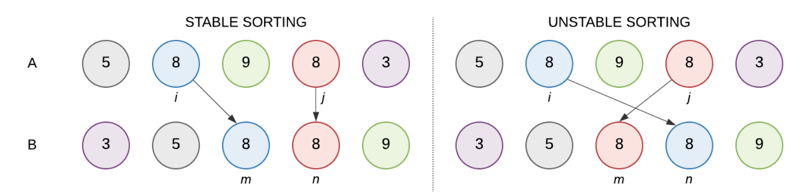
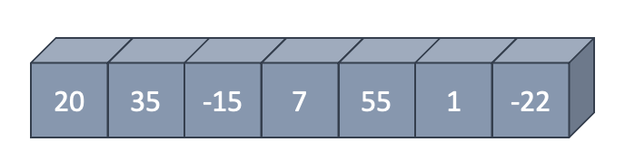
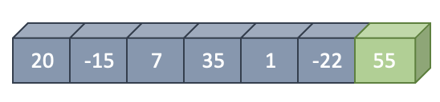
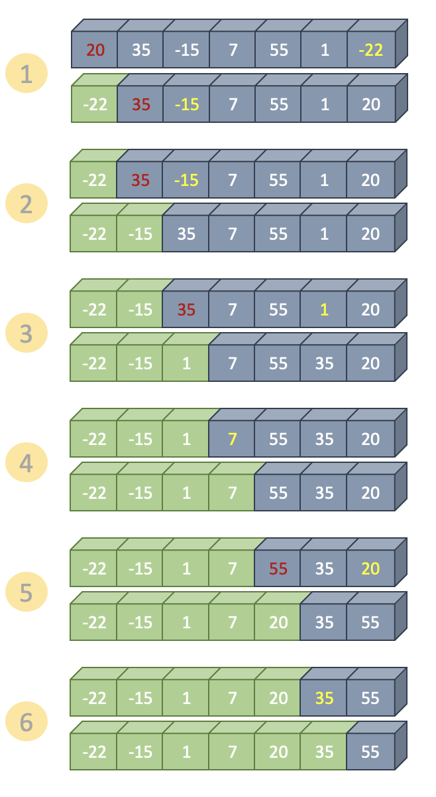
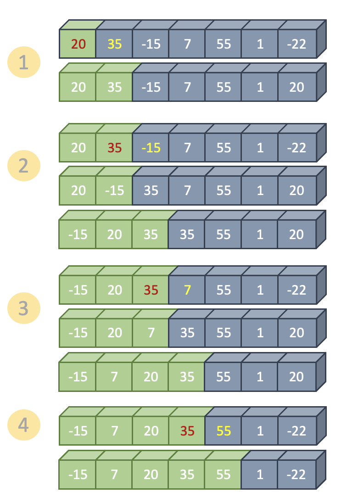
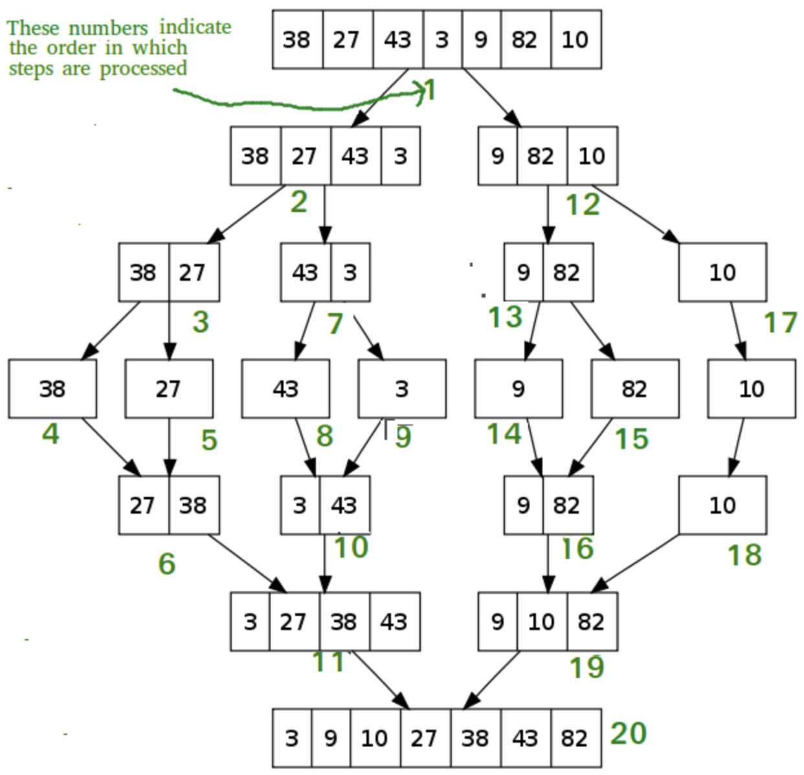
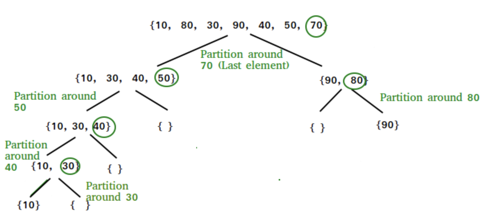

# Sort Algorithms

### 학습목표
1. 정렬 알고리즘에 대해 알 수 있다.

## 1. In-place Algorithm

### In-place Algorithm (제자리 정렬)
- 원소들의 개수에 비해서 충분히 무시할 만한 저장 공간만을 더 사용하는 정렬 알고리즘
- 추가적인 메모리 공간을 거의 생성하지 않는 정렬 알고리즘을 의미한다
- ex)
    - Bubble Sort
    - Selection Sort
    - Insertion Sort
    - Shell Sort
    - Heap Sort
    - Quick Sort

### Not In-place Algorithm
- ex)
  - Merge Sort
  - Counting Sort
  - Radix Sort

## 2. Stable VS Unstable Sort Algorithms
  Stable sort와 Unstable sort를 나누는 기준은 중복된 키 (아이템)의 순서가 보존되는지에 있다.

  ```
  A : 정렬되지 않은 상태
  B : 정렬된 상태
  i, j : 중복된 값들의 배열 A에서의 인덱스
  m, n : 중복된 값들의 배열 B에서의 인덱스
  i < j and A[i] == A[j] and m < n
  ```
  
*[출처] : https://www.baeldung.com/cs/stable-sorting-algorithms*

### Stable sort
- `array = {5, 9(1), 3, 9(2), 8, 4}`
가 있다고 할 때, 정렬 시 중복된 값들의 순서가 변하지 않는 경우 Stable Sort라고 한다.
- `array = {3, 4, 5, 8, 9(1), 9(2)}`
- ex)
    - Insertion Sort
    - Merge Sort
    - Bubble Sort
    - Counting Sort

### Unstable Sort
- 중복된 아이템 (요소)의 순서가 보존되지 않는다.
- `array = {3, 4, 5, 8, 9(2), 9(1)}`
- ex)
    - Selection Sort
    - Heap Sort
    - Shell Sort
    - Quick Sort

- Stable Sort가 Unstable Sort보다 더 선호한다 할 수 있는데, 그 이유는 아래와 같다.
  - int 배열이면 stable / unstable을 구분 짓는 것이 큰 의미가 없을 수 있을 수 있지만,


## 3. Bubble Sort
- 인접한 두 개의 데이터를 비교해가면서 정렬을 진행한다
- 정렬 순서상 위치가 바뀌어야 하는 경우, 두 데이터의 위치를 바꾼다
- 한 차례 정렬을 진행하면, 두 번째로 큰 값을 맨 뒤에서 한 칸 앞으로 보내도록 다시 정렬을 진행한다




1. 현재 인덱스 `j`의 요소와 `j+1`의 요소를 비교하여,
   - `arr[j]` > `arr[j+1]` 이라면, `arr[j]` 와 `arr[j+1]`을 swap 한다.
2. `i` 를 증가시키면서 `i(unsortedPartitionIndex)` 과 같아질 때 까지 1의 과정을 반복한다.
3. `i`와 `j` 와 같아지면 하나의 라운드가 끝난 것이다.
4. 이제 55는 **정렬이 완료된 부분** 내에 들어가게 된다. `i` 를 하나 감소시킨다.
5. `i` 가 0보다 클 때 까지 1 ~ 4를 반복한다.


### Bubble Sort 정리
- In-place Algorithm (정렬을 위해 다른 배열을 별도로 생성하지 않고, 해당 배열 내에서 정렬을 진행하기 때문)
- 시간 복잡도 : `O(n^2)`
  - 만약, 10개의 아이템을 정렬하기 위해서는 10^2 = 100번의 연산을 해야한다.
  > 정렬에서의 핵심연산은 비교연산과 대입연산이다.
  > - 비교연산 : 두 데이터 간 비교연산의 횟수
  > - 대입연산 : 위치 변경을 위한 데이터의 이동 횟수
  > - 시간 복잡도를 결정하는 기준은 **비교연산**
  - 대입연산(데이터의 이동(교환)횟수)
      - 최선의 경우 : 데이터가 이미 정렬되어 있는 상태라서 이동이 일어나지 않음
      - 최악의 경우 : 데이터가 정렬기준과 역순으로 정렬되어 있는 상태라서 비교횟수만큼 이동이 일어남 => O(n^2)
- Stable Sort
  - Bubble sort는 인접한 두 값만을 비교하여 왼쪽 아이템이 오른쪽 아이템에 비해 큰 경우에만 swap을 한다. 그러므로, Bubble Sort는 Stable Sort 라고 할 수 있다


### Bubble Sort 구현
```java
public class BubbleSort {
    public static void main(String[] args) {
        int[] intArray = {20, 35, -15, 7, 55, 1, -22};

        for (int i = intArray.length - 1; i > 0; i--) {
            for (int j = 0; j < i; j++) {
                if (intArray[j] > intArray[j + 1]) { // 비교연산이 발생하는 장소
                    swap(intArray, j, j+1);
                }
            }
        }
    }

    public static void swap(int[] array, int i, int j) {
        if (i == j) {
            return;
        }

        int temp = array[i];
        array[i] = array[j];
        array[j] = temp;
    }
}
```

## 4. Selection Sort
- 정렬 순서 상 가장 앞서는 것을 선택하여 옮기며 정렬을 진행한다
-


1. 배열에서 최솟값을 찾는다.
2. 해당 값을 맨 앞에 위치한 값과 swap한다.
3. 이미 정렬이 완료된 위치 (맨 앞)를 제외하고 배열의 뒷 부분에 대해 1~2 과정을 반복한다.



### Selection Sort 정리
- In-place Algorithm
- 시간 복잡도 : **O(n^2)**
    - 비교연산 : (n-1) + (n-2) + .... + 2 + 1 회
    - 대입연산 : 데이터의 이동 횟수에는 버블정렬과 차이가 있다
      - 선택정렬은 n-1회의 교환 (swap까지 3 * (n-1))
      - 데이터이동횟수 O(n)
- Unstable Algorithm

### Selection Sort 구현
```java
public class SelectionSort {
    public static void main(String[] args) {
        int[] intArray = { 20, 35, -15, 7, 55, 1, -22};

        for (int i = 0; i < intArray.length - 1; i++) {
            int minIdx = i;

            for (int j = i+1; j < intArray.length; j++) {
                if (intArray[i] < intArray[minIdx]) { // 비교연산이 발생하는 장소
                    minIdx = j;
                }
            }
            swap(intArray, i, minIdx);
        }
    }

    public static void swap(int[] array, int i, int j) {
        if (i == j) {
          return;
        }

        int temp = array[i];
        array[i] = array[j];
        array[j] = temp;
    }
}
```

## 5. Insertion Sort
- 정렬이 완료된 부분과 완료되지 않은 부분으로 나누어서 정렬 안 된 부분에 있는 데이터를 정렬된 부분의 특정 위치에 삽입해가면서 정렬을 진행한다
- 인덱스 1부터 시작해서, 해당 위치 앞에 있는 요소들과 비교하여 삽입할 위치를 발견하고, 데이터를 한 칸씩 뒤로 민다.
- 데이터를 한 칸씩 뒤로 밀면서 삽입할 위치를 찾을 수도 있다.


1. 인덱스 1부터 시작해서, 그 앞의 요소들과 비교하여 삽입할 위치를 발견한다.
2. 삽입할 위치를 발견하면, 요소들을 뒤로 이동한다.
3. 삽입할 위치에 값을 지정한다.  

### Insertion Sort 정리
- In-place Algorithm
- 시간 복잡도 : O(n^2)
- Stable Sort Algorithm

### Insertion Sort 구현
```java
public class InsertionSort {
    public static void main(String[] args) {
        int[] intArray = { 20, 35, -15, 7, 55, 1, -22};

        for (int i = 1; i < intArray.length; i++) {
            int newElement = intArray[i];

            for (int j = i-1; j >= 0 && intArray[j] > newElement; j--) {
                inArray[j+1] = intArray[j];
            }

            intArray[j+1] = newElement;
        }
    }
}
```

## 7. Merge Sort
- 분할 정복 (divide and conquer)이라는 알고리즘 디자인 기법에 근거하여 만들어진 정렬 방법
- `8개의 데이터를 동시에 정렬하는 것보다 이를 둘로 나눠서 4개의 데이터를 정렬하는 것이 쉽고, 또 이들 각각을 다시 둘로 나눠서 2개의 데이터를 정렬하는 것이 더 쉽다`
> 분할 정복
> - 복잡한 문제를 복잡하지 않은 문제로 분할하여 정복하는 방법
> - 분할해서 정복한 후에는 결합의 과정을 거친다
> 1. Divide : 해결이 용이한 단계까지 문제를 분할해나간다
> 2. Conquer : 해결이 용이한 수준까지 분할된 문제를 해결한다
> 3. Combine : 분할해서 해결한 결과를 결합하여 마무리한다


1. 데이터 분할의 과정을 거친다. (요소가 하나씩 구분이 될 때까지 진행을 한다.)
2. 분할 시 정렬을 고려하지 않고 일단 분할한다.
3. 분할이 완료되었다면, 결합을 진행한다. 결합 시, 정렬 순서를 고려해서 결합한다.
   1. 두 배열을 결합할 때, 정렬하는 과정은 다음과 같다.
   2. 배열의 값들을 처음부터 하나씩 비교하여 두 개의 배열 중 더 작은 값을 새로운 배열로 옮긴다.
   3. 두 배열 중 하나의 배열이 새로운 배열에 옮기는 과정이 완료될 때까지 2번을 반복한다.
   4. 만약, 두 배열 중 하나의 배열이 새로운 배열에 모두 옮겨지고 나면, 나머지 배열의 값들을 모두 새로운 배열에 옮긴다.


### Merge Sort 정리
- Not In-place Algorithm
  - 합치는 과정에서 새로운 임시 배열이 필요하므로, Not In-place Algorithm
- 시간 복잡도 : **O(Nlogn)**
  - Divide : 비교연산과 대입연산이 수행되지 않음
  - Merge :  
- Stable Algorithm

### Merge Sort 구현
```java
public class MergeSort {
    public static void main(String[] args) {
        int[] intArray = {20, 35, -15, 7, 55, 1, -22};

        mergeSort(intArray, 0, intArray.length);
    }

    // {20, 35, -15, 7, 55, 1, -22}
    public static void mergeSort(int[] input, int start, int end) {

        if (end - start < 2) {
            return;
        }

        int mid = (start + end) / 2; // 중간 인덱스를 계산하여 분할

        mergeSort(input, start, mid); // 앞쪽 부분 배열 정렬
        mergeSort(input, mid, end); // 뒷쪽 부분 배열 정렬

        merge(input, start, mid, end); // 정렬된 배열을 결합 (합병)
    }

    public static void merge(int[] input, int start, int mid, int end) {
        if (input[mid - 1] <= input[mid]) {
            return;
        }

        int i = start;
        int j = mid;
        int tempIndex = 0;

        int[] temp = new int[end - start];
        // Merge - 두 배열의 데이터를 비교해서 옮긴다

        while (i < mid && j < end) {
            temp[tempIndex++] = input[i] <= input[j] ? input[i++] : input[j++];
        }

        // 남아있는 배열을 그대로 복사하는 부분
        System.arraycopy(input, i, input, start + tempIndex, mid - i);
        System.arraycopy(temp, 0, input, start, tempIndex);

    }
}
```

## 8. Quick Sort
- 분할정복에 근거하여 만들어진 정렬
- 매우 빠른 수행 속도를 가진다


1. pivot : 중심점, 기준을 두어서 정렬을 진행한다.

### Quick Sort 정리
- In-place Algorithm
- 시간 복잡도 : **O(Nlogn)**
- Unstable Sort Algorithm

### Quick Sort 구현
```java
public class QuickSort {
    public static void main(String[] args) {
        int[] intArray = {20, 35, -15, 7, 55, 1, -22};

    }

    public static void quickSort(int[] input, int start, int end) {
        if (end - start < 2) {
            return;
        }

        int pivotIndex = partition(input, start, end);
        quickSort(input, start, pivotIndex);
        quickSort(input, pivotIndex + 1, end);
    }

    public static int partition(int[] input, int start, int end) {
        int pivot = input[start];
        int i = start;
        int j = end;

        while (i < j) {
            while (i < j && input[--j] >= pivot);
            if (i < j) {
                input[i] = input[j];
            }

            while (i < j && input[++i] <= pivot);
            if (i < j) {
                input[j] = input[i];
            }
        }
    }
}
```
