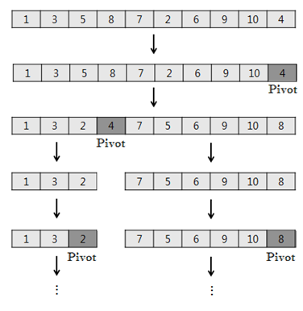
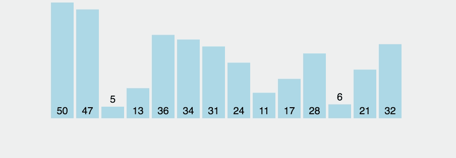

# 퀵 정렬 - 최적 O(nlog₂n), 최악 O(n^2)

- 토니 호어가 고안한 알고리즘
- 병합 정렬과 마찬가지로 **분할 정복 알고리즘**이다.
- Pivot 피봇을 기준으로 데이터를 나누어서 정렬하는 특징 때문에 **파티션 교환 정렬**이라고도 한다.
  - 피봇이라는 개념을 통해, 피봇보다 작으면 왼쪽, 크면 오른쪽과 같은 방식으로 파티셔닝을 하면서 자료를 쪼개 나간다.
  - 분할 된 파티션 내에서 위 동작을 반복하는 **분할 정복, 재귀 구조**를 갖고 정렬이 진행된다.
  - 여러가지 변형과 개선 버전이 존재한다.
    - N.로무토의 파티션 계획이 그 중 하나다.
- **불안정 정렬**에 속하며, 다른 원소와의 비교만으로 정렬을 수행하는 비교 정렬에 속한다. 
- Merge Sort와 달리 Quick Sort는 배열을 비균등하게 분할한다.

### 공간 복잡도
- 주어진 배열 안에서 교환(swap)을 통해 정렬되므로 O(n)의 공간 복잡도를 갖는다.
- 제자리 정렬이다.

### 주의
- partition() 함수에서 **피벗 값이 최소나 최대값으로 지정되어 파티션이 나누어지지 않았을 때, O(n^2)의 시간복잡도**를 가진다.
  - 즉, 정렬하고자 하는 배열이 오름차순 정렬되어있거나 내림차순 정렬되어 있는 최악의 경우, 버블 정렬과 다름 없는 O(n^2)의 시간복잡도를 가진다. 
    - 이때, 배열에서 가장 앞에 있는 값과 중간값을 교환해준다면 확률적으로나마 시간복잡도 O(nlog₂n)으로 개선할 수 있다. 
    - 하지만, 이 방법으로 개선한다해도 `Quick Sort의 최악의 시간복잡도가 O(nlog₂n)가 되는 것은 아니다.`

### N.로무토가 구현한 파티션 계획

- 항상 `맨 오른쪽의 피벗`을 택하는 단순한 방식을 말한다. 간결하고 이해하기 쉬워 가장 기본적인 방식으로 소개된다.
- left, right와 같은 2개의 포인터가 이동하면서 오른쪽 포인터의 값이 피봇보다 작다면, left와 right의 값을 swap하는 형태로 구현한다.

```python
# 로무토가 구현한 파티션 계획 Partition Scheme
# A : 리스트
# lo: 가장 작은 인덱스 값
# hi: 가장 큰 인덱스 값
def quicksort(A, lo, hi):

    def _partition(lo, hi):
        pivot = A[hi]  # 가장 오른쪽 값을 피봇으로 지정
        left = lo
        
        for right in range(lo, hi):
            # right 포인터가 피봇보다 작은 값을 가리키면
            if A[right] < pivot:
                # right 와 left swap
                A[left], A[right] = A[right], A[left]

                left += 1 # left 포인터 이동

        # 마지막에 피벗 값과 left 값(결과적으로 피벗보다 큰 값을 가리키게 된다) 변경
        A[left], A[hi] = A[hi], A[left]

        return left # 즉, 피봇 인덱스 반환

    # lo 인덱스가 hi 인덱스보다 작은 동안 수행된다.
    if lo < hi: 
        pivot = _partition(lo, hi) # 파티션 기준

        # 좌, 우 분할 반복 - 재귀
        quicksort(A, lo, pivot - 1)
        quicksort(A, pivot+1, hi)

```
### 참고 이미지



- 노란색이 pivot, 초록색이 pivot보다 작은 데이터, 보라색이 pivot보다 큰 데이터, 주황색이 정렬이 완료된 데이터를 나타낸다.

---
### 참고
#### 안정 정렬
- 중복된 값을 입력 순서와 동일하게 정렬한다.
  - 기존의 순서가 유지된다.

#### 불안정 정렬
- 기존의 순서는 무시된다.

#### 파이썬의 정렬
- 실무에서는 병합 정렬이 활발히 사용된다.
- **파이썬**의 기본 정렬 알고리즘은 **병합 정렬과 삽입 정렬을 휴리스틱하게 조합한 팀소트 Tim sort**이다.
 