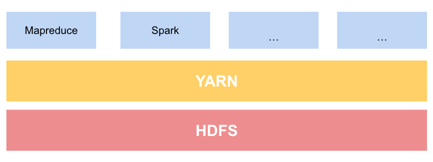
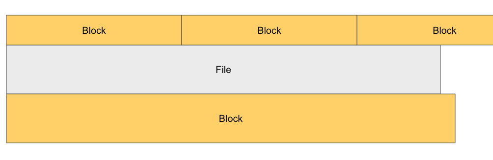

## 하둡
>  큰 데이터가 있다면 하나의 서버를 키우는것보다 더 많은 서버에서 이를 분담  
검색 엔진 개발을 위해 시작된 프로젝트
기능을  위한 크롤링 데이터를 색인하는 시스템 → 수십억 웹 페이지, 1조개 링크에 대한 데이터 저장  
-> 테라바이트 크기 이상의 데이터를 더 빠르게 정렬할 수 있게 되었다

## HDFS 하둡 분산 파일 시스템
> 대용량 파일을 다룰 수 있도록 설계된 파일 시스템  
하둡의 파일 시스템 추상화 개념에 대한 구현체 중 하나
### 설계 특성
- 매우 큰(~MB, GB, TB, PB) 파일
- 스트리밍 방식의 데이터 접근
    - 한 번 쓰고 여러번 읽는다
    - 데이터셋은 생성 or 원본으로부터 복사
- 범용 하드웨어
    - 쉽게 구할 수 있는 하드웨어로 구성된 대형 클러스터에서 문제 없이 실행되도록 설계됨
### HDFS 적합하지 않은 Case

- 빠른 데이터 응답 시간 요구하는 애플리케이션
    - HDFS는 높은 데이터 처리량을 제공하기 위해 최적화되어 있고 이를 위해 응답 시간 희생하는 구조
- 수많은 작은 파일
    - 네임노드는 파일시스템의 메타데이터를 메모리에서 관리하기 때문에 저장할 수 있는 파일 수 네임노드의 메모리 용량에 좌우됨
    - 파일 수가 많고 각 파일의 블록이 하나면 적지 않은 메모리가 필요하다.
- 임의 수정
    - 파일에서 임의 위치에 있는 내용 수정하는 것은 불가능

## 개념

### 블록

블록크기란 한번에 읽고 쓸 수 있는 데이터의 최대량
- 단일 디스크를 위한 파일시스템 블록
    - 디스크 블록 크기의 정배수인 파일시스템 블록 단위로 데이터를 다룬다.
    - 보통 파일시스템 블록 크기는 ~KB. 디스크 블록 크기는 기본적으로 512Byte.
    - 디스크 블록보다 작은 데이터라도 한 블록 전체를 점유한다.
- **HDFS 블록**
    - 기본 128MB 큰 단위: 큰 이유는 탐색 비용을 최소화하기 위해서
    - 블록 크기보다 작은 데이터일 경우 크기만큼만 점유

### 블록 추상화 장점

- 파일 하나의 크기가 단일 디스크 용량보다 더 커질 수 있다
- 스토리지 서브 시스템 단순하게 만들 수 있다
    - 메타데이터는 블록과 함께 저장될 필요 없어 별도의 시스템에 분리할 수 있다
- 복제 구현에 적합
    - 각 블록은 물리적으로 분리된 다수의 머신에 복제
    - 하나의 블록 고장나거나 이용할 수 없다면 다른 머신에 있는 복사본 읽도록 클라이언트에 전달

---

HDFS 클러스터는 마스터-워커 패턴으로 하나의 네임노드(마스터), 여러개의 데이터노드(워커)로 구성되어 있다.

## 네임노드

- 파일시스템의 네임스페이스 관리. 장애복구 기능에 필수적
    - 네임스페이스란?
        
        동일한 시스템에서 별개의 독립된 공간을 격리된 환경에서 운영하는 가상화 기술
        

### 데이터노드

- 클라이언트나 네임노드의 요청이 있을 때 블록을 저장하고 탐색
- 저장하고 있는 블록의 목록을 주기적으로 네임노드에 보고한다

---

## 블록캐싱

- 빈번하게 접근하는 블록 파일은 데이터 노드의 메모리(블록 캐시)에 명시적으로 캐싱할 수 있다
- 잡 스케줄러(맵리듀스, 스파크 등)는 블록이 캐싱된 데이터노드에서 태스크가 실행되도록 할 수 있다.
- 읽기 성능을 높일 수 있다.