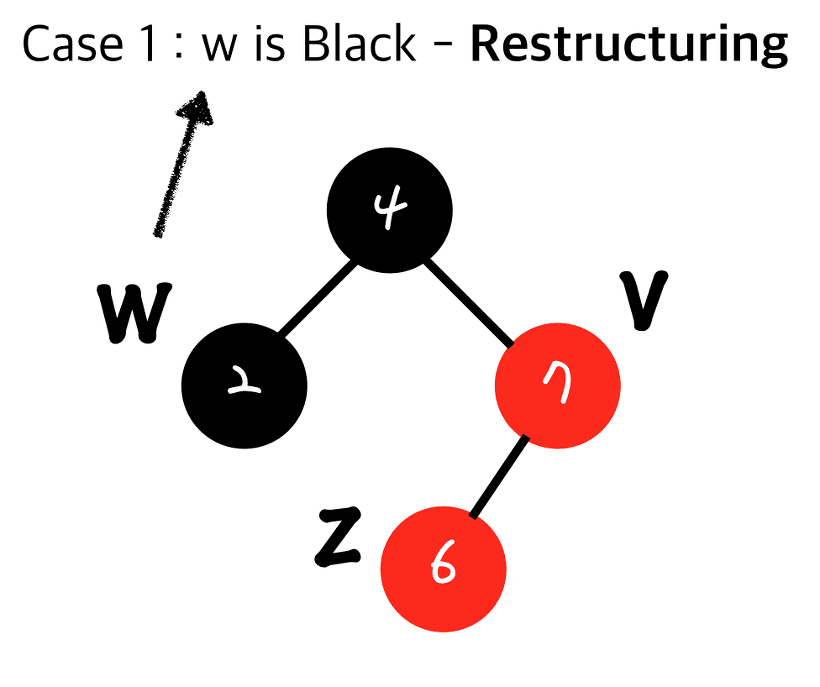
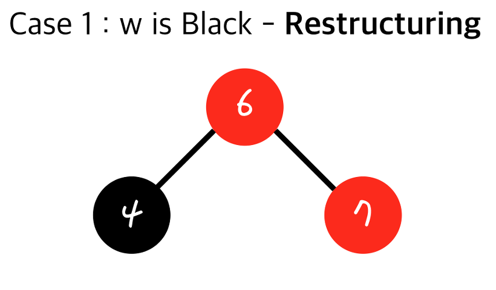
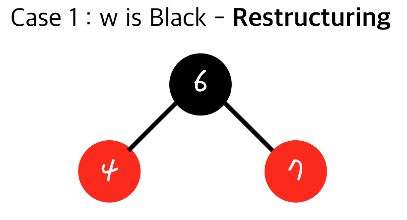
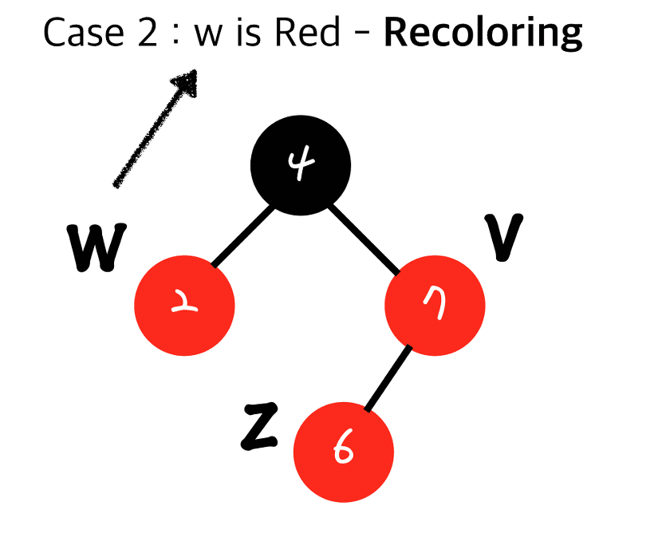
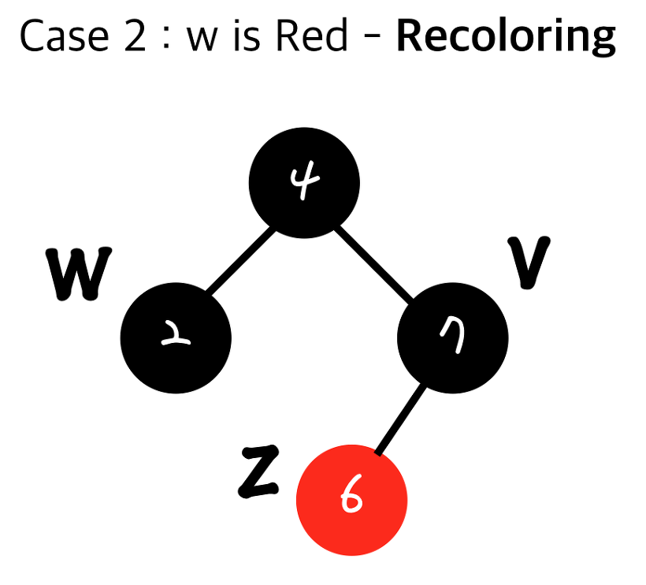
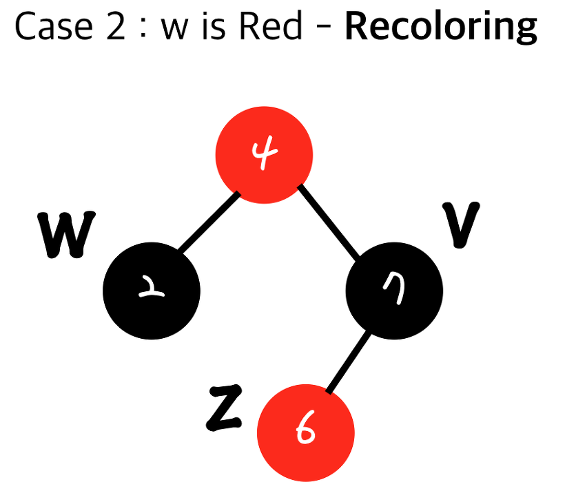

# 참고

[알고리즘 ) Red-Black Tree](https://zeddios.tistory.com/237)

[Red/Black Tree](https://www.cs.usfca.edu/~galles/visualization/RedBlack.html)

# **Red Black Tree**

레드 블랙 트리는 **자가 균형 이진 탐색 트리**로서, AVL 트리처럼 스스로 균형을 잡는 트리이다.

- 규칙에 맞는 레드 블랙 트리라고 해서, 규칙에 맞는 AVL 트리는 아닐 수 있다.

# **Red Black Tree의 규칙**

1. 모든 노드는 빨간색 또는 검은색이다.

2. **루트**는 항상 **검은색**이다. (**Root Property)**

3. **새로 추가되는 노드**는 항상 **빨간색**이다.

4. **루트에서 잎 노드**로 가는 모든 경로에는 **같은 수의 검은색 노드**가 있어야 한다. (**Depth Property)**

    - 빨간색 노드의 갯수는 다양할 수 있다.
    - 가장 긴 Black Depth를 가지는 경로(Red 노드와 Black 노드가 번갈아 구성된 경우)의 길이는 가장 짧은 Black Depth를 가지는 경로(모두 Black 노드인 경우)의 **2배**가 최대이다.
        - 균형적, 레드 블랙 트리의 높이는 log n이 최대가 된다.

5. 어떤 경로에서도 **빨간색 노드**가 **연속**으로 있어서는 안 된다. (**No Double Red)**

    - 빨간색 노드의 자식은 검은색 노드이다. (**== Internal Property)**
    - 검은색 노드는 연속으로 존재할 수 있다.

6. 모든 **빈 노드(null)** 는 **검은색**이라고 가정한다. (**External Property**)

# Double Red를 해결하는 전략

### Restructuring - BLACK AUNT ROTATE

- 이모 노드가 검은색일 경우, 회전을 수행한다.
- 회전을 하고 나면 **부모 노드**는 **검은색**이고 **두 자식 노드**는 **빨간색**이 되어야 한다.
- Restructuring은 다른 서브 트리의 **Black Depth**에 영향을 끼치지 않기 때문에 **한번의 Restructuring으로 종료된다.**
- Restructuring자체의 시간복잡도는 O(1) 이다. (순서 결정 시간 : O(1), 트리로 만드는 시간 : O(1), 원래 있던 노드들의 구조를 바꾸는 시간 : O(1))
- 실제로 Restructuring은 **노드의 insertion** 이후 일어나므로, 총 수행시간은 **O(logn)**이 된다. (즉, 노드가 삽입될 위치를 찾는 시간)

### Recoloring - RED AUNT COLOR-FLIP

- 이모 노드가 빨간색일 경우, 색상 전환을 수행한다.
- 색상 전환을 하고 나면 **부모 노드**는 **빨간색**이고 **두 자식 노드**는 **검은색**이 되어야 한다.
    - 부모 노드가 빨간색 노드로 변하면서, Double Red 가 연쇄적으로 발생할 가능성도 있다.
- Recoloring의 시간 복잡도는 O(1)이나, Root까지 propagation될 수 있으므로 최악의 경우 O(logn)이 걸린다. 마찬가지로 **노드의 insertion** 이후 발생하므로 전체 시간 복잡도는 **O(logn)** 이 된다.