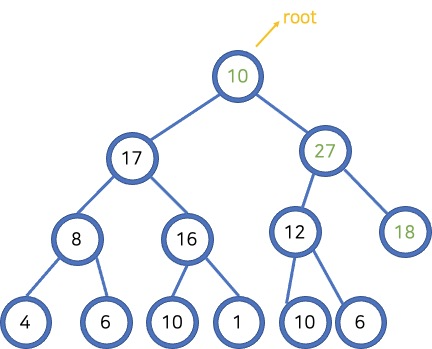

# 힙Heap

힙은 **최댓값 및 최솟값을 찾아내는 연산을 빠르게** 하기 위해 고안된 **완전 이진 트리**를 기반으로 한 자료구조이다.

## MaxHeap

부모가 자식보다 큰 경우를 말한다.


## MinHeap

부모가 자식보다 작은 경우를 말한다.

## 트리(힙)의 레벨과 높이 간 관계


- 특정 레벨까지의 노드 갯수는  2^(level+1) - 1 로 표현할 수 있다.
- 역으로 **log2(n+1) - 1**은 **트리의 높이**가 된다.
    - 트리가 갖는 요소의 갯수를 알면, 트리의 높이를 계산할 수 있다.

## 노드 추가/삭제

힙에 새로운 데이터를 추가하거나 제거할 때, **힙의 자료구조 유지**를 위해 힙이 갖는 규칙을 지켜야 한다.

최대 힙이면 부모 노드가 자식 노드보다 커야 되고 최소 힙은 자식 노드가 부모 노드보다 커야 된다.

### 노드 추가


- 최대 힙에 추가하는 경우
    - 새로운 노드를 사용 가능한 위치에 추가한다.
    - 부모 노드와 크기를 비교한 다음, 필요하다면 위치를 변경(**trickle up**)하는 과정을 재귀적으로 반복한다.

### 루트 노드 제거


- 힙에서 노드를 제거하는 경우엔 항상 루트 노드를 제거한다.
    - 루트 노드를 제거한다.
    - 힙의 마지막 요소를 루트 위치로 이동시킨다.
    - 이동한 노드의 두 자식 노드 중 큰 노드와 현재 노드의 위치를 변경(**tricle down**)하는 과정을 반복하여 힙의 구조를 유지한다.

### trickleUp 메소드 구현

힙에서 새로운 데이터를 추가하는 기능을 메소드로 구현한다.

```java
int lastposition; // 어디까지 요소를 넣었는지 기록
E[] array = (E[]) new Object[size]; // heap 배열

public void add(E obj){
	array[++lastposition] = obj; // 1. 노드 추가
	trickleup(lastposition); // 2. trickle up
}
public void swap(int from, int to){
	E tmp = array[from];
	array[from] = array[to];
	array[to] = tmp;
}
public void trickleup(int position){
	if (position == 0)
		return;
	int parent = (int) Math.floor((position-1)/2)
	if (((Comparable<E>) array[position]).compareTo(array.parent)>0) {
		swap(position, parent);
		trickleup(parent);
	}
}
```

### trickleDown 메소드 구현

```java
/*
* 루트 노드 삭제
* */
public E remove() {
    E tmp = array[0];
    // 루트와 마지막 노드를 바꾼 다음, lastPosition의 크기를 감소시킨다.
    swap(0, lastPosition--);
    trickleDown(0);
    return tmp;
}

/*
* 재귀적 형태로 trickleDown을 활용해 힙의 노드 삭제 기능을 제공할 수 있다.
* */
public void trickleDown(int parent) {
    int left = 2 * parent + 1;
    int right = 2 * parent + 2;

    /*
    * Edge Case 1.
    * 자식 노드가 마지막 노드이며, 자식 노드가 더 큰 경우
    * */
    if (left==lastPosition && (( (Comparable<E>) array[parent]).compareTo(array[left])<0)) {
        swap(parent, left);
        return;
    }
    if (right==lastPosition && (((Comparable<E>)array[parent]).compareTo(array[right])<0)) {
        swap(parent, right);
        return;
    }

    /*
     * Edge Case 2.
     * 위 조건에 해당하지 않고(자식 노드가 마지막 노드이나, 부모 노드가 더 큰 경우),
     * 자식 노드 위치가 마지막 노드 위치보다 큰 값을 가지는 (자식 노드가 더 이상 존재하지 않는는 경우
     * */
    if (left >= lastPosition || right >= lastPosition) return;
    
    /*
     * 이하 더 이상 자식 노드가 마지막 노드보다 크거나 같은 값이 아닐 것이므로,
     * 왼쪽 노드와 오른쪽 노드 중 큰 값을 가진 자식이 부모 노드보다 크다면, 부모 노드와 스왑한다.
     * 이를 재귀적으로 수행한다.
     * */
    if ( ((Comparable<E>) array[left]).compareTo(array[right]) > 0 && ((Comparable<E>) array[left]).compareTo(array[parent]) > 0 ) {
        swap(parent, left);
        trickleDown(left);
    }
    else if ( ((Comparable<E>) array[right]).compareTo(array[parent]) > 0 ) {
        swap(parent, right);
        trickleDown(right);
    }
}
```

## 힙 정렬 알고리즘

힙 규칙에 맞게 숫자의 순서를 맞추는 과정을 **힙 정렬 알고리즘**이라고 한다. 표준적인 정렬 알고리즘의 하나이다.

- 임의의 숫자들이 나열된 상태에서 힙 규칙에 맞게 작성된 **remove() 메소드**를 반복적으로 수행하면, 정렬된 결과를 배열로 얻을 수 있다.
- 힙 정렬 알고리즘의 시간 복잡도는 **O(nlogn)**이다.
    - 두 수를 비교해서 하나를 택하는 방식으로 힙의 구조를 유지하며 정렬하기 때문이다.
    - 즉, 총 n 개의 숫자를 logn 개의 숫자와 비교하게 된다.
- 데이터의 복사본을 만들지 않고, 하나의 배열에서 정렬이 가능하다. (**In-place Algorithm 제자리 정렬)**

### 참고 자료
- [자바로 구현하고 배우는 자료구조 - heap](https://www.boostcourse.org/cs204/lecture/626041)