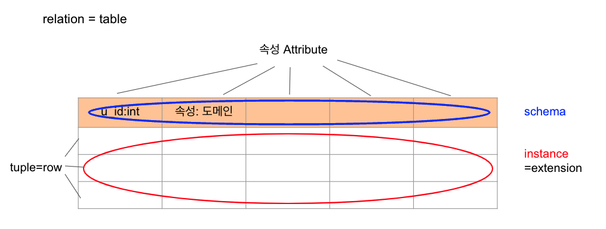
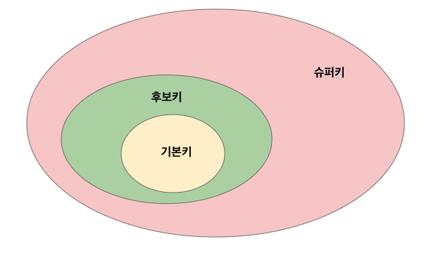
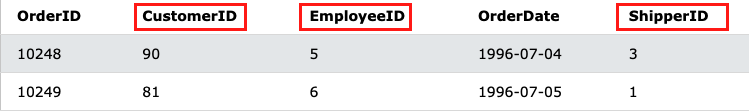

# 데이터베이스

## 개념

- **integrated data**: 중복을 최소화함으로써 데이터 불일치 현상을 없앤다
- **stored data**: 컴퓨터 저장장치에 저장된 데이터
- **operationl data**: 프로젝트의 목적을 위해 사용되는 데이터
- **shared data**: 여러 사람이 동시에 사용할 수 있다

## 특징

- **실시간 접근성** real time accessibility
    
    사용자가 요청하는 순간에 실제 데이터를 서비스
    
- **계속적인 변화** continuous change
    
    삽입, 삭제, 수정등으로 바뀐 데이터값 저장
    
- **동시 공유** concurrent sharing
    
    동시에 여러 사용자가 데이터 요청가능
    
- **내용에 따른 참조** reference by content

### 데이터 구조

- 외부 단계- **외부 스키마**: 개념 스키마 중 사용자에게 필요한 부분
- 개념 단계- **개념 스키마**: 전체 데이터베이스의 정의. 통합 조직별로 하나만 존재.
    - 데이터 관계, 제약사항, 무결성
- 내부 단계- **내부 스키마**: 물리적 저장 장치에서 데이터베이스가 실제로 저장되는 방법의 표현.
    - 인덱스, 데이터 레코드의 배치 방법, 데이터 압축...

<aside>
💡 스키마: 데이터베이스의 조직이나 구조

</aside>

## 데이터 모델

[SQL 실습 사이트]([https://www.w3schools.com/sql/trysql.asp?filename=trysql_select_all](https://www.w3schools.com/sql/trysql.asp?filename=trysql_select_all))

## 데이터 무결성

데이터베이스에 저장된 데이터의 **일관성**과 **정확성**을 지키는 것.

### 무결성 제약조건: 신뢰도 유지

**key** 튜플 유일하게 식별하는 장치, 각 릴레이션 간의 관계 말해주는 연결고리

- 슈퍼키 superkey: tuple 유일하게 식별할 수 있는 속성 or 속성집합
- 후보키 candidate key: 튜플 유일하게 식별할 수 있는 최소집합
- 기본키 primary key: 후보키 중 하나 선정하여 대표로 삼은 키

- 대리키 surrogate key: 마땅한 키 없을 때 가상 속성 만들어 기본키로.
- 대체키 alternate key: 기본키로 선정되지 않은 후보키
- 외래키 foreign key: 다른 테이블 기본키를 참조하는 속성. 테이블 간 관계 표현
    
    
    

### 무결성 제약조건

- **도메인** 무결성 제약조건
- **개체** 무결성 제약 조건(=기본키 제약)
    - NULL ❌
    - 키값 변동 ❌
    - 최소 집합. 최대한 적은 수의 속성만 가짐
    - 문제 발생 소지 ❌
- **참조** 무결성 제약 조건(=외래키 제약)

# SQL

## 데이터 정의어 Data Definition Language

데이터베이스나 **테이블** 등을 생성, 삭제, 변경을 위한 명령어

- 생성: `create table 테이블명`
- 변경: `alter table 테이블명`
    - `add 속성 타입`
    - `modify 속성 타입 (제약조건)`
    - `drop column 속성`
    - `add primary key 속성`
- 삭제: `drop table 테이블명`

## 데이터 조작어 Data Manipulation Langauge

데이터베이스에 저장된 데이터를 처리하거나 조회, 검색하기 위한 명령어. **튜플**에 대한 처리

- 조회: `select 속성 from 테이블`
- 삽입: `insert into 테이블명 (속성1, 속성2..) values (값1, 값2..)`
- 수정: `update 테이블 set 속성1=값1, 속성2=값... where 조건`
- 삭제: `delete from 테이블 where 조건`

## 데이터 제어어 Data Control Language

데이터 사용권한 관리. 데이터베이스에 저장된 데이터를 관리하기 위하여 데이터의 보안성 및 무결성 등을 제어하기 위한 명령어

- `grant` 권한 `on` 객체 `to` 사용자 `(with grant option);`
- `revoke` 권한 `on` 객체 `from` 사용자;