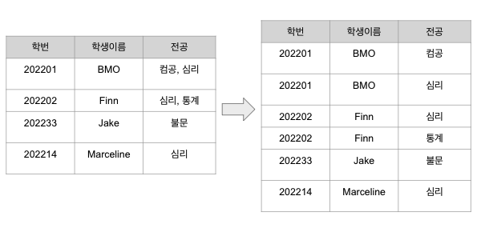
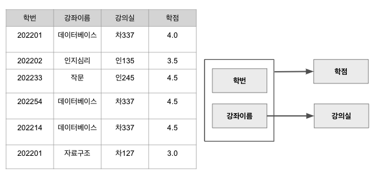
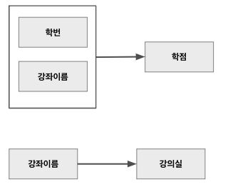
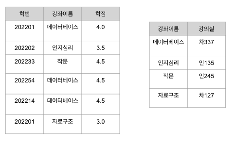
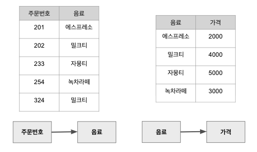
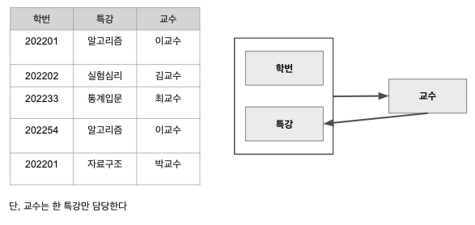
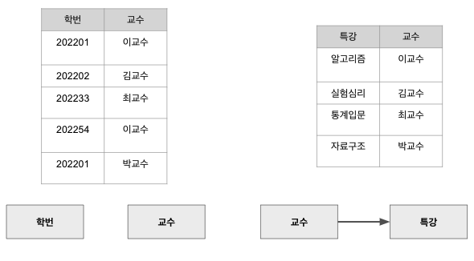

**정규화 normalization**
> 이상현상이 발생하는 릴레이션을 분해하여 이를 없애는 과정.    
이상현상을 일으키는 함수 종속성의 유형에 따라 등급을 구분할 수 있다.

## 제 1 정규형
> A relation in which the intersection of each row and column contains one and only one value.  
릴레이션의 모든 속성 값이 원자값을 가지면 제 1 정규형이라고 한다. 
### 🛠 정규형 변환

## 제 2 정규형
> A relation that is in first normal form and every non-primary key attribute is fully functionally dependent on the primary key.
릴레이션이 제 1 정규형이고 기본키가 아닌 속성이 기본키에 완전 함수 종속일 때 제 2 정규형이라고 한다.

- **완전 함수 종속?**
A와 B가 릴레이션의 속성이고 A -> B 종속성이 성립할 때, B가 A의 속성 전체에 함수 종속하고 부분 집합 속성에 함수 종속하지 않을 경우 완전 함수 종속이라고 한다. 
`(학번, 강좌이름)` -> `학점`
`학번` -x-> `학점` and `강좌이름` -x-> `학점`
- 불완전 함수 종속(부분 함수 종속)
`(학번, 강좌이름)` -> `강의실`에서 학번을 제거해도 `강좌이름` -> `강의실` 성립
### 😈 이상현상

- 삭제이상: 202233 학생의 수강을 취소하면 작문 강좌의 정보가 사라진다
- 삽입이상: 새 강좌를 개설했을때 수강신청한 학생이 없으면 학생번호, 학점을 NULL값으로 삽입해야하는 문제
- 수정이상: 데이터베이스 강좌 강의실을 변경할 시 데이터 불일치기 발생할 수 있다
### 🗝 이상현상 원인
기본키가 아닌 속성(강의실)이 기본키에 완전 함수 종속이 아닌 불완전 함수 종속 되어 있으면 이상현상이 발생한다. 
예시 릴레이션의 기본키는 (학번, 강좌이름), 기본키가 아닌 속성은 성적, 강의실. 성적과 강의실은 모두 기본키(학번, 강좌이름)에 함수적으로 종속되어 있지만 강의실은 기본키의 부분집합인 강좌이름에 종속되어 있다. 
### 🛠 정규형 변환

## 제 3 정규형
> A relation that is in first and second normal form and in which no non-primary key is transitively dependent on the primary key.  
제 2정규형이고 기본키가 아닌 속성이 기본키에 비이행적으로 종속할 때(직접 종속) 제 3정규형이라 한다. 
- **이행적 종속?**
A -> B, B -> C 이면 A -> C가 성립되는 함수 종속성

### 😈 이상현상
- 삭제이상: 202번 주문을 취소하면 밀크티 가격에 대한 정보도 사라진다
- 삽입이상: 신메뉴가 추가되었는데 아직 주문이 없을 시 주문번호를 NULL값으로 삽입해야 하는 문제
- 수정이상: 밀크티 가격을 5500원으로 변경하면 데이터 불일치가 발생할 가능성
### 🗝 이상현상 원인
가격이 기본키가 아닌 음료에 함번 더 종속되어 있다. 따라서 (주문번호->음료), (음료->가격)로 가격은 기본키에 이행적으로 종속되어 있다.
### 🛠 정규형 변환
(주문번호, 음료, 가격) 분해
-> 주문(주문번호, 음료), 메뉴(음료, 가격)

## BCNF
Boyce Codd Normal Form
릴레이션에 존재하는 함수 종속성에서 모든 결정자가 후보키이면 BCNF 정규형이다
> A relation is BCNF if and only if every determinant is a cadidate key.  
함수 종속성 X->Y가 성립할 때 모든 결정자 X가 후보키이면 BCNF 정규형이라 한다
### 😈 이상현상

- 삭제이상: 202202 학생이 수강을 취소하면 실험심리 강좌 정보도 사라진다
- 삽입이상: 백교수가 새로 특강을 개설했는데 아직 수강 신청한 학생이 없어 학생 번호를 NULL값으로 삽입해야 하는 문제
- 수정이상: 이교수가 특강 이름을 알고리즘에서 알고리즘 중급으로 바꾸면 데이터 불일치가 발생할 수 있다
### 🗝 이상현상 원인
결정자이면서 후보키가 아닌 속성이 존재하기 때문에 이상현상이 발생한다.
예시 릴레이션의 기본키는 (학번, 특강)이며 여기서 볼 수 있는 관계는 (학번, 특강)-> 교수, 교수 -> 특강이름이다. 교수는 결정자이지만 부분 릴레이션(교수, 특강)의 기본키일 뿐 해당 릴레이션의 후보키가 아니다. 
### 🛠 정규형 변환
특강수강(학번, 특강, 교수)
-> 특강신청(학번, 교수), 특강교수(특강, 교수)

## 🚨 무손실 분해: 릴레이션을 분해할 때 지켜야 할 규칙
분해된 릴레이션 간의 관계를 유지하기 위해 분해된 릴레이션에 공통 속성을 한 개 이상 두어야 한다.
릴레이션 R을 릴레이션을 R1, R2로 분해했을 때, 다시 조인 하면 원래의 릴레이션 R이 만들어져야 한다.

- 특강수강(학번, 특강, 교수) -> R1(<ins>학번</ins>, 교수), R2(<ins>특강</ins>, 교수)
    R1, R2의 공통 속성은 교수, 교수는 R2의 키이다. -> 무손실 분해 규칙 🅾️
- 특강수강(학번, 특강, 교수) -> R1(<ins>학번</ins>, 특강), R2(교수, 특강)
    R1, R2의 공통 속성은 특강, (분반이 있을 수 있다면..)특강은 R2의 키가 아니다. -> 무손실 분해 규칙 ❌