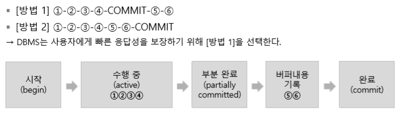
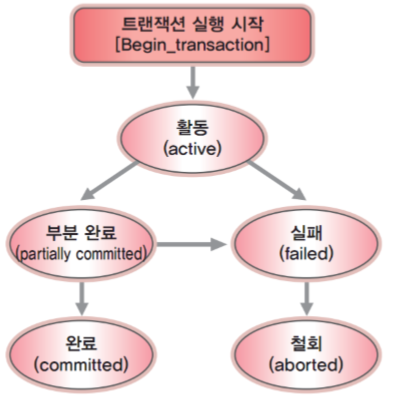
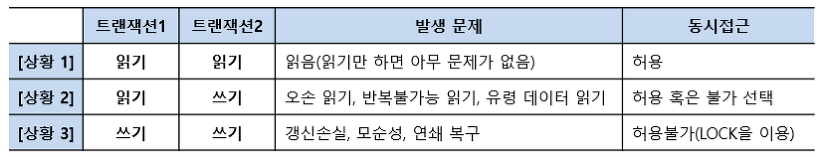
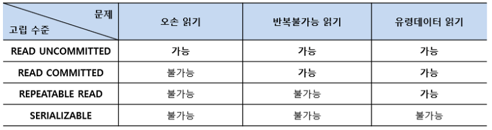
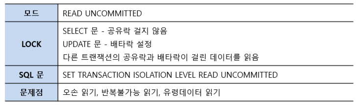
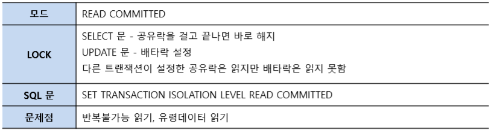
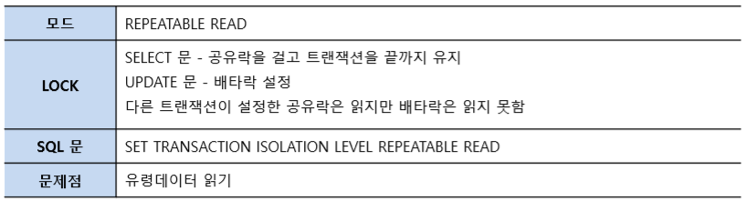
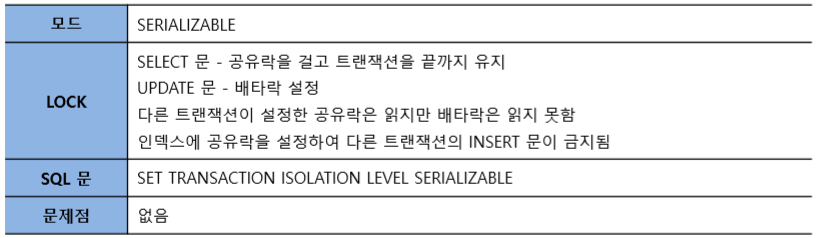

# 트랜잭션
- 데이터의 무결성을 유지하기 위해 원자성, 일관성, 고립성, 지속성의 성질을 갖는다.
- 데이터를 다룰 때 사용하는 논리적인 작업(프로그램) 단위이다.
- DBMS는 트랜잭션을 지원한다.
- 데이터를 다룰 때 장애가 발생하는 경우, 데이터를 복구하는 작업의 단위로 사용된다.
- 여러 작업이 동시에 같은 데이터를 다룰 때, 이 작업들을 서로 분리하는 단위로 사용한다.
- 트랜잭션은 전체가 수행되거나 또는 전혀 수행되지 않아야 한다. All or Nothing

## 트랜잭션 처리
```sql
START TRANSACTION -- 생략가능, 트랜잭션의 시작

-- 1, 2. 데이터를 읽어오는 작업 수행

UPDATE CUSTOMER
SET BALANCE = BALANCE - 1000
WHERE NAME = '박지성';
-- 3. 예금 인출

UPDATE CUSTOMER
SET BALANCE = BALANCE + 1000
WHERE NAME = '김연아';
-- 4. 예금 입금

COMMIT -- 트랜잭션 끝, 부분완료

-- 5, 6. 변경을 하드디스크에 기록(실제적 종료)
```

- 데이터베이스의 데이터는 전원과 관계없이 값을 유지하기 위해 보조기억장치(하드디스크)에 저장되며, **`처리를 위해서는 주기억장치(메모리) 버퍼로 사본`** 을 읽어오게 된다.
- 트랜잭션은 버퍼에 저장된 데이터를 수정한 후 최종적으로 데이터베이스에 다시 저장한다.
- 실제 동작: 1-2-3-4-Commit(부분 완료)-5-6-완료
- DBMS는 1~4까지의 과정을 수행하고 사용자에게 완료 사실을 알린다.
  - DBMS가 동시에 많은 트랜잭션을 수행할 때, 각 트랜잭션이 하드디스크에 개별 접근하는 것을 피하고 DBMS가 일괄적으로 하드디스크에 접근하여 처리한다.
  - 하드디스크 I/O 작업은 시간 소요가 크다. 
  - 다른 트랜잭션이 기존 트랜잭션이 사용한 테이블을 빠르게 할당받을 수 있다.
  - 빠른 응답성을 보장할 수 있다.
- 트랜잭션은 4의 과정 이후 임시로 종료를 선언하며, 실제 데이터베이스에 기록하는 것은 DBMS가 지원해 수행된다.

### 트랜잭션 수행 과정
- 시작-수행-부분완료-완료



### 트랜잭션 상태도


- 부분완료: 트랜잭션 수행은 완료되었으나 변경 내용이 데이터베이스에 기록되었는지는 확실하지 않은 상태를 말한다.  
시스템 내부의 문제 혹은 시스템 다운으로 DBMS가 변경 내용을 데이터베이스에 기록하지 못하면 실패 상태가 된다.
- 실패: 트랜잭션이 중단되거나 부분완료 상태에서 변경 내용을 데이터베이스에 저장하지 못한 상태를 말한다. 실패 상태에서 DBMS는 트랜잭션이 수행한 작업을 모두 원상복구시킨다.

## 트랜잭션 성질, ACID

### 원자성(Atomicity)
- 트랜잭션에 포함된 작업은 전부 수행되거나 전부 수행되지 않아야 한다.
- 트랜잭션 중간에 작업이 잘못 되는 경우 회복 알고리즘을 이용해 변경한 내용을 취소할 수 있다.
- ROLLBACK 명령어를 통해 자의적으로 트랜잭션을 취소할 수도 있다.
- DBMS는 원자성을 유지하기 위해 회복 관리자 프로그램을 작동시킨다.
  - 회복 관리자 프로그램은 데이터베이스의 변경내역을 로그로 관리하다가 문제가 발생하면 원래 상태로 되돌리는 기능을 수행한다.
### 일관성(Consistency) 
- 트랜잭션을 수행하기 전이나 후나 데이터베이스는 항상 일관된 상태를 유지해야 한다.
- 일관성은 테이블의 CREATE 나 ALTER 문에서 **무결성 제약조건**을 통해 명시한다.
  - 트랜잭션은 이 제약조건에 따라 일관성을 유지하나, 데이터 조작 중에는 일시적으로 일관성을 유지 못하는 상태가 발생할 수 있다.
- 트랜잭션이 동시에 수행되는 트랜잭션 간섭으로 인해 일관성이 깨지는 현상이 발생할 수 있다. 이는 동시성 제어 알고리즘을 통해서 방지한다.

### 고립성(Isolation) 
- 수행 중인 트랜잭션에 다른 트랜잭션이 끼어들어 변경중인 데이터 값을 훼손하지 않아야한다.
- 각 트랜잭션은 독립적으로 작업을 수행한다.
- 동시에 수행되는 트랜잭션이 같은 데이터를 가지고 충돌하지 않도록 제어하는 작업을 **동시성 제어**라고 한다.
- 동시성 제어보다 완화된 방법으로 트랜잭션 고립 수준에 따라 트랜잭션의 상호 간섭을 완화시키는 방법도 있다.

### 지속성(Durability) 
- 수행을 성공적으로 완료한 트랜잭션은 변경한 데이터를 영구히 저장해야 한다. 저장된 데이터베이스는 저장 직후 혹은 어느 때나 발생할 수 있는 정전, 장애, 오류에 영향을 받지 않아야 한다.
- DBMS 복구 시스템은 트랜잭션이 작업한 내용을 수시로 로그 log 데이터베이스에 기록하였다가 문제가 발생하면 로그를 이용하여 복구 작업을 수행한다.
  - DBMS가 회복 관리자 프로그램을 제공한다.  

## 트랜잭션 제어 명령어, TCL
표준 명령어 | 문법 | 설명
---|---|---
START TRANSACTION | SET TRANSACTION | 트랜잭션 시작
COMMIT | COMMIT | 트랜잭션 종료
ROLLBACK | ROLLBACK {TO \<savepoint\>} | 트랜잭션 취소 (전체 혹은 세이브포인트까지)
SAVE | SAVEPOINT \<idenfier\> | 세이브포인트 생성

- 트랜잭션의 길이가 길면 트랜잭션의 중간 지점에 수정내용을 반영하는 SAVEPOINT를 만들게 된다.
- SAVEPOINT는 트랜잭션 내에 여러 개 만들 수 있다.
  - 트랜잭션이 잘못되어 다시 실행해야 하는 경우, 처음이 아니라 SAVEPOINT로 되돌아가며 트랜잭션 전체가 ROLLBACK 되는 것을 방지한다.

# 동시성 제어 Concurrency Control
- 트랜잭션이 동시에 수행될 때, 일관성을 해치지 않도록 트랜잭션의 데이터 접근을 제어하는 DBMS 기능을 동시성 제어라고 한다.

### 트랜잭션의 읽기/쓰기 시나리오

- 같은 데이터에 접근하는 두 트랜잭션의 작업(읽기, 쓰기)에 따라 3가지 상황이 가능하다.
- 두 트랜잭션이 모두 읽기만 하는 경우에는 동시 진행에 아무런 문제가 없다.
- 두 트랜잭션 중 하나가 쓰기 작업을 하는 경우에 발생하는 문제는 트랜잭션 고립수준을 통해 제어한다.
- 두 트랜잭션이 동시에 쓰기 작업을 하는 경우에는 갱신 손실 문제가 발생할 수 있다.

### 갱신 손실 lost update 문제
- 두 트랜잭션이 하나의 데이터를 동시에 갱신하려고 할 때 발생한다.

## 락 Lock
- 락은 트랜잭션이 다루는 데이터를 다른 트랜잭션이 접근하지 못하도록 막아 대기 상태로 만든다.
- 트랜잭션이 할당 받은 데이터에 잠금을 표시하는 장치이다.
- 갱신 손실 문제를 해결하기 위해 락을 사용할 수 있다.
- 트랜잭션이 데이터를 수정 중이라는 것을 락이라는 잠금장치를 통해서 알린다.

### 락의 유형
- 데이터 읽기를 표시하는 락과 데이터 쓰기(수정)를 표시하는 락으로 구분된다.
- 공유락 LS, shared lock: 읽기 수행 중 사용
- 배타락 LX, exclued lock: 읽기/쓰기 수행 중 사용

### 사용 규칙
- 데이터에 락이 걸려있지 않으면 트랜잭션은 데이터에 락을 걸 수 있다.
- 트랜잭션이 데이터 X를 읽기만 할 경우 LS(X)를 요청하고, 읽거나 쓸 경우 LX(X)를 요청한다.
- 다른 트랜잭션이 데이터에 LS(X)를 걸어둔 경우, LS(X)의요청은 허용하고 LX(X)는 허용하지 않는다.
- 다른 트랜잭션이 데이터에 LX(X)를 걸어둔 경우, LS(X)와 LX(X) 모두 허용하지 않는다.
- 트랜잭션이 락을 허용받지 못하면 대기 상태가 된다.

### 2단계 락킹
- 락을 걸고 해제하는 시점에 제한을 두어, 트랜잭션이 동시에 실행될 때 데이터의 일관성이 깨지는 문제를 해결한다.
  - 락을 걸었다 풀고 다시 락을 거는 등의 중간 과정에 락의 해지 상태가 생기면서, 다른 트랜잭션에게 작업의 중간 결과가 노출될 수 있어 이를 방지한다.
#### 락킹 단계
- 락을 걸고 해지하는 시점을 2단계로 나누어 다룬다.
- 확장단계: 트랜잭션이 필요한 락을 획득하는 단계로, 확장단계에서는 **이미 획득한 락을 해제하지 않는다.**
- 수축단계: 트랜잭션이 락을 해제하는 단계로, 수축단계에서는 **새로운 락을 획득하지 않는다.**
- 
### 데드락
- 2개 이상의 트랜잭션이 각각 자신의 데이터에 대한 락을 획득하고 다른 트랜잭션이 점유한 데이터에 대한 락을 요청하는 경우 무한 대기 상태에 빠질 수 있으며 이를 데드락 혹은 교착상태라고 한다.
- 데드락 발생 시, 작업 중 하나를 강제로 중지시켜서, 나머지 트랜잭션이 정상적으로 실행될 수 있도록 한다.

# 트랜잭션 고립수준
- 동시성을 높이기 위해서 사용하는 락보다 완화된 방식을 말한다.

## 트랜잭션 동시 실행 문제
- 읽기 트랜잭션과 쓰기 트랜잭션이 동시에 작업할 때 읽기 트랜잭션이 쓰기 트랜잭션의 중간 데이터를 읽어 발생하는 문제이다.

### 오손 읽기 Dirty Read
- 읽기 작업을 하는 트랜잭션 1이 쓰기 작업을 하는 트랜잭션2가 작업한 중간 데이터를 읽기 때문에 발생하는 문제이다.
- 작업중인 트랜잭션 2가 작업을 Rollback한 경우 트랜잭션 1은 **무효가 된 데이터를 읽게 되고 잘못된 결과**를 도출한다.

### 반복불가능 읽기 Non-repeatable Read
- 트랜잭션 1이 데이터를 읽고 트랜잭션 2가 데이터를 쓰고(Update) 르랜잭션 1이 다시 한번 데이터를 읽을 때 생기는 문제이다.
- 즉, 트랜잭션 1이 읽기 작업을 다시 한 번 반복할 경우 **이전의 결과와 다른 결과가 나오는 현상**을 말한다.

### 유령데이터 읽기Phantom Read
- 트랜잭션 1이 데이터를 읽고 트랜잭션 2가 데이터를 쓰고(Insert) 트랜잭션 1이 다시 한번 데이터를 읽을 때 생기는 문제이다.
- 트랜잭션 1이 읽기 작업을 다시 한 번 반복할 경우 **이전에 없던 데이터(유령 데이터)**가 나타나는 현상을 말한다.

## 트랜잭션 고립 수준 명령어
- DBMS가 트랜잭션을 동시에 실행시키면서 락보다 좀 더 완화된 방법으로 문제를 해결하기 위해 제공하는 명령어를 말한다.
- 사용자 정의에 따라 읽기/쓰기에 대한 트랜잭션 간 고립 수준을 결정한다.
- SQL 표준에서 4 가지 고립 수준을 정의한다.
 


###  READ UNCOMMITTED, Level 0

- 고립 수준이 Level 0으로 가장 낮은 명령어로, 자신의 데이터에 아무런 **공유락**을 걸지 않는다.
  - READ UNCOMMITTED는 자신의 데이터에 아무런 공유락도 걸지 않지만, **배타락**은 데이터의 갱신손실 문제 때문에 걸어주어야 한다. 
- 또한 다른 트랜잭션에 공유락과 배타락이 걸린 데이터를 대기하지 않고 읽는다.
  - 다른 트랜잭션이 COMMIT하지 않은 데이터도 읽을 수 있어, 더티 리드가 발생한다.
- 즉, SELECT 문을 수행하는 대상 데이터에는 Lock이 걸리지 않는 것과 같다.

### READ COMMITTED, Level 1


- 고립 수준이 Level 1인 명령어로, 오손 페이지의 참조를 피하기 위해 자신의 데이터를 읽는 동안 공유락을 걸지만 트랜잭션이 끝나기 전에라도 해지 가능하다.
- 다른 트랜잭션 데이터는 락 호환성 규칙에 따라 진행됩니다. 
 
### REPEATABLE READ, Level 2


- 고립 수준이 Level 2인 명령어로, 자신의 데이터에 설정된 공유락과 배타락을 트랜잭션이 종료될 때까지 유지하여 다른 트랜잭션이 자신의 데이터를 갱신(Update)할 수 없도록 한다.
- 다른 트랜잭션 데이터는 락 호환성 규칙에 따라 진행된다. 
- 다른 고립화 수준에 비해 데이터의 동시성(Concurrency)이 낮아 특별하지 않은 상황이라면 사용하지 않는 것이 좋다.
- 
### SERIALIZABLE, Level 3


- 고립 수준이 Level 3으로 가장 높은 명령어로, 실행 중인 트랜잭션은 다른 트랜잭션으로부터 완벽하게 분리된다.
- 데이터 집합에 범위를 지어 잠금을 설정할 수 있기 때문에 다른 사용자가 데이터를 변경(UPDATE) 또는 삽입(Insert)하려고 할 때 트랜잭션을 완벽하게 분리할 수 있다. 
- 가장 제한이 심하고 동시성도 낮다. 
- 즉, SELECT 문이 사용하는 데이터에 배타락을 설정한 것과 같은 효과를 낸다. (인덱스에 공유락 설정)

### MySql
- MySql은 공유락을 걸지 않고 최초 트랜잭션 수행시 snapshot을 만들어 그 snapshot으로 조회 질의를 수행하여 다른 트랜잭션의 변경 시에도 동일한 결과를 유지한다.

# 회복
- 데이터베이스에 장애가 발생했을 때 데이터베이스를 일관성 있는 상태로 되돌리는 기능이다.
  
## 트랜잭션
- 트랜잭션은 데이터베이스 회복의 단위이다.
- 트랜잭션이 일단 COMMIT한 내용은 로그를 이용해 데이터베이스에 기록한다.
- 장애 발생시 로그의 내용을 참조하여 트랜잭션의 내용을 모두 반영하거 아니면 반영하지 않는 방법으로 원자성과 지속성을 유지한다.

### 부분 완료
- 트랜잭션의 해당 단계에서 트랜잭션이 변경한 내용은 버퍼 뿐만 아니라 재해에 대비하여 로그(임시 디스크)에 저장된다.
> 참고) COMMIT 명령어는 트랜잭션을 부분 완료 시키는 명령어다.
- 트랜잭션의 수행 중(부분 완료 전)에 문제가 생겨 트랜잭션이 실패하면 취소 abort 과정을 거쳐 이제까지 작업한 내용을 롤백한다.
  - 이미 데이터베이스에 기록된 내용이 있다면, 로그를 이용하여 되돌린다.
- 부분 완료 이후 실패가 발생한 경우에도 취소 과정을 거쳐서 작업을 롤백한다.
  - 부분 완료 후 실패하는 경우에 컴퓨터시스템 장애, 트랜잭션 오류, 데드락 등의 원인이 있을 수 있다.

## 로그파일
- 트랜잭션이 반영한 모든 데이터의 변경사항을 데이터베이스에 기록하기 전에 미리 기록해두는 별도의 데이터베이스이다.
- 안전한 하드디스크에 저장되며 전원과 관계없이 기록이 존재한다.
- START, INSERT, UPDATE, DELETE, ABORT, COMMIT 등 트랜잭션의 연산 타입을 갖는다.
- 로그의 구조: <트랜잭션 번호, 로그의 타입, 데이터 항목 이름, 수정 전 값, 수정 후 값>

## 로그 파일을 이용한 회복(즉시 갱신의 경우)
- 데이터의 변경 기록을 저장해 둔 로그 파일을 이용하면 시스템 장애도 복구 가능하다.
- DBMS는 트랜잭션이 종료되었는지 혹은 중단되었는지 여부를 판단하여, 종료된 경우에는 종료를 확정하기 위하여 REDO(재실행)을 하고 중단된 경우에는 없던 일로 되돌리기 위해 UNDO(취소)를 진행한다. 

### REDO
- 장애가 발생한 후 시스템을 다시 가동을 했을 때, 로그 파일에 트랜잭션의 시작(START)이 있고 종료(COMMIT)이 있는 경우에 수행되며, 로그를 보면서 트랜잭션이 변경한 내용을 다시 기록하는 과정이다.

### UNDO 
- 장애가 발생한 후 시스템을 재가동했을때, 로그 파일에 트랜잭션의 시작(START)만 있고 종료(COMMIT)이 없는 경우에 수행한다. 
- 완료하지 못했지만 버퍼의 변경 내용이 데이터베이스에 기록되어 있을 가능성이 있기 때문에 로그를 보면서 트랜잭션이 변경한 내용을 원상복구시키는 과정이다. 

### 부분 완료와 데이터 베이스 기록 방식
#### 즉시 갱신(Immediate Update)
- 버퍼의 갱신 데이터를 로그에 기록하고, 버퍼 데이터를 데이터베이스에 반영하는 작업이 부분완료 전에 동시에 진행될 수 있다. 
- 즉, 부분 완료 전에 갱신 데이터는 데이터베이스에 반영될 수 있는 방식이다.
- 시스템 운영 시 데이터베이스에 입출력 연산이 증가하는 단점을 갖는다.
#### 지연 갱신(Deferred Update)
- 버퍼의 갱신 데이터가 로그에 반영되는 작업이 끝난 후 부분 완료 상태가 된다. 그리고 이후 버퍼 데이터를 데이터베이스에 반영하는 작업이 진행되는 방식이다.
- 부분 완료 전에는 갱신 내용이 실제 데이터베이스에 반영 되지 않는다.
- 장애 발생시, 로그에 스타트만 작성된 트랜잭션을 취소(UNDO)하는 작업을 수행할 필요가 없다.
- 시스템 복구 시 복구시간이 좀 더 걸리는 단점을 갖는다.

## 체크포인트를 이용한 회복
- 로그를 이용한 회복은 시스템 장애가 일어났을 때 어느 시점까지 되돌아가야 하는지 알 수 없다.
- 트랜잭션이 많은 응용 시스템의 겨우 하루 이상 되돌아가서 복구하는 것은 사실상 불가능하다.
- 회복 시 많은 양의 로그를 검색하고 이를 갱신하는 시간을 줄이기 위해, 몇 십 분 단위로 데이터베이스와 트랜잭션 로그 파일을 동기화 한 후, 동기화한 시점을 로그 파일에 기록해두는 방법 혹은 그 시점을 체크포인트checkpoint(혹은 검사점) 라고 한다.
### 체크포인트 시점에 수행되는 작업
- 주기억장치의 로그 레코드를 모두 하드디스크의 로그 파일에 저장한다.
- 버퍼에 있는 변경된 내용을 하드디스크의 데이터베이스에 저장한다. (즉시 갱신의 경우)
- 체크포인트를 로그 파일에 표시한다.


#### 참고자료
- 데이터베이스 개론과 실습

#### 트랜잭션 격리수준 확인/변경 방법
- https://luran.me/325
  - 세션 혹은 글로벌 레벨에서 변경 가능하다.
- 오라클은 변경이 불가능하다고 한다.