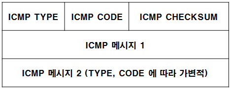
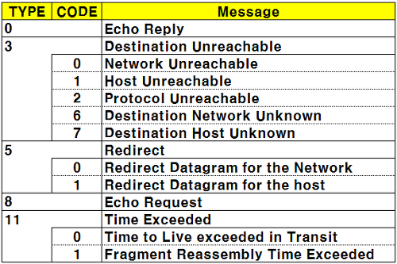
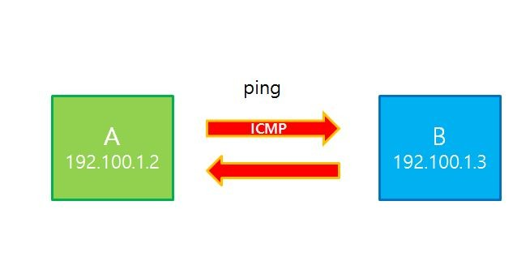
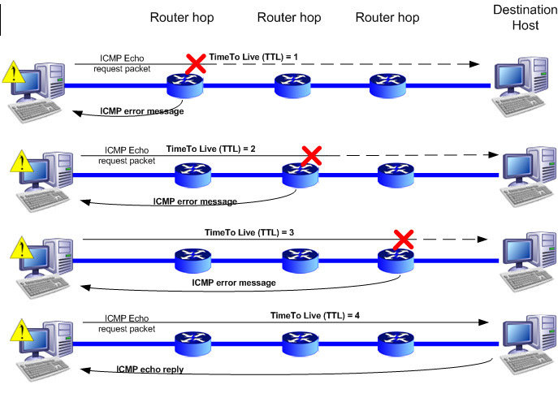

# ICMP(Internet Control Message Protocol)

- ICMP는 TCP/IP에서 IP 패킷을 처리할 때 발생되는 문제를 알려주는 프로토콜
- 인터넷 제어 메시지 프로토콜

### 용도

- 인터넷/통신 상에서 발생한 **일반적인 상황**에 대한 보고(report)
- 인터넷/통신 상에서 발생한 **오류**에 대한 보고

<aside>
💡 IP에는 오로지 패킷을 목적지에 도달시키기 위한 내용들로만 구성되어 있다. 따라서 정상적으로 목적지 호스트에 도달하는 경우에는 IP에서 통신이 성공하고 종료되므로 아무런 문제가 없다.
그러나, 만일 전달해야 할 호스트가 꺼져 있거나, 선이 단절된 경우와 같은 비정상적인 경우에 이 패킷 전달을 의뢰한 출발지 호스트에 이러한 사실을 알려야하지만, IP에는 그러한 에러에 대한 처리 방법이 명시되어있지 않다.

ICMP는 해당 **호스트가 없거나, 해당 포트에 대기중에 서버 프로그램이 없는** 등의 에러 상황이 발생할 경우 IP헤더에 기록되어 있는 출발지 호스트로 **이러한 에러에 대한 상황을 보내주는 역할을 수행**하게 된다.

</aside>

### 패킷 구조

### 메세지 종류

## 활용

### Ping

- 상대방 호스트의 작동 여부 및 응답시간 측정하는데 사용
- Echo Request (ICMP 질의메세지 요청)
- Echo Reply (ICMP 응답메세지 요청)

### Traceroute

- 목적지까지의 라우팅 경로 추적을 하기 위해 사용
- 패킷의 TTL(해당 패킷이 갖는 라우터 간 최대 Hop 크기 제한)을 1부터 늘려나가면서 이동하는 라우터 경로를 확인할 수 있다.

- 특징
  - 자신의 시스템으로부터 목적지까지 경유하는 시스템의 정보를 확인
    Traceroute 를 이용하여 획득 가능한 정보
  - 경유하는 Router의 개수
  - 경유하는 Router의 IP 와 도착시간
  - Filtering 유무
  - Border Router 의 IP
- 주의
  - VMware NAT에서는 외부로 전달되는 packet의 TTL값을 128로 초기화 시켜서
    전송하기 때문에 경로 추적이 안됨
- Time Exceeded 확인 가능
- Windows 계열
  - 명령어는 tracert 이며 ICMP를 사용
- Unix 계열
  - 명령어는 traceroute 이며 UDP를 사용
  - UDP 사용시 Destination Port 는 Open 되어있지 않을만한 번호를 사용함
    (30000 번대 이상)
