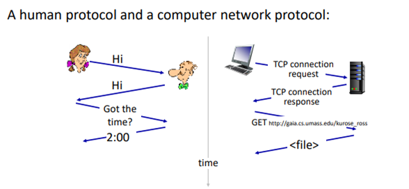
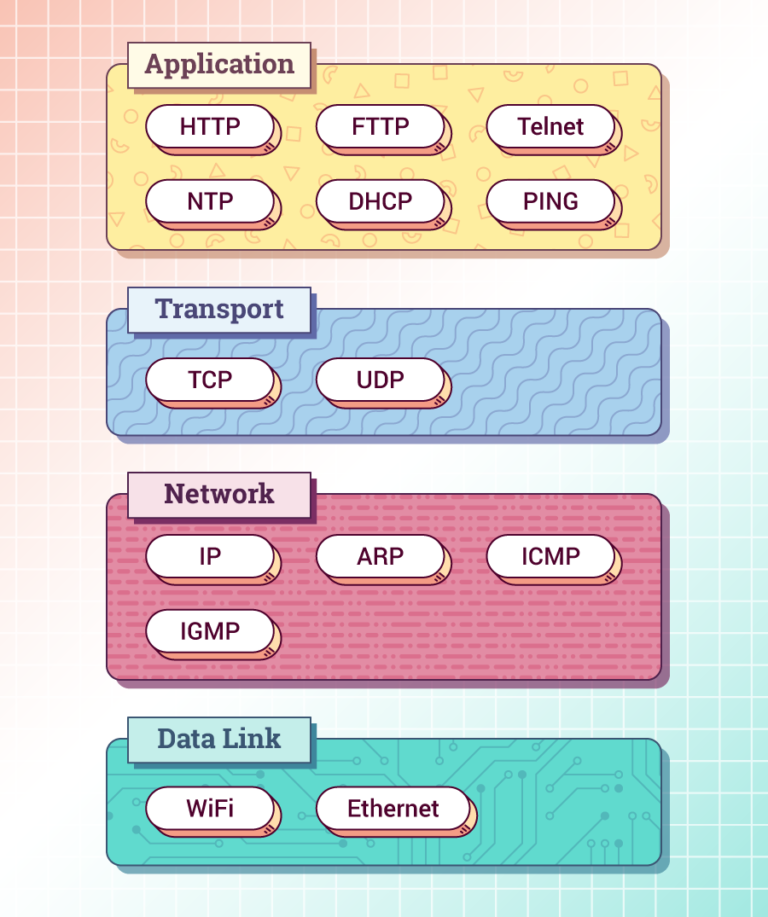
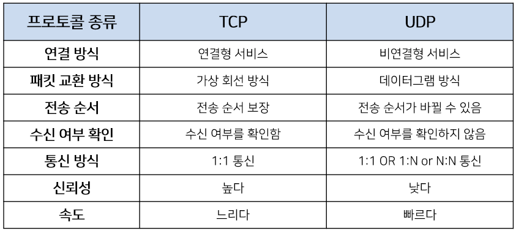

# 네트워크 하향식 접근

# 컴퓨터 네트워크와 인터넷

### **인터넷이란?**

1. **구성요소로 본 인터넷**

   > 전 세계적으로 수십억 개의 컴퓨팅 장치를 연결하는 컴퓨터 네트워크

   - 최근, 컴퓨팅 장치에는 주로 전통적인 데스크톱, PC, 자동온도 조절기, 자동차, 게임 … 같은 사물들에게도 확대됨.
     → 이러한 모든 인터넷 장치는 **호스트** 혹은 **종단 시스템(end system)**이라고 불림.

   📌 **종단시스템**

   - 통신링크와 패킷스위치의 네트워크로 연결
   - 한 종단 시스템 → 다른 종단 시스템으로 보낼 때,
     1. 데이터 → 세그먼트 단위로 나눔
     2. 각 세그먼트(메모리의 한 부분. 최대 64KB)에 헤더를 붙임
     3. 이렇게 만들어진 정보 패키지 → **패킷**이라 명명.
     4. 이 패킷은 목적지 종단 시스템으로 네트워크를 통해 보내짐
     5. 목적지(종단시스템)에서 원래의 데이터로 다시 조립

   📌 **패킷 (Packet)**

   - pack + bucket의 합성어
   - 즉, 정보를 보낼 때, 특정 형태를 맞추어 보낸다.
   - 즉, 컴퓨터 간 데이터 주고 받을 때 → 네트워크 통해서 전송되는 데이터 조각

   📌 **패킷 스위치 (패킷 교환기)**

   - 종단 시스템 간 데이터 교환 쉽게
   - 입력 통신 링크의 하나로 도착하는 패킷을 받아서 출력 통신의 하나로 그 패킷 전달

2. **서비스 측면에서 본 인터넷**

   > 종단 시스템에서 수행되는 애플리케이션에 서비스를 제공하는 인프라스트럭쳐

   ex) 음악 스트리밍, SNS,스마트폰 …

   → 위의 예시와 같은 이러한 애플리케이션들은 서로 데이터를 교환하는 많은 종단 시스템을 포함하고 있기 때문에 **분산 애플리케이션**이라고도 불림

### **프로토콜이란?**

- **사람에 있어서 프로토콜**
  > 명확하게 송.수신된 메세지와 이러한 메세지가 송.수신될 때나 다른 상황이 발생했을 때 취하는 행동
- **네트워크에 있어서 프로토콜**
  > 둘 이상의 통신 개체 (Entity)간 교환되는 메세지 포맷, 순서뿐 아니라, 메세지의 송수신과 다른 이벤트에 따른 행동들 정의
  > → 인터넷과 일반 컴퓨터 네트워크는 많은 프로토콜을 이용

### TCP/IP Layer **(**TCP/IP **Layer)**

- **TCP/IP 란?**
  - IP + TCP라는 두 가지 프로토콜 방식을 조합, 인터넷 통신하는 것
  - 송신자 → 수신자에게 IP 사용하여 최대한 빠르게 패킷 전송
  - TCP → 패킷을 정상적으로 수신받음
- 인터넷의 핵심인 TCP/IP는 데이터 전송 과정 역할에 따라, 응용,전송,인터넷,네트워크, 데이터링크 계층으로 나뉜다.
- 데이터 전송 시→ 상위 →하위로, 수신 시 → 하위 → 상위 계층으로 이동

1. **Application 계층**
   - HTTP, FTP, 같은 프로토콜을 포함
   - 여러 종단에 분산되어 있어,
     한 종단 시스템에 분산돼 있는 애플리케이션 ←→ 다른 종단 시스템과 정보 패킷을 교환하는데 이 프로토콜을 사용
2. **Transport 계층**

   - TCP / UDP 이라는 두가지의 프로토콜이 존재
     - TCP : 연결 지향형 서비스 제공 , 패킷을 정상적으로 받을 수 있도록하는 프로토콜
     - UDP : 비연결형 서비스 제공
   - client ←→ server간 메세지 전달
   - 트랜스포트 계층 패킷을 세그먼트라고 함.

3. **Network 계층**

   - 네트워크 ←→네트워크 연결
   - 직접 연결되지 않은 컴퓨터 간 데이터 통신을 구현하는 역할
   - 네트워크 연결 → 데이터 전송하기 위해 반드시 필요한 장비가 “라우터”
   - 흔히 IP계층이라고도 불림.

4. **DataLink 계층**
   - 데이터 → 전기 신호로 변환, 물리적 주소인 MAC 주소 사용 → 알맞은 기기로 데이터 전달하는 계층
   - 프로토콜로는 이더넷, Wifi 등이 사용

# 애플리케이션 계층

1. **애플리케이션이 이용 가능한 트랜스포트 서비스**

   - **TCP**

   1. 연결 지향형 서비스
   2. 클라이언트 ←→ 서버가 서로 전송 제어 정보를 교환 ⇒ 핸드셰이킹
   3. 신뢰적인 데이터 전송 서비스 ⇒ 올바른 순서로 전달 가능
   4. 암호화를 강화한 TLS(Transport Layer Security)를 개발 → 암호화, 데이터 무결성, 종단 인증 포함

   -**UDP**

   1. 신뢰성보다, 지연을 줄이기 위함 (빠름)
   2. 보다 더욱더 데이터 전송에 대한 집중
   3. connection UUID라는 고유한 식별자로 서버와 연결 → 커넥션 재수립이 필요 없음 ⇒ 지연 줄임

   - **QUIC (Quick UDP Internet Connections)**

   1. google 자체 프로토콜
   2. 2012년에 처음 구현, 적용
   3. 구글 크롬에서부터 구글 서버 모든 연결 절반 이상에 사용
   4. TLS기본 적용
   5. 아직 점유율 낮음
   6. TCP 를 사용하는 연결 지향 웹 애플리케이션 성능 개선

      → 새로운 연결에 대한 핸드세이크로 인한 지연 해결

      → 사용자 ip가 바뀌어도 연결 유지 (와이파이 →셀룰러 → 끊임없이 시청 가능)

1.  **웹과 HTTP**

    - **HTTP란?**

      1. client ←→ server사이 이뤄지는 요청/ 응답 프로토콜
      2. HTTP Header에는 client, server가 요청, 응답에 대한 부가적인 정보(캐시, 컨텐트 타입, 요청자..)를 전송할 수 있게끔 함.

    - **HTTP 1 (HTTP 0.9는 상용화가 되지 않아 생략)**

      1. 1996 release
      2. proxy서버에서 많이 사용. GET, HEAD, POST가능
      3. 1 connection → 1file만 가능. 즉, 동시 전송 불가능

    - HTTP 1.1

      1. 1999 release
      2. 모든 메소드 다 가능
      3. multiple request 처리 가능
      4. _무거운 header 구조_
         1. 많은 meta 정보 저장
         2. 다수의 http 요청마다 중복된 헤더값 전송

    - HTTP 2 (From 🐢 to 🚀 )

      1. HTTP 대체가 아닌 확장
      2. Multiplexed Streams : 한 커넥션 → 동시에 여러 개 메세지 주고 받고 가능
      3. Stream Prioritization : resource간 우선순위 설정
         1. 여러개의 css, image요청 → 우선순위 설정 가능
      4. 무거운 header → 중복 헤더 제거 (헤더 압축 가능)
      5. 2020년 기점으로 대부분 웹사이트가 http2

    - HTTP 3
      1. HTTP 1/2는 TCP와 통신, HTTP3는 UDP기반 QUIC 프로토콜 사용
      2. HTTP2 release 4년만에 출시
      3. TLS 기본 적용
      4. connection UUID로 서버와 연결
