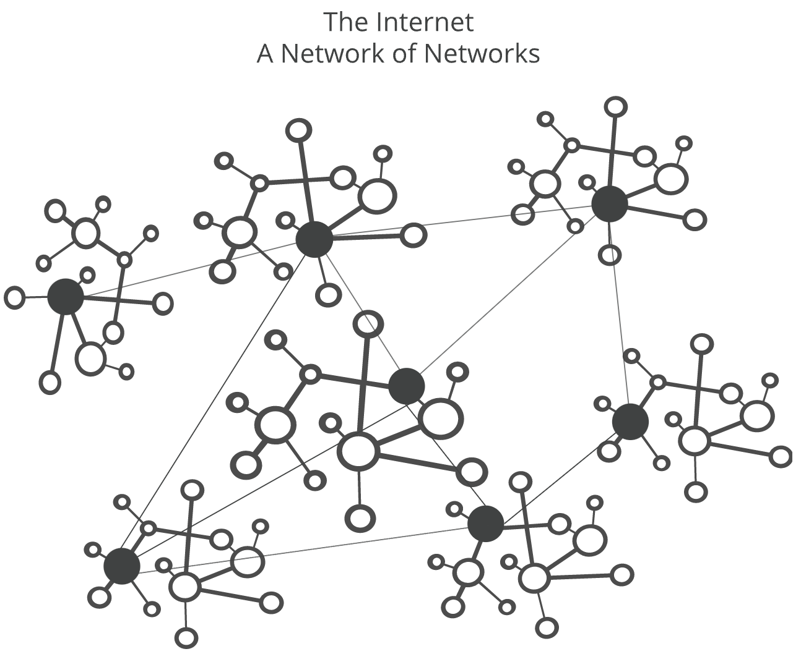
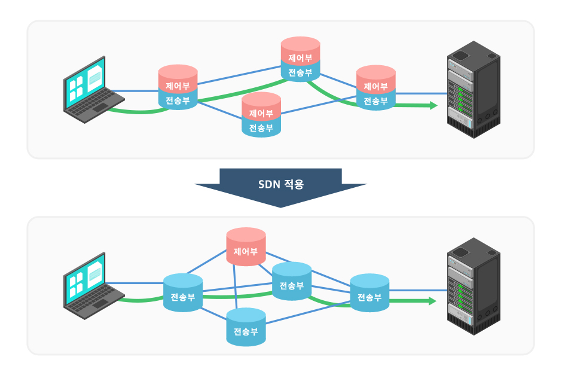
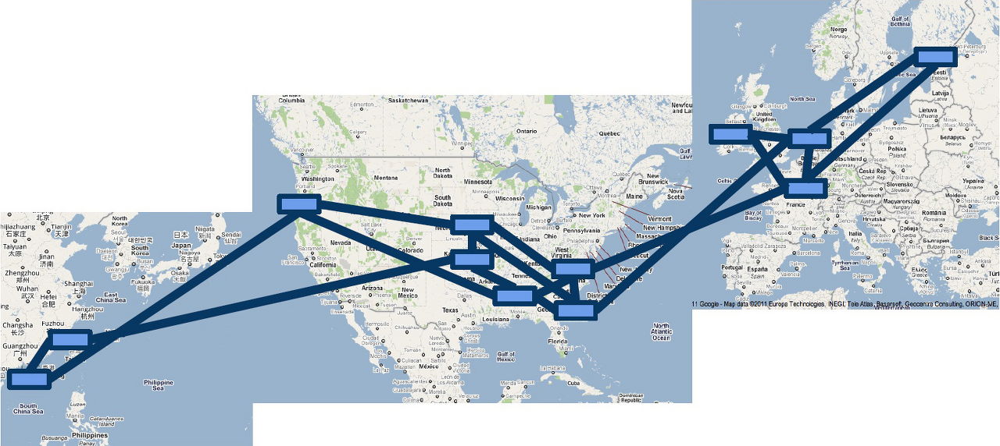

# 컴퓨터 네트워킹 하향식 접근(4)

Date: 2023년 3월 17일
Tags: Network

## 5. 제어 계층

- 네트워크 전체를 아우르는 구성요소
- 데이터그램이 출발지 호스트 → 목적지 호스트까지 어떻게 전달되는지 제어
- 네트워크 계층 구성요소와 서비스를 어떻게 설정, 관리할지 제어
- 최소 비용 경로를 계산하기 위한 전통적인 라우팅 알고리즘 다룸
  - ex)
    - OSPF (Open Shortest Path First, 개방형 최단 경로 우선)
    - BGP (Border Gateway Protocol, 경계 경로 프로토콜)

### 라우팅 알고리즘

---

- 송신자 → 수신자까지 라우터의 네트워크를 통과하는 최소 비용 경로 를 결정하는 것.
- 이러한 경로를 계산하는 것은 네트워킹의 기본
- 첫 번째로, 중앙 집중형, 분산 라우팅 알고리즘으로 분류를,
- 두 번째로, 정적/동적 알고리즘으로 분류할 수 있다.

1.  1. **중앙 집중형 라우팅 알고리즘 (Centralized Routing Algorithm)**
       - 네트워크 전체에 대한 완전한 정보를 가지고, 출발지와 목적지 사이 최소 비용 경로를 계산
       - 모든 노드 사이의 연결 상태와 링크 비용을 입력값으로 함
       - 링크 상태(Link state)알고리즘이 속함
       - 주로 다익스트라 알고리즘을 사용
    2. **분산 라우팅 알고리즘 (Decentralized Routing Algorithm)**
       - 최소 비용 경로의 계산이 라우터들에 의해 반복적이고, 분산된 방식으로 수행
       - 어떤 라우터도 모든 링크 비용에 대한 완전한 정보를 갖고 있지 않지만,
         각 라우터는 자신에게 연결된 인접 노드에 대한 링크 비용 정보를 앎.
         이후, 반복된 계산과 인접 노드와의 정보 교환을 통해, 목적지까지 최소 비용 경로 계산
       - 거리 벡터 알고리즘이 속함
       - 주로 벨만-포드 알고리즘 사용

2.

3.  **정적 라우팅 알고리즘 (Static ~)**
    - 아주 느리게 변함
    - 종종 사람이 개입 ( 사람이 직접 링크 비용을 수정하는..) 한 결과로 인해 발생
4.  **동적 라우팅 알고리즘 (Dynamic ~)**

    - 주기적으로, 혹은 토폴로지나 링크 비용의 변경에 직접적으로 응답하는 방식으로 수행
    - 네트워크 변화에 빠르게 대응한다는 장점
    - 경로의 루프나 경로 진동 같은 문제에 취약 하다는 단점

5.  **링크 상태 라우팅 알고리즘 (Link State)**

    - 네트워크 전체 정보를 이용하는 알고리즘
    - 네트워크 토폴로지와 모든 링크 비용이 알려져 있어, 링크 상태 알고리즘의 입력값으로 사용 가능
      ➡️ 노드가 자신과 직접 연결된 링크 식별자와 비용 정보를 담은 링크 상태 패킷을 네트워크상의 다른 모든 노드로 브로드캐스트함으로서 가능
      ➡️ 이는 종종 **링크 상태 브로드캐스트 알고리즘**에 의해 수행
    - 발명자 이름을 따서 다익스트라 알고리즘이라고 부름

6.  **거리 벡터 알고리즘 ( Distance-Vector )**

    - 반복적이고 비동기적, 분산적 알고리즘
    - 각 노드는 하나 이상의 직접 연결된 이웃으로부터
      - 정보를 받고, 계산을 수행,
      - 계산된 결과를 다시 이웃에게 배포한다는 점에서 **분산적**
      - 이웃끼리 더이상 정보를 주고받지 않을 때까지 반복

    | 링크 상태 알고리즘 (LS)        | 거리 벡터 알고리즘 (DV)              |
    | ------------------------------ | ------------------------------------ |
    | 네트워크 전체를 인식           | 이웃한 라우터 시각에서 네트워크 인식 |
    | 다른 라우터까지 최단 경로 계산 | 라우터 ↔ 라우터 거리 계산            |
    | 이벤트 기반의 갱신 신호 교환   | 주기적으로 갱신 데이터 교환          |
    | 링크상태 정보만 교환           | 이웃한 라우터와 라우팅 테이블 교환   |
    | 중앙 집중형 알고리즘에 포함    | 분산형 알고리즘에 포함               |
    | 다익스트라 알고리즘에 속함     | 벨만-포드 알고리즘에 속함            |

### 인터넷에서의 **AS 내부 라우팅 : OSPF**

---

- **AS ( Autonomius System, 자율 시스템 )**
  - 인터넷은 “AS”라는 수십만 개의 작은 네트워크로 나눠짐
  - 이들은 각각 기본적 하나의 조직이 운영하는 라우터들의 큰 집합
- OSPF (Open Shortest Path First) 라우팅은 AS 내부라우팅에 널리 사용
- 링크 상태를 확인하여, 최단 경로를 찾는 알고리즘을 통해 확인된 최단 경로를 바탕으로, 패킷을 전달해주는 라우팅 프로토콜
- 링크 상태를 플러딩( 어떤 노드에서 온 패킷을 라우터에 접속되어 있는 다른 노드로 전달) 하고, 다익스트라 최소 비용 경로 알고리즘을 사용하는 **링크 상태 알고리즘**
- 인접한 라우터 뿐만 아니라, 자율 시스템 내 다른 모든 라우터에게 라우팅 정보를 브로드캐스팅
- “Area”라는 개념 사용 → OSPF 네트워크를 더 작은 영역으로 나눈 다음 관리 → 효율적인 라우팅 관리 가능 && 대규모 네트워크 안정되게 운영 가능

### 인터넷 서비스 제공업자 (ISP) 간 라우팅 : BGP (경계 경로 프로토콜)

---

- 인터넷에 있는 수천 개의 ISP 들을 연결하는 프로토콜, 인터넷 프로토콜 중 가장 중요
  - 즉, 데이터 라우팅을 가능하게 함으로써 인터넷 작동하게하는 프로토콜
- 누군가 우체통에 편지를 넣어 놓음 → 우체국에서 편지 수거, 수신자에게 전달하기 위한 가장 효율적인 경로를 선택하듯,
  ➡️ 누군가 인터넷 통해 데이터를 제출 → 가용 경로 모두 검토, 최적 경로 선택하는 일 담당 (BGP)
- 목적지가 AS **외부**에 있는 경우 → BGP (Border Gateway Protocol)가 필요
- 이웃 AS 통해 도달 가능한 서브넷 프리픽스 정보 (CIDR 형식으로 된) 를 얻는다.
- BGP에서 프리픽스와 그것의 속성을 “경로”라고 함.
- 서브넷 주소 프리픽스로의 가장 좋은 경로를 결정
- OSPF 등의 라우팅 방식에 비해, 규모가 큰 망을 지원 가능

### SDN (소프트웨어 정의 네트워크, Software Defined Network)

---

- 소프트웨어를 통해 네트워크 리소스를 **가상화/추상화**하는 네트워크 인프라에 대한 접근 방식
  ➡️ 즉, SW 애플리케이션과 API 이용 → 네트워크 프로그래밍 && 중앙에서 전체 네트워크 제어하고 관리

1. **작동방식**

   - 제어부(Control Plane)와 전송부(Data Plane)의 분리
     - 기존 라우터는 제어부, 전송부가 같이 존재
   - 제어부 ⇒ 네트워크 장비를 제어하는 뇌에 해당 (별도의 컴퓨팅 서버로 분리)
   - 전송부 ⇒ 데이터를 전송하는 역할에 해당 (데이터 전송 기능만 담당)

1. **어떤 경우에 사용?**

   - SDN은 데이터 센터에서 **전환, 라우팅 및 부하 분산**과 같은 네트워크 및 네트워크 서비스를 중앙에서 구성하고 관리하는 방법 제공
     → 매일 수만 개의 네트워크 변경을 효율적으로 수행해야하는 서비스의 경우,
     글로벌 규모 데이터 센터 네트워크를 운영하는 것은 **“SDN”**에서만 가능.

1. **장점**

   - 비용 절감
     - 제어부, 전송부 분리 → 관리 관소화 & 운영에 들어가는 비용 감소
   - 확장성 및 유연성
     - “가상화” ⇒ HW → SW로 전환, 더이상 물리적 리소스 한계에 구애받지 않아도 된다.
     - 원하는 시기에 필요한 만큼 네트워크 리소스 확장 & 축소 가능

1. **적용 사례**

   

   1. 구글 B4
      - B4 : OpenFlow위에 구글이 직접 설계한 SDN 제어 평면 有
      - 2010년부터 시작한 OpenFlow 프로젝트 → 전 세계에 흩어져있는 구글 데이터센터를 SDN 기반으로 전환하는 프로젝트
      - 어마어마하게 많은 구글 초울트라 빅데이터들을 옮기는 작업 → 구글은 자체적으로 네트워크 장비를 제작 → SDN을 구현하고 이를 해결
        - 100%에 가까운 인프라 리소스 활용 가능하게끔 함.
        - 비용 절감

### ICMP (인터넷 제어 메세지 프로토콜, Internet Control Message Protocol)

---

1. 정의
   - 호스트 ↔ 라우터 서로 간, 네트워크 계층 정보를 주고받기 위해 사용
   - 네트워크 계층에 속하며, IP 프로토콜과 함께 사용 (반면 IP는 신뢰성을 보장 x)
   - 가장 전형적인 사용 형태는 “오류 보고”
     - 도착지 호스트가 없거나
     - 포트가 닫혀 있는 등
       ➡️ 이러한 에러 상황이 발생한 경우, IP 헤더에 기록되어 있는 **출발지 호스트로 에러에 대한 정보를 보내주는 역할**
     - DDos 공격에 악용될 수도 있다.
2. ICMP 사용 명령어
   - 윈도우의 Ping 명령어 : 상대방 호스트 작동(응답) 여부 및 응답 시간 측정하는데 사용
   - Tracert : 목적지까지의 라우팅 경로를 출력해주는 명령어 → 특정 사이트 접속되지 않는 경우, 어떤 회선에서 병목이 발생했는지 알아보는데 아주 유용한 명령어
