# 네트워크 레이어 (Network Layer)

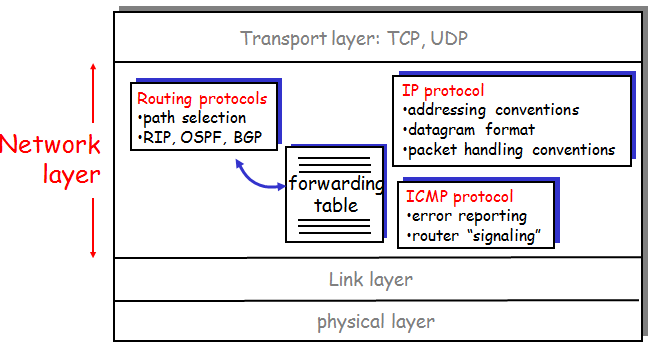

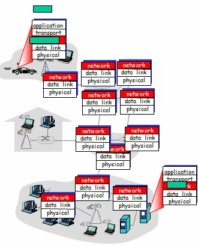

- IP 프로토콜을 활용한다.
- transport layer의 segment 단위에 header를 붙이고 캡슐화 한 packet(datagram) 단위를 다룬다.
- 네트워크 레이어 프로토콜은 모든 인터넷 호스트와 라우터에 적용된다.

---

## 두 가지 주요 역할

## forwarding

- 라우터는 적절한 경로로 패킷을 이동시킨다.
- 라우터 내에는 forwarding table이 존재하며 이를 활용해 경로를 찾는다.

## routing

- 라우터는 패킷이 이동할 경로를 결정한다.
- 라우팅 알고리즘(RIP, OSPF, BGP)
- 라우팅 알고리즘을 이용해 forwarding table을 생성한다.

### forwarding table

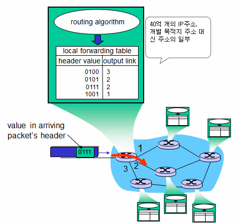

- 개별 IP 주소로 테이블을 만든다면, 테이블 크기가 비대해지므로 대신, 주소의 범위로 테이블 키 값을 만든다.
- 패킷의 헤더에 존재하는 목적지 주소값을 확인한다.
- **Longest prefix matching** 을 활용해 매칭된 주소 중 가장 긴 prefix를 갖는 주소 범위로 라우팅한다.

---

# IPv4

- 유일한 값을 갖는 32bit 길이의 주소 체계
- 아이피 주소는 계층적으로 구성된다. (prefix 이용)
- Network Interface Card(NIC)마다 유일한 값을 갖는다.
  - 각각의 인터페이스(PC, Router 등)를 구분하기 위한 값이다.
  - 라우터는 여러 개의 NIC를 이용하여 다양한 IP 주소를 매핑한다.

## subnet mask (= prefix, network id)

- IP 주소는 네트워크 파트와 호스트 파트로 분리된다.
- subnet 마스크를 이용해 컴퓨터는 이를 구분할 수 있기 때문에, IP 주소와 서브넷 마스크는 항상 한 쌍으로 다닌다.

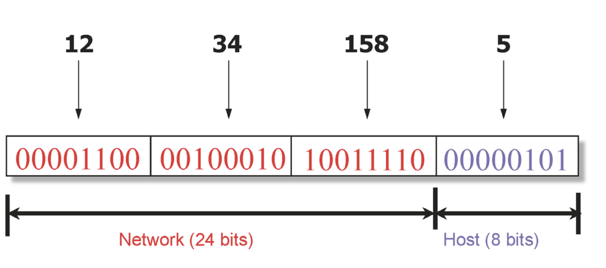

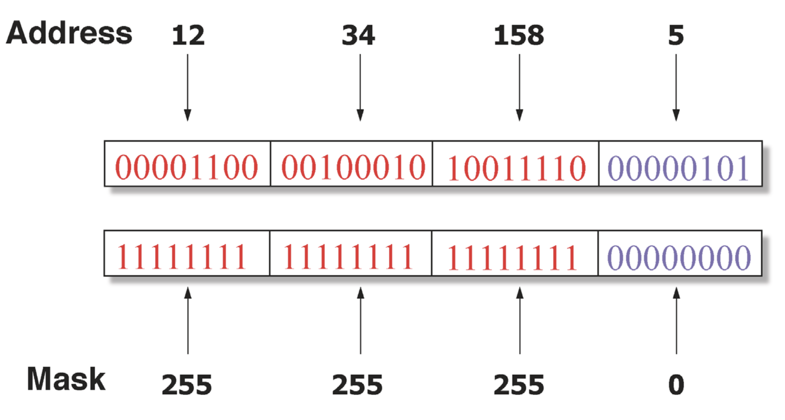

## Classful Addressing

과거에 활용했던 IP 주소 할당 기법을 말한다.

- Class A (0*) : 8 bit 블록의 네트워크 파트를 가진다. 나머지 2^24(2^4 * 100만 가량) 크기의 호스트를 설정할 수 있다.
- Class B (10\*) : 16 bit 블록의 네트워크 파트를 가진다.
- Class C (110\*): 24 bit 블록의 네트워크 파트를 가진다.

## Classless Inter-Domain Routing(CIDR)

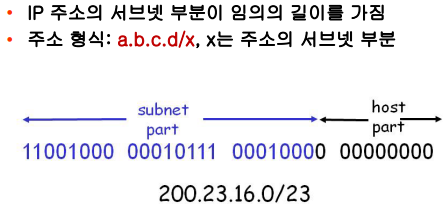

기존의 클래스를 이용한 주소 할당의 비합리성을 제거한 더 유연한 방식으로 prefix 를 제공한다.

- prefix의 길이가 고정되어 있지 않다. 필요한 호스트의 수에 적절하게 prefix 길이를 정한다.
- forwarding table의 사이즈도 훨씬 효율적으로 구성된다.

## IP Packet

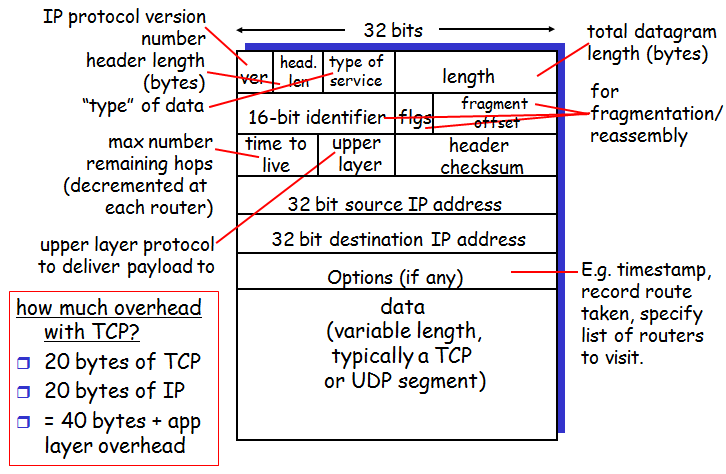

## IP fragmentation, reassembly

- Maximum Transmission Unit : 링크 계층에서 전달할 수 있는 프레임의 최대 크기
  - 링크 계층 프로토콜마다 다르다.
- 패킷이 MTU를 초과한다면 이를 분할(단편화)해서 전송하게 된다.
  - 최종 목적지에서 결합이 이루어지며, 조각이 유실되는 경우 결합은 실패한다.
  - 제대로 응답이 전송되지 않는 경우, transport layer 에서 타이머가 동작하고, 재전송을 요청하게 될 것이다.
- 패킷 헤더의 identifier와 fragflag, offset을 이용한다.

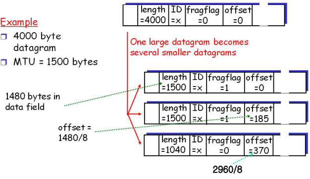

---

# Subnet

- IP 주소 체계에서 동일한 서브넷 주소를 갖는 인터페이스들의 집합을 말한다.
  - 이를 활용하여 라우팅 테이블 구성의 용이해진다.
- 동일 서브넷 그룹 안에서는 라우터를 거치지 않고, 통신이 가능하다.

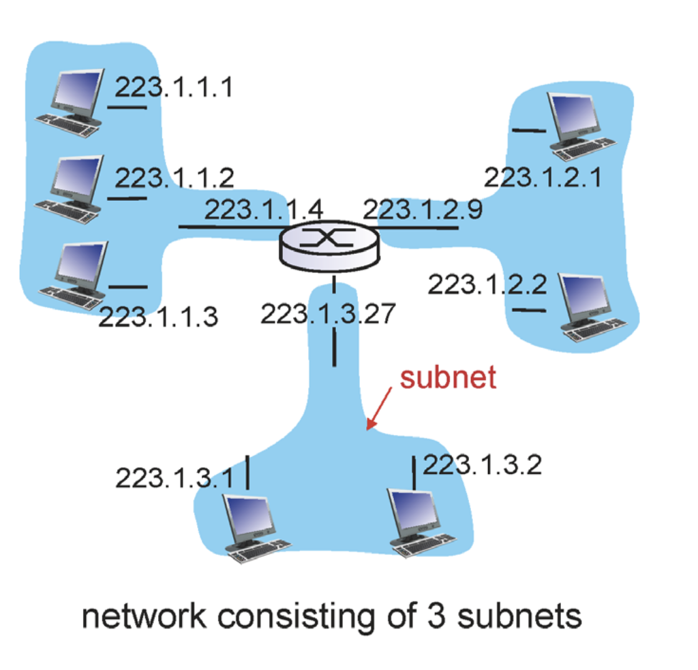

# NAT (Network Address Translation)

보통 게이트웨이 라우터에서 NAT 기능을 제공한다.

- IPv4 방식의 주소 할당 체계에서 할당할 수 있는 주소의 수 부족 문제를 해결하기 위해 고안된 기법이다.
- 특정 subnet에서 외부 통신을 하는 경우, 글로벌하게 유일한 주소를 공유해서 사용하고, 내부적으로는 다른 주소를 할당받아서 각 인터페이스를 구분하는 방식이다.
- NAT 기능을 이용해 외부 주소로 변경할 때, 패킷의 데이터 안에 들어있는 포트 정보까지 수정하여 활용하여, 레이어 violation이 발생한다.
- 라우터가 IP 주소를 조작하는 일을 수행하므로, 고안된 기능 외 동작을 하게 된다.

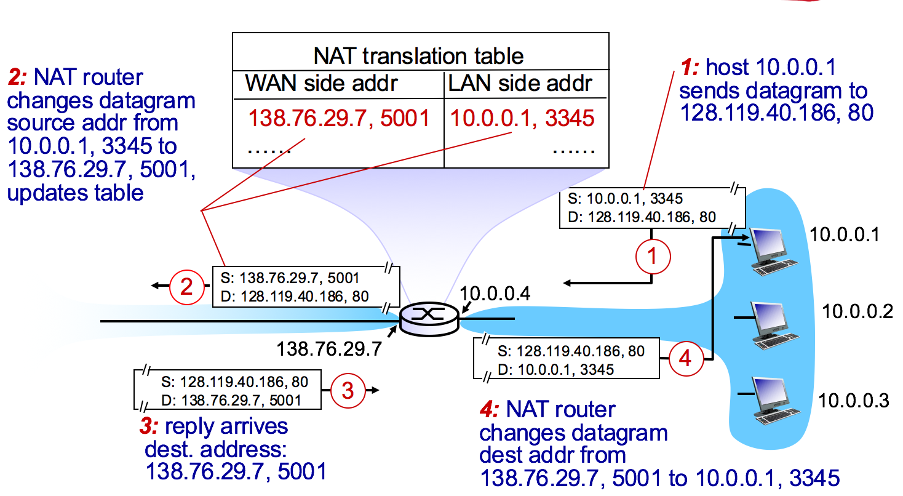

- NAT 대신 IPv6 등 다른 대안을 적용해야 한다.

# DHCP(Dynamic Host Configuration Protocol)

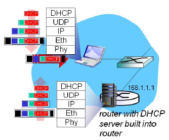

호스트가 네트워크에 접속하면 동적으로 IP를 할당해주는 프로토콜

- 고정 IP 방식에 비해 효율성이 높다.
- DHCP 서버는 App Layer

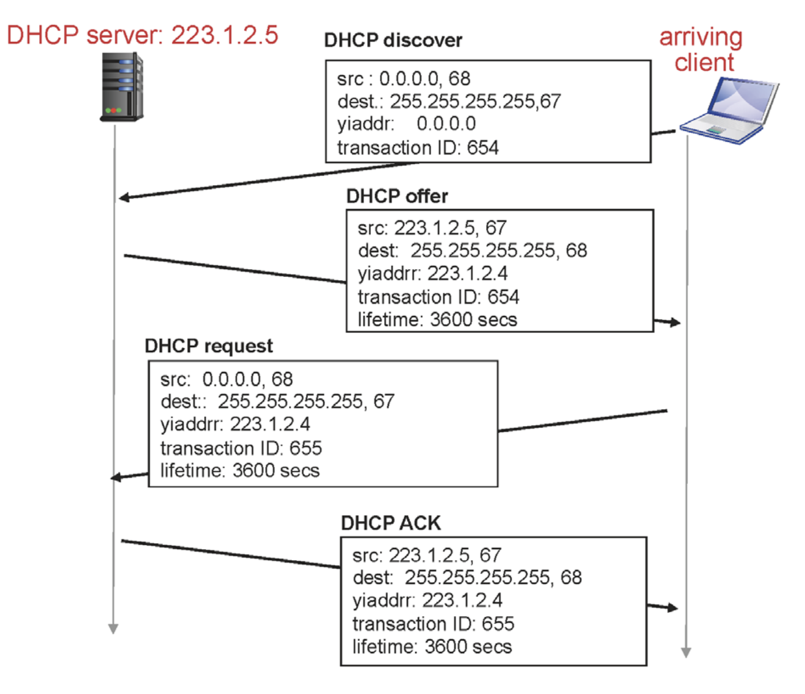

- DHCP discover : 네트워크에 도착한 클라이언트는 DHCP 서버를 찾아서 브로드캐스팅을 한다.
- DHCP offer : 메세지를 받은 DHCP 서버는 사용가능 시간과 IP 주소를 알려주면서 할당 오퍼를 제공한다.
  클라이언트는 아직 할당 받은 주소가 없으므로, 마찬가지로 브로드캐스팅을 한다. 트랜잭션 ID와 포트 넘버로 구분이 가능할 것이다.
  ( 그 외 DHCP 서버 주소, DNS 서버 주소, 라우터 주소 등의 정보도 함께 제공한다. 보통 게이트웨이 라우터가 모든 기능을 함께 담당하는 편이다. eg. 무선공유기)
- DHCP request : 제공받은 offer를 쓰겠다는 요청을 보낸다. DHCP 서버가 여러 개 존재할 수 있으므로 브로드캐스팅으로 요청을 보내 특정 DHCP의 오퍼를 활용한다는 것을 알릴 수 있다.
