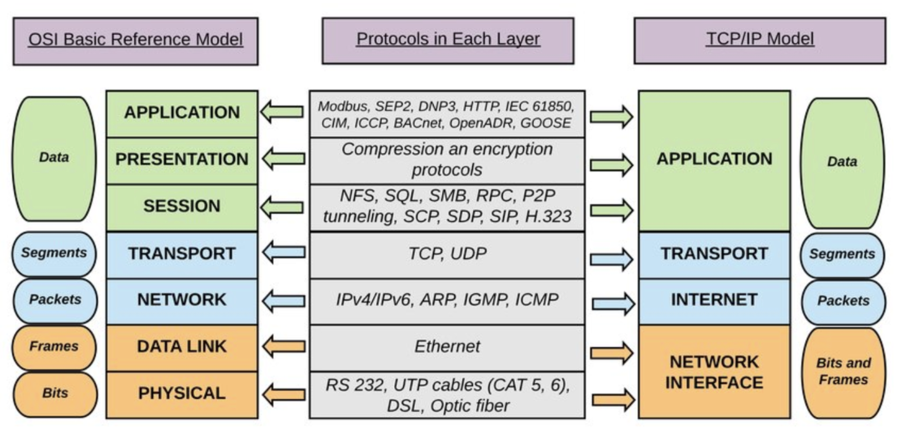

# 네트워크 계층 - OSI 7 Layer, TCP/IP Protocol의 4 Layer

## 0. Protocol

- 통신 동작의 규칙을 정한 것

## 1. OSI 7 Layer

- [출처] : [https://www.lifewire.com/osi-model-reference-guide-816289](https://www.lifewire.com/osi-model-reference-guide-816289)

### 7. Application Layer

네트워크 어플리케이션이 동작하는 계층으로, 어플리케이션 계층에서 동작하는 프로토콜은 다음과 같다. HTTP, SMTP, FTP 프로토콜이 동작한다. 어플리케이션 계층에서 주고 받는 데이터는 **message** 라고 불린다.

### 6. Presentation Layer

어플리케이션 계층의 데이터를 어떻게 표현할지 정하는 역할을 하는 계층이다.

### 5. Session Layer

응용 프로세스가 통신을 관리하기 위한 방법을 정의하는 계층으로, 세션을 만들고 없애는 역할을 한다.

### 4. Transport Layer

전송 계층은 end point의 사용자들이 신뢰성 있는 데이터를 주고 받게 해주는 역할을 한다. 이 계층에서의 프로토콜은 **TCP, UDP**가 있고, 이 계층에서 주고 받는 데이터는 **segment** 라고 불린다.

### 3. Network Layer

네트워크 계층은 송신지에서 목적지까지 책임감있게 전달하는 역할을 한다. 이 계층의 프로토콜은 IP이며, 네트워크 계층에서 주고 받는 데이터는 **datagram** 이라고 불린다.

### 2. Data Link Layer

네트워크의 데이터 형식을 정의하는 계층이다. 데이터 링크 계층에서 주고 받는 데이터 단위는 **프레임** 이라고 불린다. 오류 없이 안전하게 데이터를 보내는 역할을 한다. 

### 1. Physical Layer

네트워크 노드 간의 물리적인 케이블 연결 또는 무선 연결을 담당하는 계층으로, 최하위 계층이다. 노드를 비트로 보내는 역할을 한다. 데이터의 물리적 이동이 일어나는 계층이다. 

## 2. TCP / IP

TCP / IP 프로토콜은 네트워크를 통해 통신하는데 쓰이는 통신 규약의 모음이다. TCP / IP는 OSI 7 Layer 와는 조금 다른 TCP/IP 의 구조적인 계층 위에서 동작한다.

- [출처] : [https://www.researchgate.net/figure/The-logical-mapping-between-OSI-basic-reference-model-and-the-TCP-IP-stack_fig2_327483011*](https://www.researchgate.net/figure/The-logical-mapping-between-OSI-basic-reference-model-and-the-TCP-IP-stack_fig2_327483011*)

### 1. Network Interface Layer

- 노드 간의 신뢰성 있는 데이터 전송을 담당하는 계층

### 2. Internet Layer

- 호스트 간의 라우팅을 담당하는 계층

### 3. Transport Layer

- 프로세스 간의 신뢰성 있는 데이터 전송을 담당하는 계층

### 4. Application Layer

- 서버나 클라이언트 응용 프로그램이 동작하는 계층