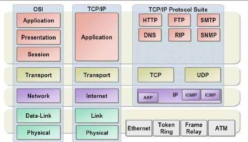
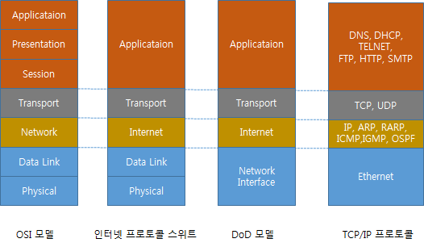
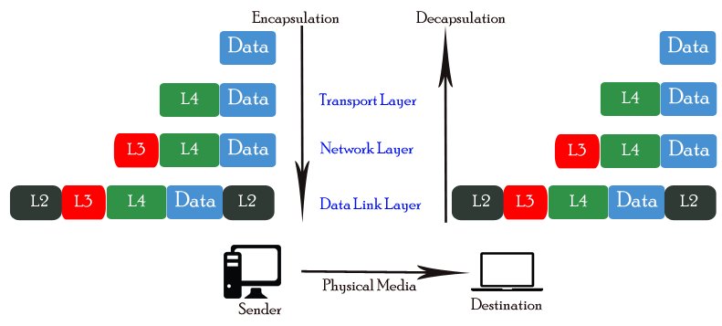
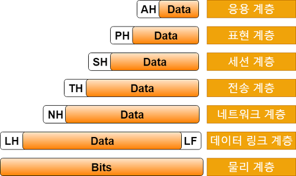
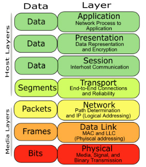
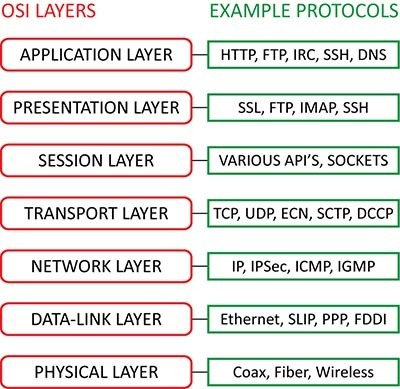

# 네트워크 계층

## 통신 계층 구조

네트워크 계층 구조

표준 기구에서는 통신 개체 사이에 **통신을 효과적으로 진행할 수 있도록 역할에 따라 여러 개의 계층**으로 나누고 있다. 

즉, 네트워크의 연결과 관련하여 각기 다른 역할을 담당하는 기능/장비들이 어떠한 **절차와 규약을 바탕으로 한 논리 구조 위에서 동작하는지 정리해 표준화** 한 것이다.

그 중에 대표적인 것이 OSI (Open System Interconnection) 모델과 인터넷 프로토콜 스위트(Internet Protocol Suite, 혹은 DoD 모델) 이 있다.

> **인터넷 프로토콜 스위트**([영어](https://ko.wikipedia.org/wiki/%EC%98%81%EC%96%B4): Internet Protocol Suite)는 [인터넷](https://ko.wikipedia.org/wiki/%EC%9D%B8%ED%84%B0%EB%84%B7)에서 [컴퓨터](https://ko.wikipedia.org/wiki/%EC%BB%B4%ED%93%A8%ED%84%B0)들이 서로 정보를 주고받는 데 쓰이는 통신규약([프로토콜](https://ko.wikipedia.org/wiki/%ED%86%B5%EC%8B%A0_%ED%94%84%EB%A1%9C%ED%86%A0%EC%BD%9C))의 모음이다. 인터넷 프로토콜 슈트 중 [TCP](https://ko.wikipedia.org/wiki/%EC%A0%84%EC%86%A1_%EC%A0%9C%EC%96%B4_%ED%94%84%EB%A1%9C%ED%86%A0%EC%BD%9C)와 [IP](https://ko.wikipedia.org/wiki/%EC%9D%B8%ED%84%B0%EB%84%B7_%ED%94%84%EB%A1%9C%ED%86%A0%EC%BD%9C)가 가장 많이 쓰이기 때문에 **TCP/IP 프로토콜** 슈트라고도 불린다.
> 

# TCP/IP 계층

### 탄생 배경

인터넷 프로토콜 스위트는 1960년대 말 미 국방성 산하 방위고등연구계획국(DARPA)이 수행한 연구개발의 결과로 탄생하였다.

- DARPA에서는 TCP/IP 통신 방식을 미 국방성DoD(Department of Defence)의 통신 표준으로 채택하며, 인터넷 프로토콜 스위트 또는 DoD 모델이라고도 불리는 TCP/IP 4계층 구조를 정리하였다.
- 냉전 시대이던 당시 **기존의 중앙 집중형 네트워크**는 회선 교환 방식을 위한 중앙에 있는 회선 교환기가 공격을 받으면 전체 통신이 끊어졌기 때문에, 이를 **보완**하기 위해 **일부가 공격 받아도 통신이 가능한 패킷 교환 방식을 사용**하기로 한다.
- 이 때, DARPA 에서는 'ARPANET' 이라는 인터넷의 시초라고 할 수 있는 패킷 교환 방식의 네트워크를 구축하고 TCP라는 통신 규약의 초기 모델을 만든다.

## 특징

- 인터넷 환경은 대부분 IP를 기반으로 한 TCP 통신으로 이루어진다. 이러한 TCP/IP 통신을 기준으로 만든 계층 구조이다.
- 인터넷 프로토콜 스위트는 OSI 모델의 상위 3계층을 응용 계층으로 통합한다.
- OSI 7 계층에 비해 간소화된 모델이다. 시간 상, 먼저 등장한 모델이다.
- TLS(세션 계층)를 설명하고자 할 때는 OSI 계층이 더 적합할 수 있다.

### 1. 네트워크 인터페이스 계층

- 1 계층인 물리, 2 계층인 데이터 링크 계층을 포함하며 OSI 계층과 같이 구분해서 이야기하기도 한다.
- 물리적 계층이다.

### 2. 인터넷 계층

- OSI 3 계층인 네트워크 계층과 동일하다.

### 3. 전송 계층

- OSI 4 계층과 동일하다.

### 4. 응용 계층

- 세션, 표현, 응용 계층을 포함한다.

# **OSI 7 계층 (OSI 7 Layer)**

- OSI모델은 시스템 상호 연결에 있어 표준 모델을 의미한다.
- **상호 이질적인 네트워크 간의 연결에 호환성 결여를 막기 위해 ISO(국제 표준화 기구, International Organization for Standardization)에서는 OSI모델을 제시**하였다.

### **OSI 7계층의 탄생배경**

- 여러 정보 통신 업체 장비들은 자신의 업체 장비 사이에서의 연결만 지원하고 다른 업체 장비와의 호환성은 지원하지 않았다.
- 위 이유로 ISO에서 1984년에 OSI모델을 발표하게 되었다.
- 모든 시스템들의 상호 연결에 있어 문제가 없도록 표준을 만든 것이며, 7개의 계층으로 구분이 된다.

## 캡슐화, 디캡슐화

OSI 7 계층에서는 데이터를 전송할 때, 각 층마다 별도로 인식할 수 있는 **헤더**가 붙는다. 이 헤더에는 그 계층에 대한 정보가 기록된다. 이런 과정을 **캡슐화Encapsulation**이라고 한다.

- 2계층(데이터 링크 계층)에서는 **오류 제어**를 위해 데이터의 뒷 부분에도 일부 데이터가 추가된다

반대로 데이터가 전송된 후, 수신자가 물리 계층부터 시작해 헤더의 정보를 확인하고 헤더를 떼어내는 과정은 디캡슐화Decapsulation이라고 한다.

>📢 통신 예시)
>
>1. 데이터를 처음으로 전송하는 호스트는 응용 계층에서 물리 계층까지 데이터를 **캡슐화** 한다. 
>2. 그리고 **물리 계층**에서는 **통신 회선을 통해 이웃하는 네트워크 장치에게 전달**한다. 
>3. 데이터를 전송하기 위한 **경로를 설정하고 판단하는 라우터**(3 계층, 네트워크 계층)에서는 **목적지가 지역망의 호스트인지 확인**한다.
    1. 로컬 서브넷 마스크를 이용하여 **상대방의 IP 주소 중에서 네트워크 ID를 구별**해 내어서, 이를 **라우터 자신이 속한 네트워크 ID와 비교**한다. 
>4. 만약 **지역망의 호스트가 맞다면 지역 호스트에게 전달**하고 **그렇지 않다면 이웃하는 라우터에게 전달**한다.
    1. 지역망에 존재하지 않는다면, **(2계층의) MAC 주소를 이용해 다른 라우터에게 전달**하게 된다. 이 과정에서 **목적지의 지역망에 도달할 때까지, 여러 라우터를 거쳐간**다고 한다.
>5. 목적 호스트는 물리 계층으로부터 수신하여 응용 계층까지 **디캡슐화**하여 상대가 보낸 데이터를 받는다.

### PDU(Process Data Unit)

각 계층에서 데이터 단위를 구분하는 개념이다. 

## 계층 상세

### 1. **물리계층(Physical Layer)**

- 7 계층 중 최하위 계층이다. 주로 **전기적, 기계적, 기능적인 특성**을 이용해 데이터를 전송한다. 
데이터는 **0과 1의 비트 열(bit stream)**, 즉 **On, Off 의 전기적, 물리적 신호 상태**로 이루어져 있다.
- 단순하게 장비를 가동시키기 위한 전기 공급부터 장비끼리의 물리적 연결을 위한 랜 케이블, 무선 통신을 위한 주파수 등의 전기적, 물리적인 것들을 모두 포함한다.
    - 통신 회선의 인터페이스와 전자적인 규격을 따라 데이터를 전송한다.
- 이 계층은 단지 데이터(전기적 신호)를 전달하기만 한다. 
오류 제어, 알고리즘 등이 없다. 어떤 에러가 있는지 같은 기능에는 전혀 관여하지 않는다.
- 대표적인 프로토콜/기술들은 전선, 광케이블, 동축 케이블, 랜 케이블, 무선 전파, 모뎀 등이 있다.

### 2. **데이터링크 계층(Data-Link Layer)**

- 물리 계층에서 송수신되는 **정보의 오류와 흐름을 관리**하여 **포인트 투 포인트(Point to Point) 간 신뢰성** 있는 정보의 전달을 수행할 수 있도록 도와주는 역할을 한다.
- 전송하는 데이터의 헤더에 다음 목적지 주소를 붙인다. 꼬리 부분에는 오류 검출을 위한 부분이 존재한다. 데이터의 단위는 **프레임(Frame)** 이다.
- 오류를 제어하고, 재전송하는 기능을 갖고 있다. (CRC 기반의 오류 제어와 흐름 제어)
- 3계층에서와 같이 논리 주소(IP 주소)를 활용하는 것이 아니라 **물리적인 주소( MAC주소)를 지정하여 장비 간 전송**을 수행한다. 
즉, **네트워크 카드는 만들어질 때부터 맥 주소(MAC address)** 가 정해져 있다.
- 데이터 링크 계층의 가장 잘 알려진 예는 이더넷이다.  +) 무선 랜 등
이 외에도 HDLC나 ADCCP 같은 포인트 투 포인트(point-to-point) 프로토콜이나 패킷 스위칭 네트워크나 LLC, ALOHA 같은 근거리 네트워크용 프로토콜이 있다.
- 네트워크 브릿지나 스위치 등이 이 계층에서 동작하며, 직접 이어진 곳에만 연결할 수 있다.

### **네트워크 계층(Network Layer)**

- 여러 개의 노드를 거칠 때마다 경로를 찾아주는 역할을 하는 계층이다. 
다양한 길이의 데이터를 네트워크들을 통해 전달하고, 그 과정에서 전송 계층이 요구하는 서비스 품질(QoS)을 제공하기 위한 기능적, 절차적 수단을 제공한다.
- **라우팅, 흐름 제어, 세그멘테이션(segmentation/desegmentation), 오류 제어, 인터네트워킹(Inter-networking) 등을 수행**한다.
    - 네트워크 계층은 네트워크에서 아주 중요한 기능들을 수행한다.
    - **라우팅** : 목적지까지 가장 안전하고 빠르게 데이터를 보내는 기능을 말한다. 따라서 최적의 경로를 설정하는 역할을 한다.
- 데이터를 연결하는 다른 네트워크를 통해 전달함으로써 인터넷이 가능하게 만드는 계층이다.
- 논리적인 주소 구조(**IP**), 곧 네트워크 관리자가 직접 주소를 할당하는 구조를 가지며, 계층적(hierarchical)이다.
    - 각 단말을 구분하도록 IP 주소를 할당하고 이를 이용해 통신을 할 수있다.
- 네트워크 계층에서 부르는 데이터 단위는 **패킷(Packet)**이라고 한다.
- 호스트 주소를 지정하는 IP 프로토콜, 주소를 변환하는 ARP와 RARP 프로토콜, IP 프로토콜 제어를 담당하는 ICMP, 멀티캐스팅을 지원하는 IGMP, 라우팅 프로토콜인 OSPF 등이 있다

### **전송 계층(Transport Layer)**

- 종단 간(end-to-end) 통신을 다루는 최하위 계층이다. 
**신뢰성 있고 효율적인 데이터를 전송하며, 기능은 오류 검출 및 복구와 흐름 제어, 중복 검사 등을 수행**한다.
    - **전송 계층은 양 끝 단(End to end)의 사용자들이 신뢰성 있는 데이터를 주고 받게 해주는 역할**을 해주어, 상위 계층들이 데이터 전달의 유효성이나 효율성을 생각하지 않도록 해준다.
    - 서로 다른 장비 간 각기 다른 **대역폭 속도를 서로 맞춰 주는 흐름 제어 역할**을 한다.
    - **시퀀스 넘버 기반의 오류 제어 방식**을 사용한다.
- 해당 계층의 데이터 유닛인 세그먼트를 **헤더에 담긴 port 번호로 구분하여 적절한 응용 계층이 나눠 받도록 분할**한다.
- 전송 계층은 특정 연결의 유효성을 제어하고, 일부 프로토콜(TCP)은 상태 개념이 있고(stateful), 연결 기반(connection oriented)이다. 이는 전송 계층이 패킷들의 전송이 유효한지 확인하고 전송 실패한 패킷들을 다시 전송한다는 것을 뜻한다.
- 대표적인 프로토콜로는 TCP(연결형)와 UDP(비연결형)가 있다.
    - TCP는 IP 위에서 동작하는 프로토콜이다. 그래서 TCP/IP라고 흔히 붙여 부른다고 한다.
    - UDP 는 수신 확인 과정을 거치지 않으므로 비연결형 프로토콜이다. 그러나 '전송'을 하기 위한 프로토콜 이므로, 전송 계층에 포함될 수 있다.
- 이 계층에서 사용하는 데이터 단위는 **세그먼트(Segment)** 라고 합니다.

### **세션 계층(Session Layer)**

- 양 끝단의 응용 프로세스가 통신을 관리하기 위한 방법을 제공한다.
- 동시 송수신 방식(duplex), 반이중 방식(half-duplex), 전이중 방식(Full Duplex)의 통신과 함께, 체크 포인팅과 유휴, 종료, 다시 시작 과정 등을 수행한다.
- 이 계층은 TCP/IP 세션을 만들고 없애는 책임을 진다.
- 통신하는 사용자들을 동기화하고 오류 복구 명령들을 일괄적으로 다룬다.
    - 예를 들어, 사용자 인증Authentication/로그인 관련
- 통신을 하기 위한 세션을 확립/유지/중단할 수 있으며, 운영체제에 의해 다루어진다.
- 대표적으로 TLS, SSH 등이 있다.

### **표현 계층(Presentation Layer)**

- 코드 간의 번역을 담당하여, 사용자 시스템에서 [데이터](https://ko.wikipedia.org/wiki/%EB%8D%B0%EC%9D%B4%ED%84%B0)의 형식 상 차이를 다루는 부담을 응용 계층으로부터 덜어 준다.
- [MIME](https://ko.wikipedia.org/wiki/MIME) 인코딩이나 암호화 등의 동작이 이 계층에서 이루어진다.
    - 예를 들면, [EBCDIC](https://ko.wikipedia.org/wiki/EBCDIC)로 인코딩 된 문서 [파일](https://ko.wikipedia.org/wiki/%EC%BB%B4%ED%93%A8%ED%84%B0_%ED%8C%8C%EC%9D%BC)을 [ASCII](https://ko.wikipedia.org/wiki/ASCII)로 인코딩 된 파일로 바꿔 주는 것이 표현 계층의 몫이다.
    - 포장/압축/암호화/복호화
    - 데이터를 어떻게 표현할 지 정하는 역할
- JPEG, MPEG, SMB, AFP 등의 프로토콜이 존재한다.

### **응용 계층(Application Layer)**

- 응용 프로세스와 직접 관계하여, 일반적인 응용 서비스를 수행한다.
- 네트워크 소프트웨어 UI 부분과 사용자의 입출력(I/O)부분을 말한다.
    - 브라우저, 메일, 메신저, 파일 공유 프로그램, 원격 가상 터미널 등
- HTTP, HTTPS, SNMP, POP3, FTP 등과 같은 다양한 프로토콜이 있다.
    - 응용 계층에는 도메인 네임 서비스를 제공하는 DNS 프로토콜, 동적 호스트 설정 서비스를 제공하는 DHCP 프로토콜, 가상 터미널 서비스를 제공하는 TELNET 프로토콜, 파일 전송 서비스를 제공하는 FTP 프로토콜, 웹에서의 하이퍼텍스트 전송 서비스를 제공하는 HTTP 프로토콜, 메시지 전송 서비스를 제공하는 SMTP 등이 있다.
  
### 참고자료
[이해하기-osi-7계층-그리고-tcp-ip-4계층](https://www.stevenjlee.net/2020/02/09/%EC%9D%B4%ED%95%B4%ED%95%98%EA%B8%B0-osi-7%EA%B3%84%EC%B8%B5-%EA%B7%B8%EB%A6%AC%EA%B3%A0-tcp-ip-4%EA%B3%84%EC%B8%B5/)
[[네트워크] OSI 7 계층 (OSI 7 Layer) 기본 개념, 각 계층 설명](https://reakwon.tistory.com/59)
[인터넷 프로토콜 스위트 - 위키백과, 우리 모두의 백과사전](https://ko.wikipedia.org/wiki/%EC%9D%B8%ED%84%B0%EB%84%B7_%ED%94%84%EB%A1%9C%ED%86%A0%EC%BD%9C_%EC%8A%A4%EC%9C%84%ED%8A%B8)
[[TCP/IP 프로토콜 파헤치기] 1.1 통신 모델](https://ehclub.co.kr/1470)
[TCP/IP 4계층](http://pigbrain.github.io/network/2017/03/08/OSI7_on_Network)
[네트워크 계층별 프로토콜(Layer Protocol)](https://needjarvis.tistory.com/158)