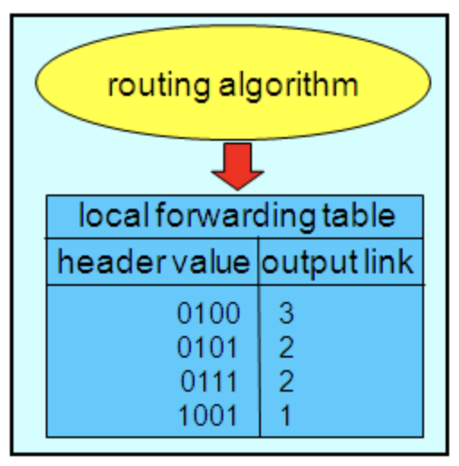

# 컴퓨터 네트워킹 하향식 접근(3)

## 4. 네트워크 계층

- 네트워크의 근본적인 역할은 매우 단순.
- 네트워크 레이어 장비인 라우터가 가지고 있는 기능
- 송신 호스트 → 수신 호스트로 패킷을 전달
- 이를 위한 네트워크 계층의 중요한 2가지 기능
- 하지만, 사실 이 두 가지 단어는 혼용되기도 함.

1. **포워딩(데이터평면, HW)**

   - 패킷이 라우터의 입력 링크에 도달 → 출력링크로 이동시키는 것
   - 차이점은, 매우 짧은 시간 단위를 갖기에, 대표적으로 **하드웨어**에서 실행
   - 한 교차로를 지나는 과정
     - ex)
       - 호스트 1 → 호스트 2로 정보 교환 시작
       - 호스트 1로부터 패킷이 R1에 도착
       - 라우터 R1은 H2로 가는 경로상에 있는 다음 라우터로 전달되어야 함.

1. **라우팅 (제어평면, SW)**
   - 송신자 → 수신자 패킷 전송시, 네트워크 계층은 패킷 **경로**를 설정해줘야함.
   - 수많은 경로 중, 하나의 경로를 선택하고 계산하는 알고리즘을 **라우팅 알고리즘**이라 일컫음.
     - 대개, 비용이 가장 적게 드는 (가장 빠른) 경로가 선택
   - 차이점은, 네트워크 전반에 걸쳐 출발지 → 목적지까지 데이터그램 종단 간 경로를 결정
   - 출발지 → 목적지까지의 경로 결정 (전반적인)
   - 네트워크 라우터에서 필수 불가결한 요소 : 포워딩 테이블

- **포워딩 테이블**
  
  - 네트워크 라우팅에서 필수 불가결한 요소
  - 라우터는 Network Topology(네트워크 요소 (링크, 노드..)들을 물리적으로 연결해놓은것)를 입력받아 라우팅 알고리즘을 통해 포워딩 테이블 만듦 (테이블 내 내용 결정)
    1. 라우터는 패킷 헤더의 필드값 조사 → 패킷 전달
    2. 전달되는 패킷을 라우터의 포워딩 테이블의 내부 색인으로 사용
    3. 라우팅 알고리즘에 있어, **선택된 가장 빠른 경로를 저장해 둔 것**이 포워딩 테이블
  - 이러한 테이블을 만드는 과정이 곧 출발지 → 목적지 경로 찾는 일
  - 포워딩 테이블 내에는 목적지 주소(IP Address), 출력포트 || 출력링크 두가지가 저장.

### 🔍 라우터 내부에는 무엇이 있을까?

- **입력 포트 (Input Port)**

  - 라우터로 들어오는 입력 링크
  - 들어오는 링크의 반대편에 있는 링크 계층과 상호 운용하기 위해 필요한 링크 계층 수행
  - 포워딩 테이블 참조 → 스위치 구조를 통해 라우터 출력 포트 결정

- **스위치 (Switch)**
  - 라우터의 입력 포트와 출력 포트 연결
  - 가장 중앙에 위치
- **출력 포트 (Output Port)**

  - 스위치 구조에서 수신한 패킷 저장
  - 필요한 링크 계층 및 물리 계층 기능을 수행 → 출력 링크로 패킷 전송
  - 일반적으로 동일한 입력 포트와 한 쌍을 이룸

- **라우팅 프로세서 (Routing Processor)**
  - 제어 평면 기능 수행
  - 원격 컨트롤러와 통신 -> 계산된 포워딩 테이블 엔트리 수신 -> 설치

<aside>
💡 **라우터의 입,출력포트 , 스위치 구조는 거의 항상 하드웨어로 구현**

</aside>

## 🕹️ IPv4 데이터 그램 포맷

---

- 인터넷 네트워크 계층 패킷을 **데이터그램**이라고 함
- 각 IP주소는 $2^{32}$ 길이 (약 40억개로 추정, 32비트)
- 4구간으로 나누어서 사용 (4Octet)
  ➡️ 사람이 보기 편하게(개발의 편의성) 하기 위해
- 주소의 각 바이트를 십진수로 표현, 주소의 다른 바이트와 점으로 구분하는 **십진 표기법** 사용

## 📕 IPv6

---

- IPv4의 32비트에서 128비트로 확장
- $2^{128}$ 개수
- 2옥텟 (16비트)단위로 8등분
  - 각 자리는 네 자리의 16진수로 표현
  - 각 자릿수들은 콜론으로 구분하여 표기

## 🖲️ 네트워크 클래스

---

- IPv4로는 턱없이 부족한 $2^{32}$(40억)개의 주소
- 이미 구성된 인프라를 최대한 활용하기 위해 IPv4체계의 IP주소를 사용하는 **네트워크의 규모**에 따라 관리하기 쉽도록
- 위의 클래스로 네트워크를 구분하게 되면, IP주소의 낭비로 이어질 수 있음.
  ➡️ 서브넷과 연계하여 사용하는 것이 일반적
- A class
  - 하나의 네트워크가 가질 수 있는 호스트 수가 가장 많은 클래스
  - 맨 앞자리 수가 0
- B class
  - 맨 앞자리 수가 10으로 시작
- C class
  - 맨 앞자리 수가 110으로 시작

## 📌 서브넷

---

- 클래스 단위로 분류를 하게 되면 적절한 네트워크 크기로 구분 못함
  ➡️ 서브넷으로 분할하여 사용
- 하나의 네트워크가 분할되어 나눠진 작은 네트워크
- **서브네팅 (Subnettin)**
  - 네트워크를 분할하는 것
  - 너무 큰 브로드캐스트 도메인은 네트워크 환경에서 성능 저하 발생
  - 네트워크를 쪼개서 보냄 → 성능 보장
  - 즉, $2^{32}$만큼만 표현가능하다는 말
  - 필요한 네트워크 주소만 호스트 IP로 할당
- 각 클래스로 나눠진 네트워크를 운영중인 서비스 규모에 맞게 분할
  ➡️ 낭비되는 IP 주소 자원 최소화 목적

## 📌 웹서버 vs WAS

### 웹 서버 (Web Server)

---

- HTTP 프로토콜을 기반으로, client가 웹 브라우저에서 어떠한 요청을 하면, 그 요청을 받아 **정적 콘텐츠 (HTML문서, css, 이미지, 파일 등)** 를 제공하는 서버
- 웹서버가 정적이 아닌 동적 컨텐츠를 요청 時 ) WAS에게 해당 요청 toss
  → WAS에서 처리한 결과를 클라이언트에게 전달
- 필요한 이유 ?
  - 클라이언트에 이미지 파일을 보낼 시,
    1. 클라이언트는 HTML 문서 받음
    2. 그에 필요한 이미지 파일을 다시 서버에 요청
    3. 이후, 이미지 파일을 받아옴.
  - Web server를 통해 정적인 파일 → application server까지 가지 않고, 앞단에서 빠르게 송신 가능. → 서버의 부담을 줄일 수 있음.
- ex) Apache, NginX, node js

### WAS (Web Application Server)

---

- DB조회, 다양한 로직 처리를 요구하는 **동적인 콘텐츠**를 제공하기 위해 만들어진 Application Server
  - 프로그램 실행 환경, DB 접속 기능
- HTTP를 통해 컴퓨터, 장치에 애플리케이션을 수행해주는 미들웨어
- “웹컨테이너“ 혹은 “서블릿 컨테이너”라고 불림
- 즉, WAS = Web server + Web container
- 필요한 이유?
  - web server만 존재한다면, 모든 요청에 대한 결과값을 미리 만들어 놓고 서비스를 해야 함.
  - 이렇게 수행하기엔, 자원이 절대적으로 부족
  - 따라서, WAS를 통해 요청에 맞는 데이터를 비즈니스 로직에 맞게 그때 그때 결과를 만들어 제공 → 자원을 효율적으로 사용 가능
- ex) Tomcat, JBoss, Jeus 등
