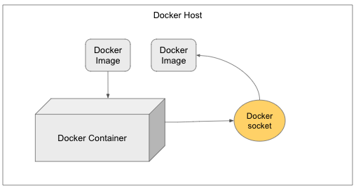

## 소켓 통신

### TCP/IP

> 💡 패킷 교환 네트워크 프로토콜들의 계층화된 집합

커넥션이 맺어지면 클라이언트와 서버 컴퓨터 간에 주고 받는 메시지들은 손실 혹은 손상되거나 순서가 바뀌지 않고 안전하게 전달된다. 

---

### 소켓 통신

서버는 특정 포트가 바인딩된 소켓을 가지고 특정 컴퓨터 위에서 돌아간다. 클라이언트의 연결 요청을 소켓을 통해 리스닝하면서 대기한다.

클라이언트는 서버가 떠 있는 머신의 호스트네임과 열려있는 포트 번호를 알고 있다. 클라이언트는 서버를 상대로 자신을 식별시켜주기 위해서 연결동안 로컬 포트에 바인딩된다. 

서버는 연결을 수락과 동시에 서버는 동일한 로컬 포트에 바인딩된 새로운 소켓을 얻게 되어 클라이언트 주소와 포트로 세팅된 리모트 엔드포인트를 가지게 된다. 

### 엔드 포인트

엔드포인트는 네트워크에 연결하고 네트워크를 통해 통신하는 모든 디바이스. IP 주소와 포트 번호의 조합

모든 TCP 연결은 2개의 앤드 포인트로 유일하게 식별되어질 수 있다. 따라서 클라이언트와 서버간 여러개의 연결이 맺어질 수 있다. 

### 소켓

프로토콜, IP 주소, 포트 번호로 정의된다.

네트워크 상에서 돌아가는 두 개의 프로그램 간 양방향 통신의 하나의 엔드 포인트. 포트 번호에 바인딩되어 TCP 레이어에서 데이터가 전달되어야하는 애플리케이션을 식별할 수 있게 한다.

프로세스가 데이터를 보내거나 받기 위해서는 반드시 소켓을 열어서 소켓에 데이터를 써보내거나 소켓으로부터 데이터를 읽어드린다. 

### 도커 소켓

도커 소켓 파일은 `/var/run/docker.sock`에 위치한다. 기본적으로 메인 도커 데몬(프로세스)와 통신하기 위해서 사용된다. 도커 소켓은 Docker API의 진입점이다. 이 소켓은 기본으로 Docker CLI에 의해 도커 커맨드를 실행하기 위해 사용된다. 



---

### 패킷📦

컴퓨터 간 데이터를 주고 받을 때 네트워크를 통해서 전송되는 데이터 조각 (**≈**파일)


---

### 커넥션 관리

> http는 어떻게 tcp 커넥션을 사용하는가
> 

커넥션이 맺어지면 클라이언트와 서버 컴퓨터 간 주고 받는 메시지들은 내용, 순서가 보장된다. 

```markdown
사이트에서 특정 정보를 조회할때 일어지는 일

1. 브라우저가 www.test.com 호스트 명 추출
2. 브라우저가 포트 번호(80) 얻는다
3. 브라우저가 이 호스트 명에 대한 IP 주소 찾는다
4. 브라우저가 서버 ip 주소의 열린 포트(80)으로 TCP 커넥션을 생성
5. 브라우저가 서버로 HTTP GET 요청 메시지를 전송
6. 브라우저가 서버에서 온 HTTP 응답 메시지를 읽는다
7. 브라우저가 커넥션 끊는다
```

HTTP 커넥션은 몇 사용 규칙 제외하고 TCP 커넥션에 불과하다. TCP 커넥션은 인터넷을 안정적으로 연결해준다. 

TCP는 HTTP에 신뢰할 만한 통신 방식 제공한다. ip 패킷이라고 불리는 작은 조각을 통해 데이터를 전송한다. 

세그먼트라는 단위로 데이터 스트림을 잘게 나누고, 세그먼트를 IP 패킷이라고 불리는 봉투에 담아서 인터넷을 통해 데이터를 전달한다. 따라서 각 TCP 세그먼트는 하나의 IP 주소에서 → 다른 IP 주소로 IP 패킷에 담겨 전달된다.

---
#### 참고자료
- HTTP 완벽 가이드