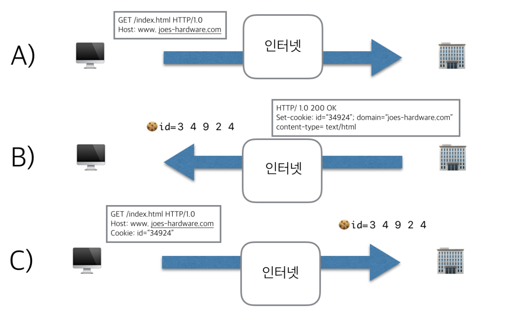
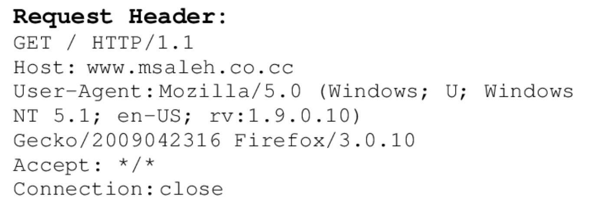
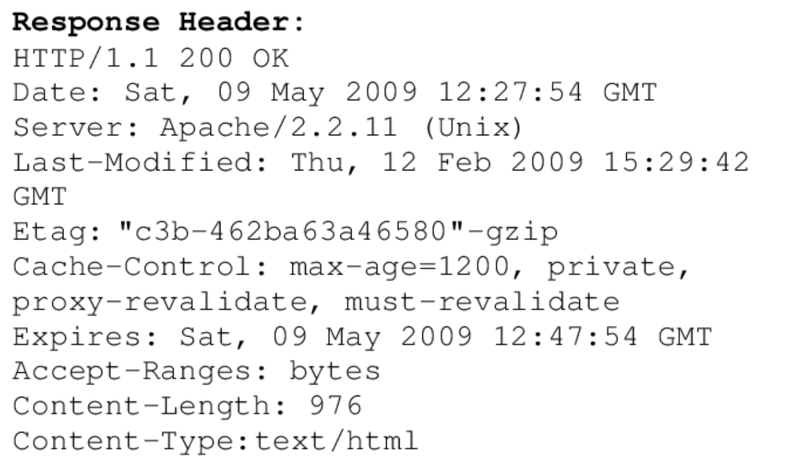

# 컴퓨터 네트워킹 하향식 접근(2)

## 쿠키 🍪

---

- 사용자를 식별하고, 세션을 유지하는 방식 중 현재까지 가장 널리 사용하는 방식
- HTTP 헤더는 상태를 유지 하지 않음 → 새로운 HTTP 헤더 정의
- 사용자의 인증을 도와줌 (client에 저장)
- 만료시간이 지나면, 자동 삭제
- 즉, **사이트에 수차례 트랜잭션을 만들어내는 사용자를 추적하는데 사용**
- ex) User 관련된 여러가지 다른 목적 (오늘 이 창 보지 않음, 로그인 정보, 방문 기록, 방문횟수..)

### 쿠키의 동작 방식 🔎

A. 처음 사용자가 아마존 웹 사이트 방문 → 서버는 아무것도 모름

B. 서버는 사용자 식별을 위한 값을 쿠키에 할당

1. 쿠키는 이름=값 형태
2. 그 리스트는 Set-Cookie || Set-Cookie2와 같은 HTTP 응답 헤더에 기술해, 사용자에게 전달

C. 브라우저는 서버에서 온 쿠키콘텐츠를 브라우저 쿠키 DB에 저장

1. 추후 요청에 서버가 이 사용자 할당했던 쿠키를 요청헤더에 담아 전송
2. 웹사이트는 나의 이름을 알 필요는 없지만, 34927 사용자가 어느 페이지를, 어떤 순서로, 몇 시에 방문했는지 정확히 알 수 있다.
3. 이러한 방식으로, 아마존 서버는 나의 아마존 사이트에서의 활동 추적 가능
4. 이 후, 일주일 후에 다시 아마존 사이트 접속 → Cookie :34924 를 헤더 라인에 넣어 요청 메세지를 보냄 → 이전에 기록돼었던 장바구니, 검색 기록을 바탕으로 제품을 추천해줌



### 쿠키의 4가지 요소 🔎

1. **HTTP 요청 메세지 쿠키 헤더 라인**
   

   - _method_
     - POST, PUT,HEAD,GET,DELETE
       - _HEAD_
         - GET과 유사
         - 서버가 HEAD 요청 받음 → HTTP로 응답 ( but, 요청 객체는 보내지 않음)
         - 디버깅을 위해 HEAD 메소드 많이 사용
         - 웹서버에 업로드할 객체를 필요로 하는 애플리케이션에 의해 사용
   - _Connection : close_
     - client → 메세지 보냄 → TCP 연결 닫는 데 사용
     - 브라우저는 서버에게 지속 연결 사용을 원치 않는다는 것을 말함
   - _user-agent_
     - 서버에게 요청하는 브라우저 타입 명시

1. **HTTP 응답 메세지 쿠키 헤더 라인**
   

   - Date
     - HTTP 응답이 서버에 의해 생성되고 보낸 날짜와 시간
   - Server
     - 아파치 웹서버에 의해 만들어졌음을 의미
     - request header의 user-agent와 비슷
   - Last-Modified
     - 객체가 생성되거나 마지막으로 수정된 시간과 날짜
   - Content-Length
     - 송신되는 객체 바이트 수
   - Content-Type
     - 개체 몸체 내부의 객체가 HTML 텍스트인 것
   - Etag (Entity Tag)
     - 웹 캐시 유효성 검증에 사용
     - 리소스 특정 버전에 대한 고유 값 → 리소스 업데이트 → Etag또한 업데이트
     - 클라이언트에서 캐싱하고 있는 버전 === 서버 버전 ⇒ 304 Not Modified 상태 코드 response → response body에 대한 트래픽 절감 가능

1. **browser에 사용자 종단 시스템과 관리를 지속시키는 쿠키 파일**
   - 이름=값 (필수) , domain, path, expires, secure(http ssl보안 연결 사용시에만 보냄)
1. **웹 사이트 백엔드 DB**

단점

- 사생활 침해라는 관점에서 커다란 논쟁거리
  - 캐시되지 말아야 할 문서라면
  - Cache-Control: no-cache=”set-Cookie”를 명확히 표시한다.

## 웹 캐싱

---

- 프록시 서버라고도 함
- 서버이면서 클라이언트라는 점
- 웹 서버를 대신하여 HTTP 요구를 충족시키는 네트워크 개체
- 자체의 저장 디스크 有 **→ 최근 호출된 객체의 사본을 저장 && 보존**
- 페이지가 빠르게 렌더링할 수 있도록 도와줌 (로딩 속도 개선을 위해 사용)
- 사용자가 직접 수동으로 삭제해줘야 함.
- ex) **이미지, 오디오, 비디오 파일** 등

### 캐싱 과정

1. 브라우저는 웹 캐시와 TCP 연결 설정 , 웹 캐시에 있는 객체에 대한 HTTP 요청 보냄
2. 웹 캐시 : 객체 사본이 자기에게 저장되어있는지 확인
   1. 저장 되어 있는 경우? : HTTP 응답 메세지와 함께 객체 전달
   2. 저장 되지 않는 경우 :
      - 웹캐시는 TCP 연결 설정
      - TCP 연결 객체에 대한 HTTP 요청 보냄
      - 요청 받은 후, 서버는 웹 캐시로 HTTP 응답 메세지와 함께 객체 보냄
3. 웹 캐시의 객체 수신 시, 객체 지역 저장장치에 복사하고, 객체 사본을 보냄

### 조건부 GET

- 데터가 변경되지 않아도, 계속해서 네트워크를 통해 데이터를 다운받아야 함 → 엄청난 자원 소모
- 다행히 HTTP는 클라이언트가 브라우저로 전달되는 모든 객체가 최신의 것임을 확인 하면서, 캐싱하게 해주는 방식을 가짐
- HTTP 요청 메세지가
  1. GET 방식 사용
  2. If-Modified-Since 헤더 포함
     ⇒ 조건부 GET메세지

## 소켓 프로그래밍

---

- 다른 PC에서 수행되는 프로세스 간 통신은 소켓에 메세지를 보냄으로써 실현
- 각 프로세스 = “집” , 프로세스의 소켓 = “문”
- 애플리케이션은 집의 문 한쪽에 有, 트랜스포트 계층은 외부 세계에 있는 문의 다른 쪽에 有
- 애플리케이션 개발자는 애플리케이션 계층에 대한 제어권 有, 트랜스포트 계층에 대한 제어권 無

> **UDP를 이용한 소켓 프로그래밍**

1. 수신 프로세스에 있는 소켓으로 라우팅 위해 패킷에 **_“목적지 주소”_**를 붙여넣음

   → 목적지 주소에는

   1. 목적지 호스트의 IP주소
   2. 소켓이 생성될 시 할당된 소켓 포트 번호

**UDP를 이용한 클라이언트 애플리케이션**

**UDPClient.py**

```python
from socket import *;

serverName = 'hostname'; // IP주소, 서버의 호스트 이름
severPort = 12000;

// socket(주소군, TCP, UDP 구분)
// AF_INET : IPv4 사용
// SOCK_DGRAM : UDP 사용
clientSocket = socket(AF_INET, SOCK_DGRAM)

// input : 파이썬 내장함수
// 클라이언트 사용자에게 인자 안의 글자로 프롬프트가 나타남
message = input('Input lowercase sentence:');

// encode로 문자열 -> 바이트 형으로 변환
// 클라이언트는 패킷을 보낸 후, 서버로부터 데이터 수신 기다림
clientSocket.sendto(message.encode(), (serverName, serverPort));

// 소켓 종료
clientSocket.close();

```

**UDP를 이용한 서버 애플리케이션**

**UDPServer.py**

```python
from socket import *;

// client와 동일
serverName = 'hostname'; // IP주소, 서버의 호스트 이름
severPort = 12000;
serverSocket = socket(AF_INET, SOCK_DGRAM)

// 포트 번호 12000을 서버 소켓에 할당 (bind)
serverSocket.bind((''), serverPort));

// UDPServer는 클라이언트로부터 계속해서 패킷 수신,처리 가능하게끔
// 패킷이 도착하기를 기다림 (도착할 때까지 while문 반복)

while True :

// clientAddress: 패킷 출발지 주소
// 반송해야할 때, 이 주소를 참조
// message: 패킷 데이터

	message, clientAddress = serverSocket.recvfrom(2048)

// 대문자로 변환
	modifiedMessage = message.decode().upper()

// 클라이언트 주소를 대문자로 변환된 메세지에 붙임
// 만들어진 패킷을 서버 소켓으로 보냄
	serverSocket.sendto(modifiedMessage.encode(), clientAddress)
```

> **TCP를 이용한 소켓 프로그래밍**

1. 연결 지향형 프로토콜 → 사전에 클라이언트 ↔ 서버 연결 설정 필요
2. TCP 연결 설정 후 → 소켓을 통해 데이터를 TCP연결로 보냄

**TCP에서 클라이언트와 서버의 상효작용 순서**

1. 클라이언트 → 서버로의 접속 시도 ( = TCP 연결 시도 )
2. 클라이언트 → 3way handshake 함 → 서버와의 TCP 연결 설정

   **3way handshake란?**

   - TCP에서 장치간 서로 연결 잘 돼 있는지 확인하는 방식
     1. 클라이언트가 연결 요청 메세지(Synchronize Sequence Number, SYN) 전송
     2. 서버가 요청 수락, 클라이언트에게 다시 연결 요청 메세지 전송 (ACK, SYN +1 )
     3. 클라이언트가 잘 응답했다는 메세지 전송

**TCP를 이용한 클라이언트 애플리케이션**

**TCPClient.py**

```python
from socket import *;

serverName = 'hostname';
severPort = 12000;

// SOCK_STREAM : UDP가 아닌 TCP 소켓임을 의미
clientSocket = socket(AF_INET, SOCK_STREAM)

// client -> server전, TCP 연결
clientSocket.connect((serverName, serverPort));

message = input('Input lowercase sentence:');

//문자열 sentence를 서버로 보냄
clientSocket.send(sentence.encode());

clientSocket.sendto(message.encode(), (serverName, serverPort));

// 소켓 종료
clientSocket.close();

```

**TCP를 이용한 서버 애플리케이션**

**TCPServer.py**

```python
from socket import *;

serverName = 'hostname'; // IP주소, 서버의 호스트 이름
severPort = 12000;
serverSocket = socket(AF_INET, SOCK_STREAM)

// 포트 번호 12000을 서버 소켓에 할당 (bind)
serverSocket.bind((''), serverPort));

// 연결 요청, 파라미터는 큐잉 되는 연결 최대 수
serverSocket.listen(1);

while True :
*// clientSocket과 서버의 connectionSocket 간 TCP 연결 설정*
	connectionSocket, addr = serverSocket.accept();

	sentence = connectionSocket.recvfrom(1024).decode();
	capitalizedSentence = sentence.upper();
	connectionSocket.send(capitalizedSentence.encode());
	connectionSocket.close();
```
