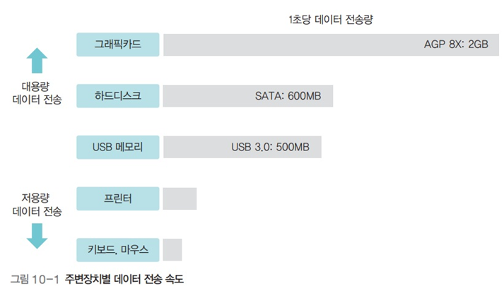
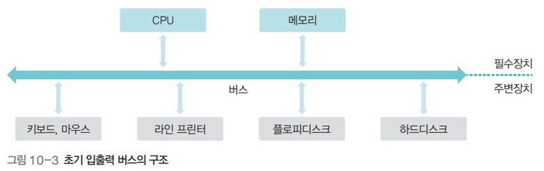
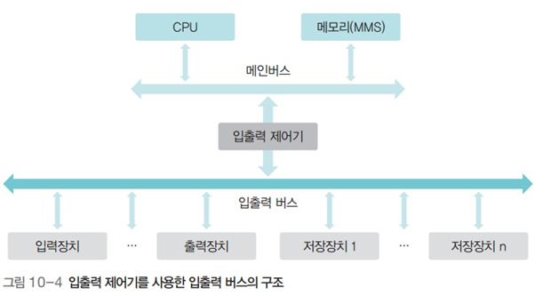
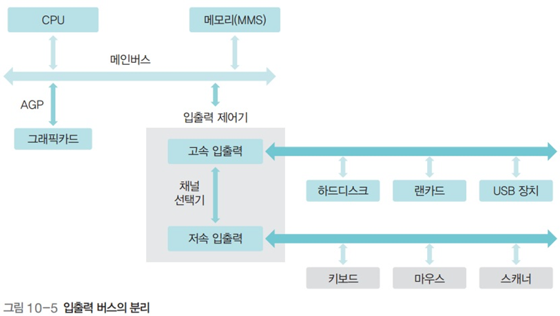
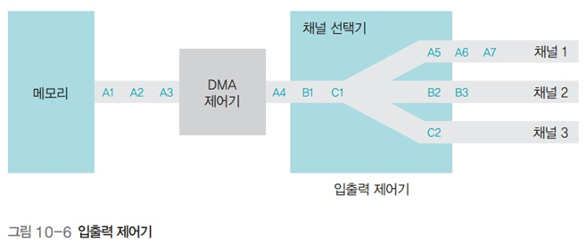
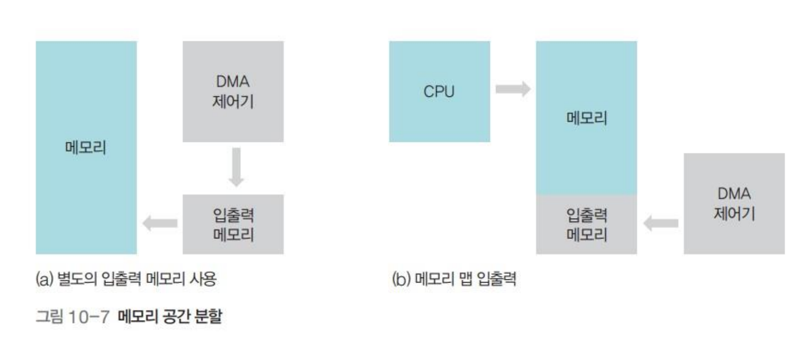
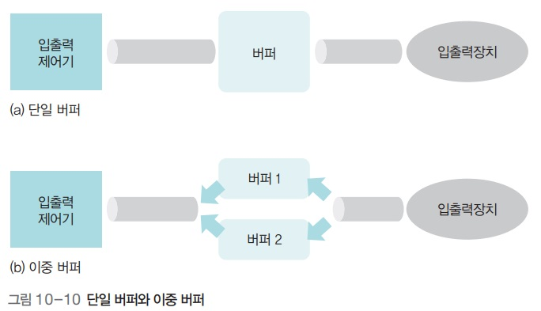
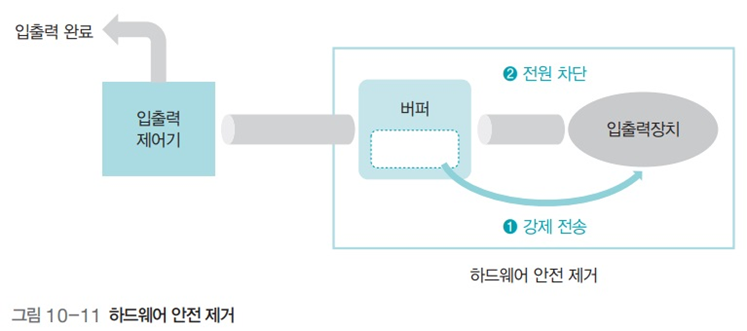

# **입출력 시스템**

## **1. 입출력장치와 채널**

- 저속 주변장치 : 데이터의 양이 적어 데이터 전송률이 낮은 장치, eg. 키보드
- 고속 주변장치 : 대용량의 데이터가 오고 가는 데이터 전송률이 높은 장치, eg. 그래픽카드, 하드디스크

- 채널 : 데이터가 지나다니는 하나의 통로 (in 버스)
    - 채널 공유 : 채널을 모든 주변장치가 무분별하게 공유하면 성능 저하 문제 발생
    - 채널 분리 : 속도가 비슷한 장치끼리 묶어 장치별로 채널을 할당하여 전체 데이터 전송 속도를 향상

## **2. 입출력 버스의 구조**

### 1. 초기

- 모든 장치가 하나의 버스로 연결되고, CPU가 작업 중 입출력 명령을 만나면 직접 입출력장치에서 데이터를 가져오는 방식 (폴링 polling 방식)
    - CPU는 입출력 작업을 하는 동안 다른 작업을 할 수 없다. (예를 들면, busy waiting)

### 2. 입출력 제어기

- 기술이 발전하면서 CPU와 메모리 성능 향상, 주변장치의 종류도 다양화되면서 입출력 제어기 I/O controller 가 등장한다.
- 2개의 채널, 메인 버스와 입출력 버스로 나뉜다.
    - 메인 버스 : 고속으로 작동하는 CPU와 메모리가 사용
    - 입출력 버스 : 주변장치가 사용
- CPU가 입출력 요청을 보내면 입출력 제어기가 입출력 장치로부터 데이터를 직접 송수신한다.

### 3. 입출력 버스의 분리

- 고속/저속 입출력 버스의 분리
    - 채널 선택기를 통해 관리
- 그래픽카드는 GPU를 부착하게 되었고, 대용량 데이터를 전송하므로 메인버스에 바로 연결되는 그래픽 버스 사용
    - AGP(Accelerated Graphics Port) : 그래픽카트 전용 포트 사용

### 버스 채널

하나의 버스 채널은 주소 버스, 데이터 버스, 제어 버스로 구성된다.

- 주소 버스 : 데이터를 가져올 주소
- 데이터 버스 : 실제로 송수신되는 데이터
- 제어 버스 : 명령어의 시작과 종료, 데이터의 이동 방향, 오류 처리, 인터럽트 같은 다양한 신호

## 3. 직접 메모리 접근 DMA(Direct Memory Access)

CPU의 도움 없이 메모리에 접근할 수 있도록 입출력 제어기에 부여된 권한을 말한다.

메인 메모리는 CPU가 작업하는 공간이기에 DMA 제어기를 활용하는 경우, 메모리 내에서 충돌이 발생할 우려가 있다. 이를 방지하기 위해 메모리 공간을 분할한다.

- 과거에는 입출력 메모리라는 별도의 메모리를 사용했으나 ,입출력 메모리에서 다시 메인 메모리로 데이터를 옮기는 불필요한 작업을 수반한다.
- 근래에는 메모리 내 CPU가 작업하는 공간과 DMA 제어기가 데이터를 옮기는 공간을 분리하여 메인 메모리를 운영한다. 이를 메모리 맵 입출력 memory mapped I/O 라고 부른다.
    - 즉, 메인 메모리의 주소 공간 중 일부를 DMA 제어기에 할당한다.

## 4. 인터럽트

인터럽트는 주변장치의 입출력 요구나 하드웨어의 이상을 CPU에 알려주는 역할을 하는 신호를 말한다.

### 입출력과 인터럽트

- 외부 인터럽트 (하드웨어 인터럽트)
    - 입출력 장치로부터 오는 인터럽트 외에도 전원 이상이나 기계 오류로 인한 인터럽트를 포함한다.
    - 각 장치마다 IRQ 번호가 부여되어 있고, 이 번호는 인터럽트 번호에 일대일로 대응한다.
- 내부 인터럽트 (예외 상황 Exception 인터럽트)
    - 프로세스의 오류와 관련된 인터럽트를 말한다.
    - 발생시, 해당 프로세스가 즉시 종료된다.
        - 운영체제는 프로세스가 종료되기 직전까지 메모리와 레지스터 상태를 가지는 코어 덤프를 저장하며, 이를 통해 어떤 상황에서 오류가 발생했는지 확인할 수 있다.
- 사용자 인터럽트(시그널)
    - 사용자가 직접 발생시키는 종류의 인터럽트를 말한다.
        - 모든 시그널엔 인터럽트 번호 128을 할당한 후 세부 시그널 번호를 따로 명시한다.

### 인터럽트 벡터와 핸들러

- 인터럽트 벡터
    - 여러 인터럽트 중 어떤 인터럽트가 발생했는지 파악하기 위해 사용하는 자료구조로, 인터럽트 벡터의 값이 1이면, 인터럽트가 발생했다는 의미이다.
    - 인터럽트 핸들러를 호출할 수 있도록, 핸들러가 저장된 메모리 주소를 포인터 형태로 갖는다.
- 인터럽트 핸들러 : 인터럽트의 처리 방법을 함수 형태로 만들어놓은 것
    - 시그널의 경우 자신이 만든 인터럽트 핸들러를 등록할 수도 있다.

## 5. 버퍼링

- 버퍼 : 속도가 다른 두 장치의 속도 차이를 완화하는 역할을 한다.
    - 단일 버퍼에서는 데이터를 담는 작업과 데이터를 전송하는 작업을 동시에 하기 힘들다.
    - 이중 버퍼에서 한 버퍼는 데이터를 담는 용도로, 다른 버퍼는 데이터를 가져가는 용도로 사용할 수 있어 운용에 유리하다.

- 버퍼의 운용 방식
    - 버퍼가 다 차기 전까지 입출력장치에 자료가 전송되지 않는다.
    - 혹은 일정 시간이 흐른 후 데이터를 전송한다.
- 사용시 주의점
    - (외부)저장장치를 제거할 때,  데이터 전송 조건이 만족되지 않은 경우, 버퍼 안의 데이터가 저장장치에 저장되지 않는 문제가 발생한다.
        - 윈도우에서는 하드웨어 안전 제거 기능을 활용하여 문제를 방지한다.
            
            
            
    - 프로그래밍을 할 때도 같은 문제를 주의할 필요가 있다.
        - 강제 flush() 실행
        - 줄 바꿈 문자(버퍼의 내용을 강제로 모니터에 출력하도록 함) 활용

> 출처
> - 쉽게 배우는 운영체제
> - https://k-mozzi.tistory.com/74?category=996340 등
 