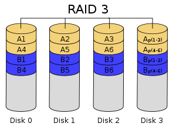

# RAID(Redundant Array of Independent Disks)

- 저장장치의 관리 기법 중 하나이다.
- 자동으로 백업을 하고 장애가 발생하면 이를 복구하는 시스템으로 '레이드'라고 읽는다.
- 동일한 규격의 디스크(저렴)를 여러 개 모아 구성한다.

### **원리**

- 원본 디스크와 같은 크기의 백업 디스크에 같은 내용을 동시에 저장하고, 하나의 디스크가 고장 났을 때, 다른 디스크를 사용하여 데이터를 복구하는 시스템이다.

### **미러링Mirroring**

- 2개의 디스크에 똑같은 내용을 저장한다는 의미에서 미러링이라고 하며, RAID 1 방식이 순수한 미러링을 지원한다.

### **스트라이핑Striping**

- 여러 디스크에 데이터를 조각으로 나누어 저장하여, 데이터의 입출력 속도를 높이는 방식을 말한다.
- RAID 0 은 순수한 스트라이핑 방식을 지원하므로, 데이터 전송 속도가 빠르지만, 장애 발생시 데이터를 복구하는 기능이 없다.
- RAID 10(1+0)은 미러링과 스트라이핑을 동시에 지원한다.

### **다양한 방식**

- RAID 0, 1, 10 외에 RAID 2, 3, 4, 5, 6, 50, 60 등의 오류 교정 코드 ECC인 해밍 코드나 오류 검출 코드 EDC인 패리티를 이용하여 추가되는 디스크의 양을 줄이는 방식이 존재한다.
  - RAID 2, 3, 4, 5는 더 작은 용량으로도 데이터를 복구할 수 있다. 그러나 하드디스크의 가격이 저렴해지면서 복잡한 연산을 필요로 하는 이러한 방식들은 잘 사용하지 않게 되었다.

### 오류 관련 코드

- 오류 검출 코드 EDC : 오류가 발생했는지 확인할 수 있는 코드 (패리티 비트)
- 오류 교정 코드 ECC : 오류 발생 확인과 동시에 교정까지 할 수 있는 코드 (해밍 코드)

## **RAID 0(스트라이핑)**

- 병렬로 연결된 여러 개의 디스크에 데이터를 동시에 입출력할 수 있는 방식의 구성이다.
    - 이론적으로는 병렬로 연결된 디스크의 갯수의 배만큼 입출력 속도가 빠르다.
- 장애 발생 시 복구하는 기능이 없다.

## **RAID 1(미러링)**

- 순수한 백업 시스템으로 하나의 데이터를 2개의 디스크에 나누어 저장한다.
- 같은 크기의 디스크를 최소 2개 이상 필요로 하며, 짝수 개의 디스크로 구성한다.
- 저장하는 데이터와 같은 크기의 디스크가 하나 더 필요하므로 비용이 증가한다.
- 같은 내용을 2번 저장하기에 속도가 느려질 수 있으므로, 데이터 입출력이 없는 시점에 백업이 이루어지도록 조정하는 것이 좋다.

## **RAID 2**

- 해밍 코드와 같은 오류 교정 코드를 별도의 디스크에 따로 보관하고 있다가 장애가 발생하면 이를 이용해 데이터를 복구할 수 있다.
- 보통 하드디스크의 데이터 저장 단위는 **블록**이지만, RAID 2d에서는 데이터가 **비트** 단위로 분리되어 여러 디스크에 저장된다.
- 비트별로 만들어진 오류 교정 코드는 별도의 디스크에 저장하고, 추후 복구시에도 비트 단위로 복구된다.
- n개의 디스크에 대해 오류 교정 코드를 저장하기 위한 n-1 개의 추가 디스크를 필요로 한다. RAID 1 보다는 작은 저장 공간을 요구하지만, 오류 교정 코드를 계산하는데 많은 시간을 소비하여, 잘 사용되지 않는다.

## **RAID 3**

- N-way 패리티 비트 방식
- N-way 패리티 비트를 구성한 후 데이터 디스크가 아닌 별도의 디스크에 보관하여 장애 발생 시 오류를 복구한다.
- 추가되는 디스크의 양은 4개의 디스크당 1개 정도이나, N-way 패리티 비트를 구성하는 데 필요한 계산량이 많은 것이 단점이다.
- 데이터를 **섹터** 단위로 여러 개의 디스크에 나누어 저장하는 구조이다. 이 때문에 데이터의 입출력이 일어날 때마다 모든 디스크가 동작한다.
- 오류 검출 코드인 패리티 비트를 여러 섹터끼리 묶어서 구성하고, 이를 통해 오류가 없는 섹터를 이용해 오류가 있는 섹터의 데이터를 복구한다.

## **RAID 4**

- 데이터를 하나의 디스크에 **블록** 단위로 저장하고, 패리티 비트를 블록과 연결하여 구성하기 때문에, 입출력 시 데이터가 저장되는 디스크와 패리티 비트가 저장되는 디스크만 동작하는 것이 장점이다.
- 추가되어야 할 디스크의 양은 RAID 3과 같으나, 패리티 비트를 추가하기 위한 계산량이 많다.
- 모든 패리티 비트가 하나의 디스크에 저장되기 때문에 병목 현상이 발생할 가능성이 크다. 또한 패리티 비트가 저장된 디스크와 다른 디스크에 동시에 장애가 발생할 경우 복구가 불가능하다는 치명적인 단점이 있다.

## **RAID 5**

- RAID 4의 단점을 보완한 방식이다.
- 패리티 비트를 여러 디스크에 분산하여 보관함으로써 패리티 비트 디스크의 병목 현상을 완화한다.
- 패리티 비트를 해당 데이터가 없는 디스크에 보관함으로써 한 디스크에 장애가 발생하면 다른 디스크에 있는 패리티 비트를 이용하여 데이터를 복구할 수 있다.
- 한 디스크에 장애가 발생했을 때는 복구가 가능하지만 디스크 2개에 동시에 장애가 발생했을 경우에는 복구가 불가능하다.

## **RAID 6**

- RAID 5의 단점을 보완하여 패리티 비트를 2개를 구성하여 분산하는 방식이다.
- 디스크 2개에 동시에 장애가 발생해도 복구할 수 있다.
- RAID 5 에 비해 계산량이 많아지고, 4개의 디스크 당 2개의 추가 디스크가 필요하다.

### RAID 10

빠른 입출력이 장점인 RAID 0과 복구 기능을 가진 RAID 1을 결합한 방식이다.

- 결합 방식
    - RAID 0+1 : 디스크를 RAID 0으로 먼저 묶은 방식을 말한다.
        - 장애 발생 시 복구를 위해 모든 디스크를 중단해야 한다. (RAID 0은 복구 기능이 없기 때문)
    - RAID 1+0 : 디스크를 RAID 1로 먼저 묶은 방식을 말한다.
        - 장애 발생 시 일부 디스크만 중단하여 복구 가능

### RAID 50, RAID 60

- RAID 10에 비해 추가되는 디스크의 수가 적지만 입출력 시에 계산량이 증가한다.