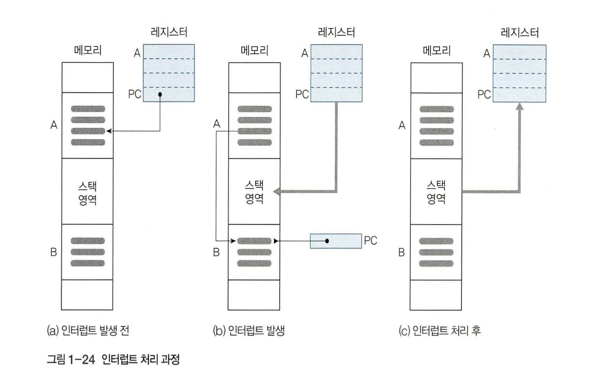

# 알고리즘알고싶따

# **인터럽트 (Interrupt)**

- 현재 실행 중인 프로그램을 중단하고, 다른 프로그램의 실행을 요구하는 명령어이다.
- 컴퓨터에 설치된 입출력 장치나 프로그램 등에서 프로세서로 보내는 하드웨어 신호이다.
- 인터럽트를 받은 프로그램은 실행을 중단하고, 다른 프로그램을 실행한다.
- 왜 필요할까?
    
    단일 프로세서의 컴퓨터는 명령어를 한 번에 한 개만 수행할 수 있는데, 다중 프로세서의 컴퓨터는 인터럽트를 이용하여 중간에 다른 프로그램이나 명령어를 수행할 수 있다.
    
- 컴퓨너틑 인터럽트를 외부 장치의 동작과 자신의 동작을 조정하는 수단으로 사용한다.

### **인터럽트 요청 신호의 발생**

- 인터럽트 요청 신호 발생 시, 컴퓨터는 정보를 단일 명령어로 저장할 수 있으므로 실행 중인 프로그램을 메모리에 저장하고, 인터럽트 처리 프로그램으로 분기한다
- 인터럽트 처리 프로그램을 완료하면 인터럽트를 발생시킨 프로그램에 제어를 돌려준다.

1. 인터럽트가 도달하기 전 프로그램 A를 실행한다고 하자. PC는 현재 명령어를 가리킨다
2. 프로세서에 인터럽트 신호가 도달하면 현재 명령어를 종료한다. 레지스터의 모든 내용을 스택 영역 (또는 PCB) 에 보낸다. 그리고 프로그램 카운터에는 인터럽트 처리 프로그램의 시작 위치를 저장하고 제어를 넘긴 프로그램 B를 실행한다.
3. 인터럽트 처리 프로그램을 완료하면 스택 영역에 있던 내용을 레지스터에 다시 저장하며, 프로그램 A가 다시 시작하는 위치를 저장하고 중단했던 프로그램 A를 재실행한다.

## **시스템콜**

- 사용자 프로그램이 디스크의 파일에 데이터를 쓰거나 디스크의 파일로부터 데이터를 읽어오는 행위, 키보드로부터 입력을 받거나 수행 결과를 화면에 출력하는 행위 등은 모두 특권 명령인 입출력 명령에 해당하므로 사용자 프로그램이 직접 수행할 수 없다.
- 이러한 입출력 명령은 운영체제 코드에 구현되어 있으며, 사용자 프로그램은 직접 입출력을 수행하는 대신, 운영체제에게 SystemCall이라는 서비스 대행 요청을 하여 입출력을 수행한다.
- 일종의 소프트웨어적인 인터럽트로서, 사용자 프로그램이 시스템 콜을 할 경우 트랩이 발생하여 CPU의 제어권이 운영체제로 넘어가게 된다
- 그러면, 운영체제는 해당 시스템 콜을 처리하기 위한 루틴으로 가서 정의된 명령을 수행한다.