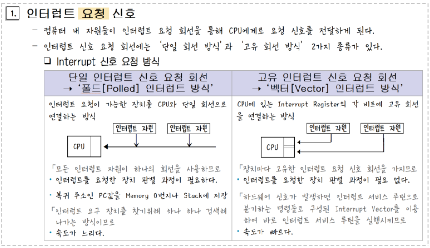
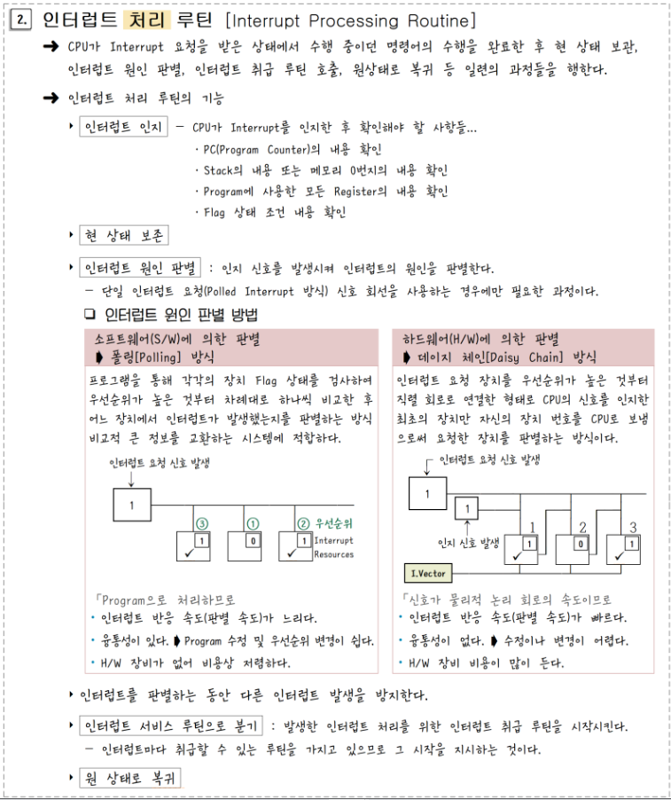
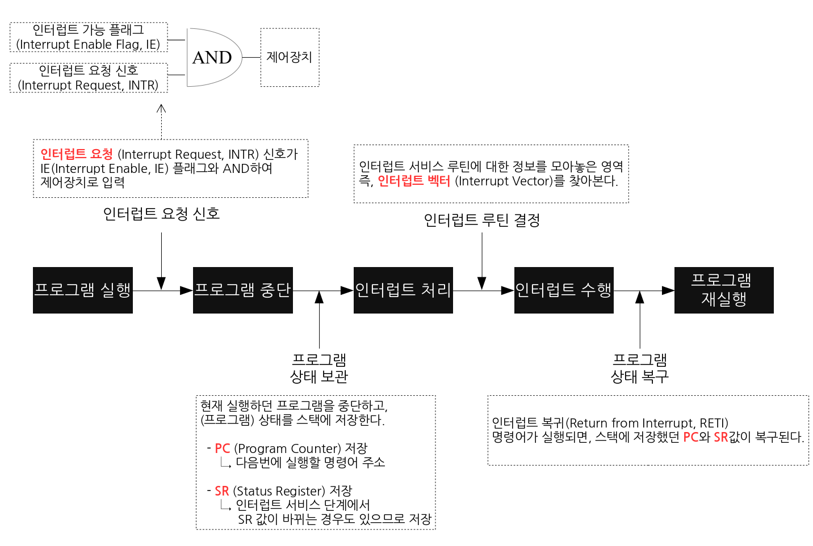

# 1. 인터럽트 Interrupt

## 정의
프로그램을 실행하는 도중에 **예기치 않은 상황**이 발생할 경우 **현재 실행 중인 작업을 즉시 중단**하고, 발생된 상황에 대한 우선 처리가 필요함을 **CPU**에게 알리는 것

- 예기치 않은 상황이 꼭 에러는 아니다.
- 현재 수행중인 일보다 더 중요한 일(ex. 입출력, 우선 순위 연산 등)이 있다면 그것을 먼저 처리하고, 하던 일을 계속하는 것을 말하기도 한다.

1. 외부/내부 인터럽트
    
    > CPU의 **하드웨어** 신호에 의해 발생
    > 
    1. 외부 인터럽트
        1. **입출력 장치, 타이밍 장치, 전원** 등 외부적인 요인으로 발생
        2. CPU가 아닌 다른 하드웨어 장치가 cpu에 어떤 사실을 알려주거나 cpu 서비스를 요청해야 할 경우 발생

            🗒️ 예시 : 
            
            1. `정전`, 혹은 자료 전달 과정에서 오류 발생과 같은 `컴퓨터 자체 내에서의 기계적인 문제`
            - 정전 시 :
                1) 정전 전까지의 처리 결과를 보존
                2) 전원 회복 후 나머지 업무 수행
            
            - 입출력 시 :
                1) CPU와 주변 장치 사이의 속도 차이에 의해 발생
                2) `입력`(이라는 입출력이) 필요 시, CPU는 입력 장치에 원하는 정보를 읽도록 요청한 후 수행 가능한 작업을 다시 수행
                3) (입력 장치로부터) 원하는 정보가 준비되면 `입력 장치가 인터럽트 요청`
                4) 위와 같은 과정을 통해 CPU와 입출력 장치의 병행 동작(= 입출력은 원하는 정보를 준비, CPU는 기존 작업 수행)으로 하드웨어 운영 효율 증대
            
            1. 보호된 기억 공간에 접근하거나, 불법적인 지시 수행 등과 같은 `프로그램 상의 문제`
            2. 컴퓨터 오퍼레이터(컴퓨터 시스템 전반을 관리하는 사람)의 의도적인 중단
            3. `입출력`과 같은 `주변 장치들의 조작`에 CPU의 기능이 요청되는 경우
            
    2. 내부 인터럽트
        1. **Trap**이라고 부르며, **`잘못된 명령이나 데이터를 사용`** 할 때 발생
            1. 예시 : 0으로 나누기가 발생, 오버플로우, 명령어를 잘못 사용한 경우 (Exception 예외상황), system call ...
2. 소프트웨어 인터럽트
    - **명령어의 수행**에 의해 발생
        프로그램 처리 중 명령의 요청에 의해 발생한 것 (SVC 인터럽트) 
    🗒️ **예시 : 사용자가 프로그램을 실행시킬 때 발생**
      1) 프로그램을 실행 또는 감시프로그램(SuperVisor Call)을 호출하는 동작을 수행하거나
      2) 소프트웨어 이용 중에 다른 프로세스를 실행시키면
      → *시분할* 처리를 위해 자원 할당 동작이 수행된다.

---

## 인터럽트의 체제

### 1. 인터럽트 요청 신호

### 2. 인터럽트 처리 루틴

### 3. 인터럽트 서비스 루틴

---
## 인터럽트 발생-처리 과정

1. 주 프로그램이 실행되다가
2. process A가 `system call` 을 통해 인터럽트 발생 시킴
3. 현재 수행 중인 프로그램 중단
    1. **현재 수행중인 명령의 수행이 완료된 후 중단!**
    2. 현재의 주기억 장치 사이클이 끝나는 시점이 아님!
4. PC(Program Counter) 에 다음에 실행할 명령의 주소를 저장
5. 상태 레지스터(SR)와 PC, PCB 등을 **스택**에 잠시 저장한 뒤에(**`임시 보류`**의 의도로 스택에 잠시 저장)
    - SR / PC / PCB
        
        <aside>
        🗒️ 용어 정리
        
        - SR
        - PC
        - PCB
        </aside>
        
6. 인터럽트 벡터를 읽고 ISR 주소값을 얻어 ISR(Interrupt Service Routine)로 점프하여 루틴을 실행한다
    - 인터럽트 서비스 루틴
        
        <aside>
        🗒️ 왜 루틴?
        
        → 어떤 소스(source)가 **인터럽트 요청**을 하면 **반복적으로 수행**하는 일이 있다는 뜻
        
        - 다른 말로 인터럽트 핸들러
        - 인터럽스 서비스 루틴 역시 기억장치 내에 저장되어 있는 **프로그램(program)**
        </aside>
        
    - 인터럽트 벡터
        
        - 🗒️ 인터럽드 발생시 처리해야 할 **인터럽트 핸들러**의 주소를 인터럽트 별로 보관하고 있는 테이블
        
        

        
        AVR ATmega128 마이크로컨트롤러가 정의하는 인터럽트 벡터의 일부
        
        - 인터럽트 핸들러는 각각 `Program Address`에 저장되어 있고
        - source : 인터럽트를 요청한 소스
        - `Vector No.` 는 인터럽트 번호
        - 인터럽트 번호
            - (예외상황 인터럽트 제외) 운영체제가 결정
            - 리눅스에서의 인터럽트 번호
                - 0 ~ 31 : 예외상황 인터럽트
                - 32 ~ 47 : 하드웨어 인터럽트
                - 128 : 시스템 콜

        
7. 해당 코드를 실행
8. 해당 일을 다 처리하면, 대피시킨 레지스터를 복원
9. ISR(인터럽트 서비스 루틴)의 끝에 IRET(`Interrupt Return`) 명령어에 의해 인터럽트가 해제 됨
10. IRET 명령어가 실행되면, 대피시킨 PC 값을 복원하여 이전 실행 위치로 복원
11. 하던 일을 마저 수행

## 우선 순위

---

### 인터럽트 우선 순위 체제

- 각 장치에 우선순위를 부과하는 기능
- 인터럽트를 요청한 장치의 우선 순위를 판별하는 기능
- 우선순위가 높은 것을 먼저 처리할 수 있는 기능

### 인터럽트 우선 순위

### 인터럽트 우선순위 판별 방법

1. 폴링 방식 - 소프트웨어적인 방법

- **인터럽트 요청 플래그**를 차례로 비교하여 **우선순위**가 가장 높은 인터럽트 자원을 찾고, 이에 해당하는 **인터럽트 서비스 루틴**을 수행한다.
- **속도**가 빠른 장치에 높은 등급을 부여한다.
- 우선순위 변경이 쉽다.
- 많은 인터럽트가 있을 경우 **하드웨어 적인 방법에 비해서 우선순위 판단 속도가 느리다**
- 회로가 **간단**하고 융통성이 있으며, **별도의 하드웨어가 필요 없다.**

2. 인터럽트 방식 -  하드웨어적인 방법

- 인터럽트를 요청할 수 있는 장치와 CPU사이에 장치번호를 식별할 수 있는 버스를 직렬/병렬로 연결한다.
- 인터럽트 벡터는 인터럽트를 발생한 장치가 분기할 곳에 대한 정보이다.
- 소프트웨어적인 방법에 비해 비경제적이다.
- 회로가 복잡하고 융통성이 없으나, 별도의 소프트웨어가 필요없이 하드웨어로 처리되므로 속도가 빠르다.
- 하드웨어적인 방법은 아래 2가지로 나뉜다.
    - Daisy Chain
        >🗒️ **Daisy Chain**
        >
        >- *인터럽트가 발생하는 모든 장치*를 하나의 **직렬 회선**으로 연결한다.
        >- **우선순위**가 높은 장치를 상위에 두고 우선순위 차례대로 배치한다. - 우선 순위대로 인터럽트 처리

        
    - 병렬(Parallel) 우선순위 부여 방식
        >🗒️ **병렬 우선 순위 부여**
        >
        >- 각 장치별 우선순위를 판별하기 위한 Mask register에 bit를 설정한다.
        >- Mask register상 우선순위가 높은 서비스 루틴 수행중 우선순위가 낮은 bit들을 비활성화 시킬 수 있다.
        >- 반대로 우선순위가 높은 인터럽트는 낮은 인터럽트 수행 중에도 우선 처리된다.
        
- 인터럽트 서비스 루틴을 실행할 때 인터럽트 플래그(IF)를 1로 하면 인터럽트 발생을 방지할 수 있다.

#### 인터럽트 방식 
  - **하드웨어로 자원을 받아야하는 제약**이 존재 → 그러나 폴링에 비해 신속한 대응 가능케함 → **실시간 대응**이 필요 시 필수 기능임

# 2. 시스템콜 System Call

[시스템 호출(System Call)](https://whitesnake1004.tistory.com/2)

---

**참고**

[[정보처리][EC구조] 31. 인터럽트 Interrupt](https://m.blog.naver.com/syunjae21/222065512231)
[인터럽트(Interrupt) | 👨🏻‍💻 Tech Interview](https://gyoogle.dev/blog/computer-science/operating-system/Interrupt.html)
[인터럽트 처리과정 및 정의, 종류 알아보기](https://mindstation.tistory.com/164)
[[컴퓨터구조] 인터럽트(Interrupt)란?](https://whatisthenext.tistory.com/147#%EA%B0%9C%EC%9A%94)
[인터럽트(Interrupt)의 개념과 종류](https://raisonde.tistory.com/entry/%EC%9D%B8%ED%84%B0%EB%9F%BD%ED%8A%B8Interrupt%EC%9D%98-%EA%B0%9C%EB%85%90%EA%B3%BC-%EC%A2%85%EB%A5%98)