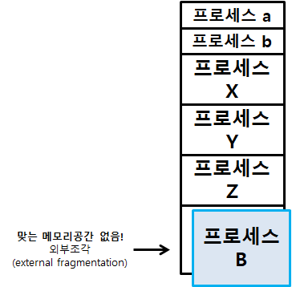

# 메모리 관리

하드웨어를 이용한 주소 변환이 이루어지므로, 메모리는 물리적으로 관리된다고 할 수 있다.

### Symbolic address

- 프로그래밍 시점에 사용하는 주소값(함수명, 변수명 등 기계어로 변환하기 이전의 주소를 말한다.)

### 논리적 주소 Logical address(= Virtual address)

- CPU가 바라보는 주소에 해당한다.
- 각 프로세스마다 독립적으로 가지는 주소 공간이다.

### 물리적 주소 Physical address

- 실제 메모리에 올라가는 위치를 말한다.

### 주소 바인딩

논리적 주소를 물리적 주소로 할당, 결정하는 것을 일컫는다.

### 주소 바인딩 시점

- 컴파일 시 바인딩
  - 컴파일러에 의해 절대 코드 absolute code가 생성되는 방식
  - 메모리 내 위치 변경 필요시 재컴파일 필요
- 로딩시 바인딩
  - Loader의 책임하에 물리적 메모리 주소 부여
  - 컴파일러가 재배치 가능 코드 relocatable code를 생성한 경우
- 실행 중 바인딩
  - 현대적 방식
  - 프로그램이 실행되는 동안 프로세스의 메모리 상 위치 변경 가능
  - CPU가 주소를 참조할 때마다 address mapping table을 통해 binding을 점검
  - 하드웨어적 지원이 필요(MMU, base and limit register)

## MMU(Memory Management Unit)

논리적 주소를 물리적 주소로 매핑해주는 하드웨어 장치를 말한다.  

- 논리적 주소값에 base register(relocation register, 프로세스의 실제 메모리 내 시작 위치를 값으로 갖는다.)의 값을 더해서 실제 memory 주소값을 매핑한다.
- limit register는 논리적 주소의 범위(프로그램의 크기)를 갖고 있어서, 이를 통해서 프로세스가 자신의 메모리 영역 외부의 데이터를 악의적으로 요청하는 것이 아닌지 검증할 수 있다.
  - 범위를 벗어나는 경우 트랩을 발생시켜, 실행을 중단하고 CPU의 제어권을 운영체제에게 넘긴다.

# 메모리 할당

메모리는 일반적으로 OS 커널 영역(interrupt vector와 함께 낮은 주소 영역에 상주)과 사용자 프로세스 영역(높은 주소 영역)으로 나뉘어서 활용된다.

## 연속 할당 Contiguous allocation

- 각 프로세스가 메모리의 연속적인 공간에 적재되도록 한다.
- 보통 프로세스 전체가 메모리에 올라가는 경우에 쓰인다.

### 고정 분할 Fixed partition 방식

메모리를 몇 개의 영구적인 분할로 나누어서 각 분할에 프로세스를 할당한다.

이미지 출처 : https://zangzangs.tistory.com/133

- 분할의 크기는 모두 동일할 수도, 서로 다를 수도 있다.
- 분할 당 하나의 프로세스를 적재한다.
- 융통성이 없다.
- 내부 단편화 문제와 외부 단편화(조각) 문제가 모두 발생한다.

### 가변 분할 Variable partition 방식

프로그램의 크기를 고려해서 할당하는 방식이다.

- 분할 크기와 갯수가 동적으로 변한다.
- 외부 단편화 문제가 발생한다.

### 외부 단편화 External fragmentation

프로그램의 크기보다 분할의 크기가 작은 경우 발생한다.

- 어떠한 프로세스도 할당되지 못한 메모리 조각을 말한다.

### 내부 단편화 Internal fragmentation

프로그램의 크기보다 분할의 크기가 큰 경우 발생한다.

- 특정 프로세스가 할당된 하나의 분할 내에 사용되지 않는 메모리 조각을 말한다.

### Hole

가용 메모리 공간을 일컫는다. 프로세스가 메모리에 올라갈 때 수용 가능한 hole을 확인하고 이를 할당한다.

### Dynamic Storage Allocation Problem

가변 분할 방식에서 size n인 요청을 만족하는 가장 적절한 hole을 찾는 문제를 말한다.

- First-Fit 최초 적합
  - size가 n 이상인 hole 중 가장 먼저 발견된 hole에 할당
  - hole을 탐색하기 위한 오버헤드가 평균적으로 가장 적다.
- Best-Fit 최적 적합
  - size가 n 이상인 hole 중 가장 크기가 작은 hole에 할당
  - 많은 수의 아주 작은 hole들이 생성된다.
  - 크기 순으로 정렬되지 않은 경우 모든 hole의 리스트를 탐색해야 한다.
- Worst-Fit 최악 적합

  - size가 n 이상인 hole 중 가장 크기가 큰 hole에 할당
  - 상대적으로 큰 hole들이 생성된다.
  - 최적 적합과 같이 탐색 시간이 소요된다.

- 실험적으로 First-fit과 Best-fit이 Worst-fit보다 속도와 공간 이용률 측면에서 효과적인 것으로 알려졌다.

### Compaction

외부 단편화 문제를 해결하는 방법 중 하나로, 사용 중인 메모리 영역을 한 군데로 몰아서 hole들을 큰 block으로 만든다.

- 비용이 매우 많이 드는 방법이다.
- 주소가 실행 중 동적으로 재배치 가능한 경우에만 수행할 수 있다.

## 불연속 할당 Noncontiguous allocation

하나의 프로세스를 작은 단위로 나누어 할당한다. 메모리의 여러 영역에 분산되어 올라갈 수 있다.

- paging
- segmentation
- segmentation with paging

## 페이징

프로세스를 동일한 크기의 page 단위로 분할하는 방식이다.

- 나뉘어진 page 중 일부는 실제 메모리에, 그 나머지는 swap area(하드디스크)에 존재할 수 있다.

### Basic method

- 물리적 메모리를 동일한 크기의 frame으로 나눈다.
- 프로세스를 동일한 크기의 page로 나눈다.(frame과 같은 크기)
- page 테이블을 이용해 논리적 주소를 물리적 주소로 매핑한다.
- 외부 단편화는 발생하지 않지만, 프로그램의 크기가 페이지 크기의 배수가 아닌 이상 내부 단편화는 발생할 수 있다.

## Page Table

- 페이지 테이블은 크기가 크기 때문에 메모리 위에 존재한다. (레지스터나 캐쉬 메모리에 모두 올릴 수 없다.)
  - 페이지 테이블의 존재로 인해, 메모리에 접근하는 횟수가 증가한다.
- Page table base register (PTBR) 는 page table의 위치를 가리킨다.
- Page table length register (PTLR) 는 페이지 테이블의 크기를 값으로 갖는다.

- 위 이미지에서 p는 페이지 테이블의 인덱스 값이고, d 값(offset)은 페이지 내에서의 상대적 주소를 갖는다. f는 프레임의 번호를 가리키며, 실제 메모리에서 프레임이 시작되는 주소값을 갖는다.

### TLB

속도 향상을 위해 associative register 혹은 translation look-aside buffer(TLB)라는 고속의 캐쉬 메모리를 사용한다.

- TLB에서는 인덱싱을 통한 조회가 불가능한 대신, parallel search를 지원한다.
- TLB는 context switch가 발생할 때, 내부의 모든 엔트리가 지워진다. (flush된다.)

### Memory Protection

페이지 테이블에서 각 entry마다 Protection bit와 Valid-Invalid bit가 존재한다.

- Protection bit는 페이지에 허용되는 연산 권한(read&write / readonly)을 부여한다.
- valid-invalid bit는 해당 페이지 번호의 주소가 유효한 정보인지 아닌지를 알려준다.
  - 프로세스가 사용하지 않는 페이지 영역인 경우, 해당 페이지가 메모리가 아닌 swap area에 존재하는 경우 발생

### Shared Page

- 여러 프로세스에서 동일하게 사용되는 페이지가 있을 때, 이를 메모리에 한 번만 올려 공유할 수 있다.
  - 이 때, shared page는 read-only로 메모리에 올라간다.
  - share code(page)는 모든 프로세스에서 동일한 logical address 주소를 갖는다. (주소 매핑을 위해서)

### Multi-Level Page Table

- Two-Level

- 현대의 컴퓨터에서 address 크기는 보통 64bit이므로, 지원하는 address space는 대략 2^64 Byte, 즉 16GB가 된다.
- 실제로 대부분의 프로세스틑 주어진 주소 공간 중 극히 일부분만 활용하므로 page table 공간 역시 심하게 낭비된다.

  - 그렇기에 page table 자체를 page로 구성한다.
  - 사용되지 않는 주소 공간에 대해 outer page table은 Null 값을 가리킨다.

- Multi-Level
  - 페이지 테이블은 공간적 낭비를 줄이기 위해서 다중으로도 존재할 수 있다.
    - 프로그램의 모든 영역이 실행을 위해 사용되지 않기 때문에 페이지 테이블이 불필요한 경우가 있다. 그러나 하나의 페이지 테이블을 사용하면 전체 프로그램 주소 크기만큼 페이지 테이블이 반드시 존재해야 하는데 이러한 낭비를 페이지 테이블을 다단계로 구성하여 줄일 수 있다.
    - 페이지 테이블이 다중으로 존재하면 그만큼 메모리 접근 횟수가 증가한다. 그러나, TLB를 활용해 이를 최소화할 수 있다.

### Inverted Page Table

- 각 프로세스가 갖는 논리적 주소 공간에 모두 대응하는 page table을 만들기 때문에 page table의 크기가 커진다.
  - 즉, page table의 각 entry에 대응하는 프로세스의 페이지가 메모리에 로드되지 않는 경우도 존재한다. 이를 이용한 것이 Inverted Page Table 이다.
- Inverted Page Table은 실제 메모리의 frame에 대응하는 page table을 구성한다.
  - system 내에서 오직 하나의 테이블이 존재한다. (system-wide)
  - 각 entry에는 해당 frame이 담고 있는 페이지 정보를 갖고 있다. (pid, process의 logical address)
- 항상 페이지 테이블 전체를 탐색해야 한다는 단점이 존재한다.
  - associative register와 같은 별도의 하드웨어를 사용하여 병렬로 탐색하며 오버헤드를 줄일 수 있다.

## Segmentation

프로그램을 의미 단위로 분할한다.

- 작게는 프로그램을 구성하는 함수 단위로 분할할 수 있으며, 보통은 code, data, stack 영역이 각 segment로 정의된다.

### Segmentation table

- 각 엔트리는 base(해당 세그먼트의 물리적 주소의 최솟값)와 limit(세그먼트의 길이) 값을 갖는다.
  - 위 그림에서 세그먼트 내 상대 주소 값인 d는 항상 limit 보다 작아야 한다.
- Segment-table base register(STBR)
  - 물리적 메모리에서의 segment table의 위치
- Segment-table length register(STLR)
  - 프로세스의 segment 갯수
  - 세그먼트 번호 s 는 STLR 보다 작아야 한다. (크다면 trap 발생)
- Protection & Sharing
  - segment 테이블 내에 Protection bit와 Sharing bit가 존재한다.
  - segment는 의미 단위로 분할되기 때문에 공유와 보안에 있어서 효율적으로 관리할 수 있다.
- Allocation
  - 할당시 외부 단편화 문제가 발생한다. first-fit 혹은 best-fit 방식으로 할당할 수 있다.

## Segmentation with Paging

각 segment를 일정한 크기의 page로 다시 분할한다.

- 외부단편화를 해결할 수 있다.
- segment table의 엔트리가 segment의 base address를 가지고 있는 것이 아니라, segment를 구성하는 page table의 base address를 갖는다.
- protection, sharing과 같은 의미 단위 작업은 segment table이 처리한다. (bit 값을 갖는다)

### 참고)

- kocw 운영체제 반효경 강의
- https://kouzie.github.io/operatingsystem/%EB%A9%94%EB%AA%A8%EB%A6%AC-%EA%B4%80%EB%A6%AC/#two-level-page-table-%EC%9D%98-address-bindging
