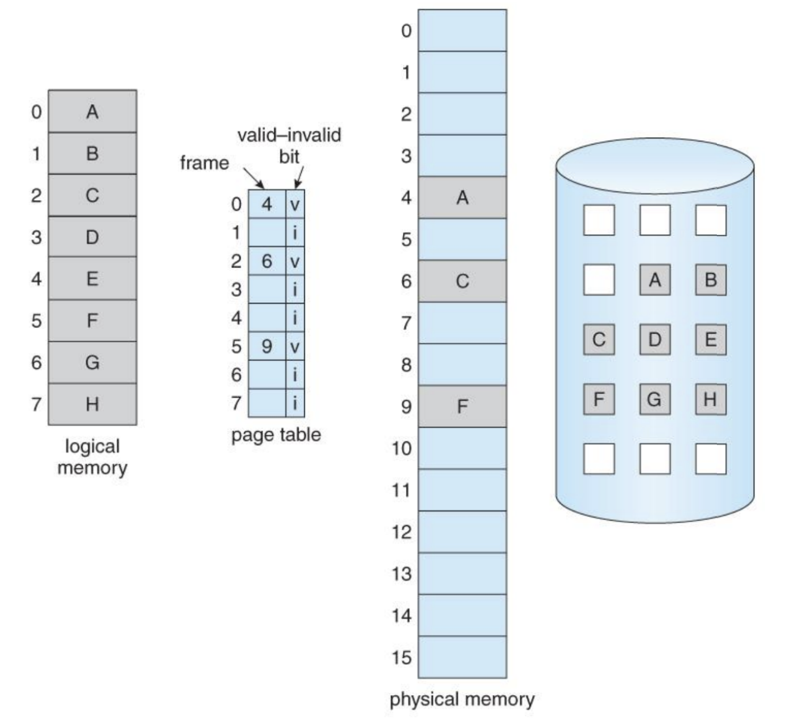
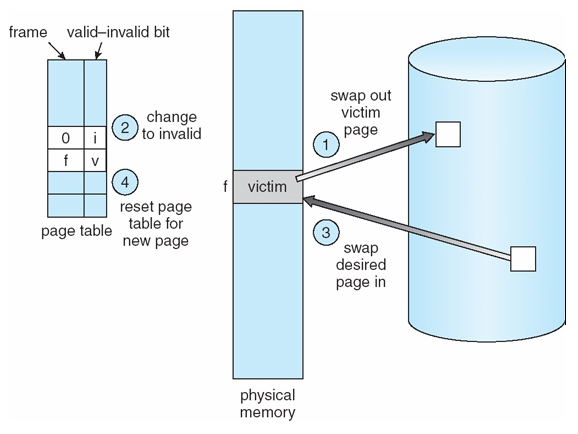
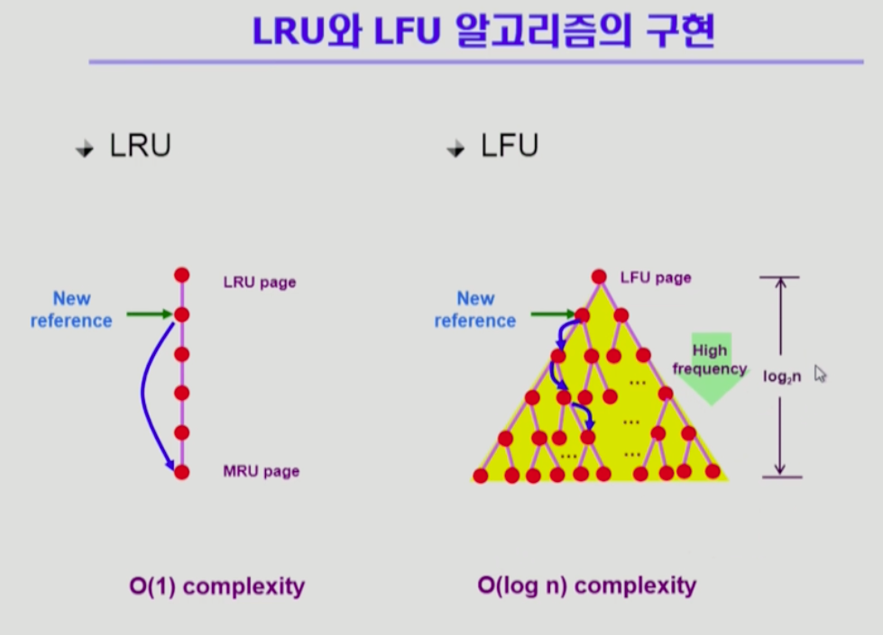

# Virtual Memory 가상메모리

- 크기가 다른 물리 메모리에서 일관되게 프로세스를 실행할 수 있는 기술을 말한다.
- 물리 메모리의 크기와 프로세스가 올라갈 메모리의 위치를 신경쓰지 않고 프로그래밍하도록 지원해주는 기술로, 가상 메모리를 통해 물리 메모리의 크기와 무관하게 각 프로세스에 커다란 메모리 공간을 제공한다. 즉, 물리 메모리의 크기에 의해 제한되지 않는 실행환경을 제공해주는 기술이라고 볼 수 있다.  
  

### 논리주소와의 차이점

- 가상 메모리 시스템은 모든 프로세스에게 물리 메모리와 별개로 0번지부터 시작하는 연속된 메모리 공간을 제공한다.
- 논리 주소와 유사한 시스템이나, 논리 주소는 물리 메모리의 주소 공간에 비례하지만, 가상 주소는 물리 메모리의 크기에 구애받지 않는다는 차이점이 존재한다.

### 메모리 분할 방식

세그멘테이션(가변 분할 방식), 페이징(고정 분할 방식) 등의 메모리 관리 기법이 존재하며, 두 기법의 단점을 보완한 세그먼테이션-페이징 기법을 주로 사용한다.

### Swap Area

가상 메모리의 구성 요소 중 하나로 하드디스크에 존재하지만 메모리 관리자가 관리하는 메모리의 일부 영역이다. 물리 메모리의 부족한 부분을 스왑 영역으로 보충한다.

- 스왑 아웃(swap out) : 물리 메모리가 꽉 찼을 때 일부 프로세스를 스왑 영역으로 보낸다.
- 스왑 인(swap in) : 스왑 영역에서 메모리로 필요한 프로세스 일부를 가져온다.

# 요구 페이징 Demand Paging

> 가져오기 정책 : 프로세스가 필요로 하는 데이터를 언제 메모리에 적재할 것인지 결정하는 정책

- 요구 페이징은 프로세스가 해당 페이지를 요청할 때 메모리를 가져오는 방식을 말한다.
- 요구 페이징 방식을 이용하여 메모리의 절약, 메모리의 효율적 관리, I/O 처리 감소, 프로세스 응답 속도 향상 등의 효과를 볼 수 있다.
- 페이지 테이블에 Valid/Invalid bit 값을 저장해두고 ,이를 이용해 찾는 페이지가 메모리에 있는지 확인할 수 있다.

## 페이지 부재 Page Fault

- 프로세스가 어떤 페이지를 요청했을 때, 그 페이지가 메모리에 없는 상황을 페이지 부재라고 한다.
- 페이지 테이블에서 해당 페이지의 invalid bit가 i(유효하지 않음) 값을 갖고, 해당 페이지는 swap area에 존재한다.
- 페이지 부재가 발생하면 MMU에 의해 trap(소프트웨어 인터럽트의 일종)이 발생해 CPU가 운영체제에게 넘어간다. 운영체제의 page fault handler를 통해 해당 페이지를 스왑 영역에서 물리 메모리의 빈 영역으로 옮기고(스왑인) 페이지 테이블을 갱신한다.
  - disk I/O 가 동작하는 동안 프로세스는 CPU를 빼앗겨 block 상태가 된다.
- 메모리 내에 빈 프레임이 없는 경우에는 프레임 중 하나를 내보내고 요구된 페이지를 적재한다. 이 때, 어떤 페이지(victim page)를 내보낼지 결정하는 알고리즘이 페이지 교체 알고리즘이다.

# 페이지 교체 알고리즘

- 희생 페이지(대상 페이지, victim page)를 결정하는 알고리즘으로 page-fault rate을 최소화하는 것이 목표이다.

## Optimal Algorithm 최적 알고리즘

- 가장 먼 미래에 참조될 page를 메모리에서 스왑아웃해 교체한다.
- 그러나 미래의 메모리 참조에 대한 정보를 얻는 것이 실제로는 불가능하므로, 최적 알고리즘은 다른 알고리즘의 성능에 대한 평가 지표(이상적 기준, upper bound)로 활용한다.

## FIFO(First In First Out)

- 가장 먼저 메모리에 들어온 페이지부터 희생시킨다.
- 아주 간단한 알고리즘이지만, 메모리의 프레임을 늘렸을 때, 오히려 성능 저하가 발생할 수도 있다는 단점이 있다.

## LRU(Least Recently Used)

- 최근에 가장 덜 사용된 혹은 가장 오래 전에 참조된 페이지를 희생시킨다.

## LFU(Least Frequently Used)

- 참조 횟수(reference count)가 가장 적은 페이지를 희생시킨다.
- 참조 횟수가 최저인 페이지가 여러개인 경우, LFU 알고리즘만 이용하는 경우에는 그 중 하나를 임의로 선정하게 된다.
- 성능 향상을 위해서 그 중 가장 오래 전 참조된 페이지를 지우도록 구현할 수 있다.
- LRU에 비해 page의 인기도를 좀 더 정확히 반영할 수 있으나, 참조 시점의 최근성은 반영하지 못한다.
- LRU 보다 구현이 복잡하다.
  - 최소 힙 구조 활용

> 그러나 실제로 paging system에서 LRU, LFU의 사용은 어렵다. 실제로 pagefault가 발생하는 경우 외엔 OS가 관여하지 않으므로 페이지가 이미 메모리에 존재하는 경우엔 OS 입장에서 페이지가 언제부터 참조되었는지 등의 정보를 확인하기 어렵기 때문이다.

## Clock Algorithm, NRU(Not Recently Used), NUR

- LRU의 근사 알고리즘
- reference bit를 이용해 교체 대상 페이지를 선정할 수 있다.
  - 하드웨어가 페이지를 참조할 때 reference bit를 1로 세팅한다.
  - 이후, OS가 교체 대상 페이지를 선정하기 위해 포인터를 이용해 페이지 테이블을 순회하며 refernece bit가 0인 것을 탐색한다.
    - reference bit 가 0인 페이지를 만날 때까지, 지나오는 다른 page들의 reference bit은 모두 0으로 값을 변경한다.
- 추가적으로 modified bit(dirty bit)를 함께 사용해서 더 나은 성능을 기대할 수 있다.
  - modified bit 가 1(true)이라면, 수정이 발생했기에 이를 메모리에서 swap out 하기 전에 backing store에 반영해 줄 필요가 있다. 이러한 시간 소요를 줄이기 위해 modified bit이 0인 것을 먼저 희생시킨다.

## 캐싱 기법

- 한정된 빠른 공간(캐쉬 메모리 등)에 요청된 데이터를 저장해 두었다가 후속 요청시 캐쉬에서 데이터를 찾아서(cache hit!) 서비스하는 방식을 말한다.
- paging system 외에도 cache memory, buffer caching, Web caching 등 다양한 분야에서 사용한다.
- 교체 알고리즘에서 너무 많은 시간 소요를 해서는 안된다.
  - O(1)에서 O(log n) 정도까지 허용

## 스레싱

## 프레임 할당
