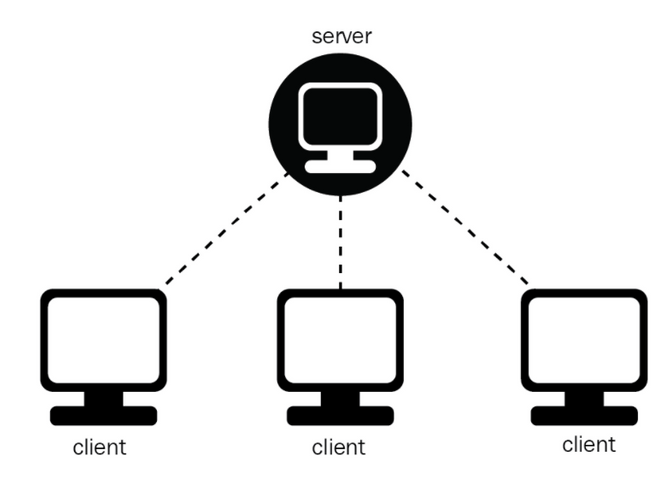
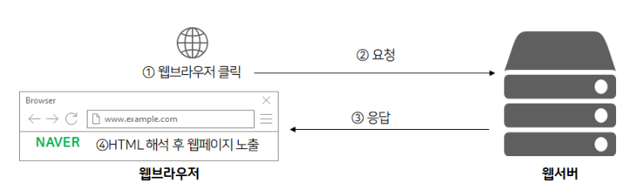
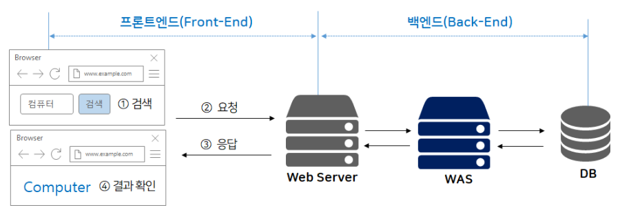
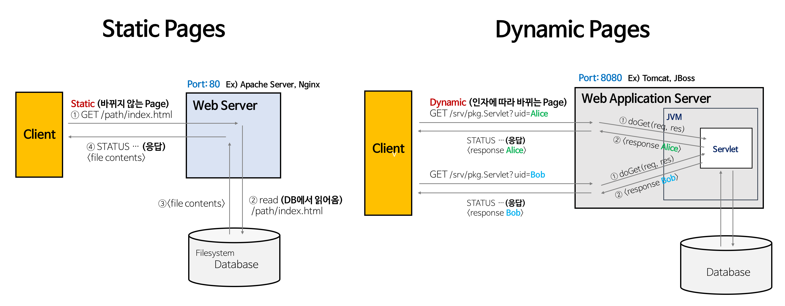
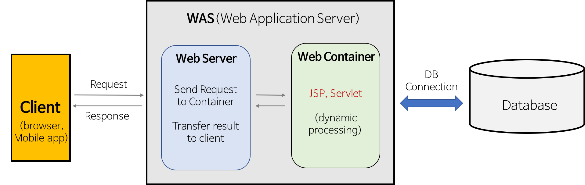
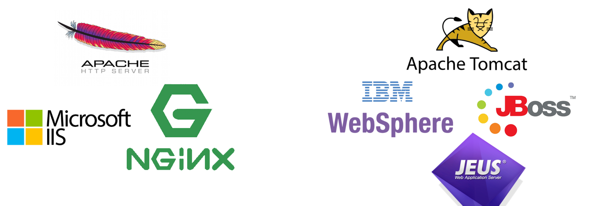
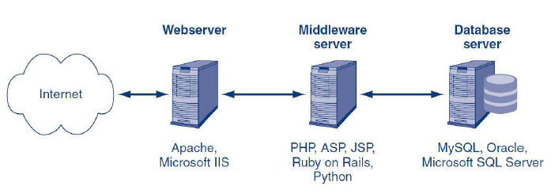

# 자람님 jarammm

## 1. Client - 클라이언트와 서버

---

> 우리가 사용하는 모든 IT 서비스는 클라이언트와 서버를 구분해서 개발합니다.
클라이언트로는 대표적으로 우리가 사용하는 `웹, 앱` 등이 해당됩니다. 
그리고 클라이언트가 데이터를 요구했을 때 `응답해주는 서버`가 필요하겠죠.

[이미지 출처](https://www.grabbing.me/8d9e92b19e084c5a8cb173a695aa81af#a37b1cde941f4f54b9e45b813d4558b3)

### `클라이언트` 

- **네트워크에서 정보를 `요구해서 받는` 쪽**
- **네트워크를 통해 서버에게 정보를 제공 받는 응용 프로그램**

### `서버(Server)`

- **정보를 `제공`해 주는 쪽**
- **네트워크를 통해 클라이언트의 요청에 따라 정보를 제공하는 시스템**

 👉 **예시 : 네이버 로그인**

- **클라이언트 : 크롬, 인터넷 익스플로러 등의 `웹브라우저`**
- **서버 :  `로그인 인증`해주는 프로그램이 실행되고 있는 시스템**

👉 **예시 : 네이버 접속 - 웹브라우저와 웹서버 간 플로우**

  
[이미지 출처](https://reinvite.tistory.com/84)

**서버가 정보를 제공해준다는 건 보통 컴퓨터 안에 정보를 제공해주는 프로그램이 실행되고 있다는 걸 뜻합니다.**

예를 들어 웹을 제공해주는 `웹서버`는 **웹을 전달해주는 프로그램을 컴퓨터에서 실행**하고 있습니다.

위 사진처럼 웹을 제공해주는 `웹 서버`,  클라이언트에게 데이터를 제공해주는 `API 서버`, 이미지들을 제공해주는 `이미지 서버`, 비디오 파일을 제공해주는 `비디오 서버` 등 **서버 컴퓨터에는 목적에 맞는 정보를 제공해주는 프로그램 등이 항상 실행되고 있습니다**

## 2. WAS - Web Server, WAS, 차이점

---

> **Static Pages**와 **Dynamic Pages** 과정을 이해한다.  
**Web Server**와 **WAS**의 차이를 이해한다.  
**Web 서비스 구조(Web Service Architecture)** 에 대해 이해한다.

### WAS 개요
>🥞 식당 주인을 **웹서버**, 손님을 **웹클라이언트**(웹브라우저)라고 할 때,
>
>1. 손님은 주문을 하고,
>2. 식당 주인이 주문을 체크하고, 주방장에게 주문서를 전달한 후
>3. 주방장이 요리를 끝내면
>4. 식당 주인이 손님에게 음식을 가져다 줍니다.

이때 주방장의 역할을 하는 것이 **WAS**(Web Application Server) 입니다.

[이미지 출처](https://reinvite.tistory.com/86)

- `Web Server`  : 웹브라우저(**클라이언트**)로부터 요청을 받아 `정적인 컨텐츠`(html, css, jpeg...etc) 를 처리하는 시스템
    - 종류 : Apache, Nginx, IIS
- `WAS(Web Application Server)` : DB 조회나 다양한 로직을 처리하는 `동적인 콘텐츠`(누가, 언제, 어떻게 서버에 요청했는지에 따라 결과값을 다르게 보여주는 형식: 유튜브 추천 영상, 넷플릭스...etc)를 처리하는 시스템
    - 종류 : Tomcat, JBoss

**좀 더 알아보기**

[이미지 출처](https://gyoogle.dev/blog/web-knowledge/Web%20Server%EC%99%80%20WAS%EC%9D%98%20%EC%B0%A8%EC%9D%B4.html)

### Static Pages
> 바뀌지 않는 페이지
 
- **웹 서버**는 파일 경로 이름(예시 : `[www.naver.com](http://www.naver.com)` )을 받고, **경로와 일치하는 file contents를 반환**합니다.
- 동일한 파일 경로에 대해 항상 동일한 페이지를 반환합니다.

> 👉 image, html, css, javascript 파일과 같이 컴퓨터에 저장된 파일들

### Dynamic Pages
> 인자에 따라 바뀌는 페이지

- **인자의 내용**에 맞게 **동적인 contents**를 반환합니다.
- **웹 서버에 의해 실행되는 프로그램**을 통해 만들어진 결과물임 (`Servlet` : was 위에서 돌아가는 자바 프로그램) → 개발자는 Servlet에 doGet() 메소드를 구현  

[이미지 출처](https://gyoogle.dev/blog/web-knowledge/Web%20Server%EC%99%80%20WAS%EC%9D%98%20%EC%B0%A8%EC%9D%B4.html)

### 1. 웹 서버

> **개념**에 있어서 하드웨어와 소프트웨어로 구분된다.
> 
> 1. **하드웨어** : Web 서버가 설치되어 있는 컴퓨터
> 2. **소프트웨어** : 웹 브라우저 클라이언트로부터 HTTP 요청을 받고, 정적인 컨텐츠(html, css 등)를 제공하는 컴퓨터 프로그램

**`웹 서버 기능`**

> **Http 프로토콜**을 기반으로, 클라이언트의 요청을 서비스하는 기능을 담당
> 

요청에 맞게 **2 가지 기능 중 선택해서 제공**해야 한다.

- **`정적 컨텐츠 제공`**
    
    WAS를 거치지 않고 바로 자원 제공
    
- **`동적 컨텐츠 제공을 위한 요청 전달`**
    
    클라이언트(웹 브라우저) 요청을 WAS에 보내고, WAS에서 처리한 결과를 클라이언트에게 전달
    

**`웹 서버 종류`** : Apache, Nginx, IIS(Windows 전용 Web Server) 등

### 2. **WAS**

Web Application Server의 약자

> DB 조회 및 다양한 로직 처리 요구시 동적인 컨텐츠를 제공하기 위해 만들어진 애플리케이션 서버
> 
- HTTP를 통해 애플리케이션을 수행해주는 미들웨어(소프트웨어 엔진)다.
- **WAS는 웹 컨테이너 혹은 서블릿 컨테이너**라고도 불림 (컨테이너란 JSP, Servlet의 `구동 환경`을 제공해주는 `소프트웨어`.)

**`역할`**

> WAS = 웹 서버 + 웹 컨테이너
> 
- 웹 서버의 기능들을 구조적으로 분리하여 처리하는 역할
- 보안, 스레드 처리, 분산 트랜잭션 등 `분산 환경`에서 사용됨 ( 주로 **DB 서버와 함께** 사용 )

**`WAS 주요 기능`**

>👉   
>**1. 프로그램 실행 환경 및 DB 접속 기능 제공  
>2. 여러 트랜잭션 관리 기능  
>3. 업무 처리하는 비즈니스 로직 수행**

**`WAS 종류`** : Tomcat, JBoss 등

좌: 웹 서버 / 우: WAS ([이미지 출처](https://gmlwjd9405.github.io/2018/10/27/webserver-vs-was.html))

### 웹 서버가 필요한 이유

**웹 서버에서는 정적 컨텐츠만 처리하도록** **기능 분배를 해서 서버 부담을 줄이는 것**

>👉 **클라이언트(웹 브라우저)에 이미지 파일(정적 컨텐츠)를 보낼 때..**
>
>이미지 파일과 같은 `정적인 파일`들은 웹 문서(html 문서)가 클라이언트로 보내질 때 함께 >가지 않는다.
>
>클라이언트는 1️⃣먼저 html 문서를 받고, 2️⃣이에 필요한 이미지 파일들을 다시 서버로 >요청해서 받아오는 것.
>
>웹 서버를 통해서 정적인 파일을 애플리케이션 서버까지 가지 않고 앞 단에 빠르게 보낼 수 >있음!

### **WAS가 필요한 이유**

**WAS를 통해 요청에 맞는 데이터를 DB에서 가져와 비즈니스 로직에 맞게 그때마다 결과를 만들고 제공하면서 자원을 효율적으로 사용할 수 있음**

>👉 **웹 페이지 = 정적 컨텐츠 + 동적 컨텐츠**
>
>❓이때, 웹 서버만 사용한다면?
>→ 사용자가 원하는 요청에 대한 결과 값을 모두 미리 만들어 놓고 서비스해야 → `자원`이 >절대적으로 부족함
>
>따라서 WAS를 통해 `요청이 들어올 때마다` 
>DB와 비즈니스 로직을 통해 결과물을 만들어 제공!

### **그러면 WAS로 웹 서버 역할까지 다 처리할 수 있는거 아닌가요?**

> `자원 이용의 효율성 및 장애 극복, 배포 및 유지 보수의 편의성` 때문에 웹 서버와 WAS를 분리해서 사용!

>👉 **기능을 분리하여 서버 부하 방지**
>WAS는 DB 조회, 다양한 로직을 처리하는 데 집중해야 함. 
>따라서 단순한 정적 컨텐츠는 웹 서버에게 맡기며 **`기능을 분리시켜 서버 부하를 방지`**하는 >것
>
>만약 WAS가 정적 컨텐츠 요청까지 처리하면, 
>부하가 커지고 동적 컨텐츠 처리가 지연되면서 수행 속도가 느려짐 
>→ 페이지 노출 시간 늘어나는 문제 발생

>👉 **물리적으로 분리하여 보안 강화**
>
>SSL에 대한 암복호화 처리에 **Web Server**를 사용

>👉 **여러 대의 WAS를 연결 가능**
>
>1️⃣ Load Balancing을 위해서 **Web Server**를 사용  
>2️⃣fail over(장애 극복), fail back(장애가 발생하기 전의 상태로 되돌리는 처리) 처리에 유리  
>3️⃣특히 대용량 웹 어플리케이션의 경우(여러 개의 서버 사용) Web Server와 WAS를 분리하여 `무중단 운영`을 위한 장애 극복에 쉽게 대응할 수 있다.  
>    `👉 예를 들어, 앞 단의 Web Server에서 오류가 발생한 WAS를 이용하지 못하도록 한 후 >WAS를 재시작함으로써 사용자는 오류를 느끼지 못하고 이용할 수 있다.`

>👉 **여러 웹 어플리케이션 서비스 가능**
>예를 들어, 하나의 서버에서 PHP Application과 Java Application을 함께 사용하는 경우

>👉 **기타**
>
>접근 허용 IP 관리, 2대 이상의 서버에서의 세션 관리 등도 Web Server에서 처리하면 효율적이다

### Web Service Architecture

>1. Client -> Web Server -> DB
>2. Client -> WAS -> DB
>3. Client -> Web Server -> WAS -> DB
 

**가장 효율적인 방법( 3번)**

> 웹 서버를 WAS 앞에 두고, 필요한 WAS들을 웹 서버에 플러그인 형태로 설정하면 효율적인 분산 처리가 가능함

[이미지 출처](https://gmlwjd9405.github.io/2018/10/27/webserver-vs-was.html)

>👉 **3번 구조의 동작 과정**
>
>1. Web Server는 웹 브라우저 클라이언트로부터 HTTP 요청을 받는다.
>2. Web Server는 클라이언트의 요청(Request)을 WAS에 보낸다.
>3. WAS는 관련된 Servlet을 메모리에 올린다.
>4. WAS는 web.xml을 참조하여 해당 Servlet에 대한 Thread를 생성한다.(Thread Pool 이용)
>5. HttpServletRequest와 HttpServletResponse 객체를 생성하여 Servlet에 전달한다.
>    1. Thread는 Servlet의 service() 메서드를 호출한다.
>    2. service() 메서드는 요청에 맞게 doGet() 또는 doPost() 메서드를 호출한다.
>    3. `protected doGet(HttpServletRequest request, HttpServletResponse response)`
>6. doGet() 또는 doPost() 메서드는 인자에 맞게 생성된 적절한 동적 페이지를 Response 객체에 담아 WAS에 전달한다.
>7. WAS는 Response 객체를 HttpResponse 형태로 바꾸어 Web Server에 전달한다.
>8. 생성된 Thread를 종료하고, HttpServletRequest와 HttpServletResponse 객체를 제거한다.

## 3. DB Server

---
  
[이미지 출처](https://m.blog.naver.com/PostView.naver?isHttpsRedirect=true&blogId=kbh3983&logNo=220756233529)

### DBMS와 MiddleWare의 개념

1. DBMS(Database Management System) : 데이터베이스 관리 시스템
    - 다수의 사용자들이 DB 내의 데이터를 접근할 수 있도록 해주는 소프트웨어
    - DBMS는 보통 `Server 형태`로 서비스를 제공한다.
    - Ex) MySQL, MariaDB, Oracle, PostgreSQL 등
    - Q) DBMS Server에 직접 접속해서 동작하는 Client Program의 문제점?
        - Client에 로직이 많아지고 이에 따라 Client Program의 크기가 커진다.
        - 로직이 변경될 때마다 매번 배포가 되어야 한다.
        - Client에 대부분의 로직이 포함되어 배포가 되기 때문에 보안에 취약하다.
    - A) => 이를 해결하기 위해 아래와 같은 MiddlWare가 등장했다.
    
2. MiddleWare
- `Client - MiddleWare Server - DB Server(DBMS)`
- 동작 과정
    - Client는 단순히 요청만 중앙에 있는 MiddleWare Server에게 보낸다.
    - MiddleWare Server에서 대부분의 로직이 수행된다.
    - 이때, 데이터를 조작할 일이 있으면 DBMS에 부탁한다.
    - 로직의 결과를 Client에게 전송한다.
    - Client는 그 결과를 화면에 보여준다.
- 즉, 비즈니스 로직을 Client와 DBMS 사이의 MiddleWare Server에서 동작하도록 함으로써 Client는 입력과 출력만 담당하게 된다.

---

- 참고
    - [[IT 개발자와 일할 때 필요한 모든 개발지식] A to Z 자료 모음집 By 그랩](https://www.grabbing.me/8d9e92b19e084c5a8cb173a695aa81af#a37b1cde941f4f54b9e45b813d4558b3)
    - [알아두면 좋은 개발 용어 1](https://reinvite.tistory.com/84)
    - [알아두면 좋은 개발 용어 2](https://reinvite.tistory.com/86)
    - [Web Server와 WAS의 차이](https://gyoogle.dev/blog/web-knowledge/Web%20Server%EC%99%80%20WAS%EC%9D%98%20%EC%B0%A8%EC%9D%B4.html)
    - [Web Server와 WAS의 차이와 웹 서비스 구조](https://gmlwjd9405.github.io/2018/10/27/webserver-vs-was.html)