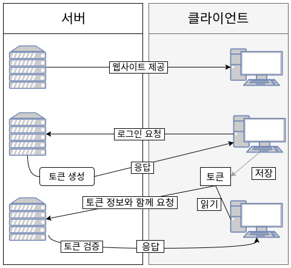
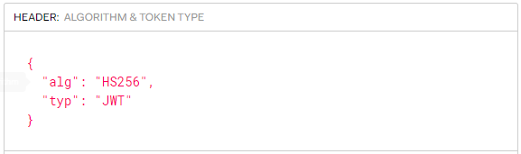

# 인증 시스템

---

인증 시스템에는 크게 **서버 기반 인증**과 **토큰 기반 인증**이 있다.

기존에는 서버 기반의 인증 시스템을 사용했지만 점점 규모가 커져 서버 기반의 인증 방식은 한계가 생기기 시작했고 토큰 기반의 인증 시스템이 등장했다.


>💡 인증과 인가
>
>- 인증(Authentication)
>    
>    이 사이트의 일정 권한이 주어진 사용자라는 것을 아이디와 패스워드를 통해 인증 받는 것 = 로그인
>    
>- 인가(Authorization)
>    
>    한 번 인증을 받은 사용자가 서비스를 이용할 때 웹사이트에서 로그인이 되어있음을 알아보고 허가해 주는 것, 로그인이 유지되는 상태에서 일어나는 일


## 서버(세션) 기반 인증

---

서버 기반 인증 방식은 서버 측에서 사용자의 정보를 기억하고 있어야 한다. 사용자들의 정보를 기억하기 위해서는 세션을 유지해야 하는데 메모리나 데이터베이스 등을 통해 관리한다.

이 방식은 소규모 시스템에서는 무리가 없지만 사용자가 많아지고 규모가 커질수록 저장해야 할 것들이 많아져 과부하가 걸릴 수 있고 많은 트래픽을 처리하기 위해 서버를 늘리거나 세션을 분산시켜야 한다는 단점이 있다.


## 토큰 기반 인증

---

인증받은 사용자에게 토큰을 발급하고 서버에 요청을 할 때 헤더에 토큰을 함께 보내도록 하여 유효성 검사를 한다. 이 방식에서는 사용자의 인증 정보를 서버나 세션에 저장하지 않고 클라이언트에서 보내주는 요청만으로 처리한다. 그리고 더이상 서버 기반의 인증 시스템처럼 서버가 인증된 상태를 유지하지 않는다. 이 구조를 Stateless라고 하는데 이러한 구조 덕분에 서버에서 사용자가 로그인 되어있는지 아닌지를 신경쓰지 않아도 되어 시스템을 쉽게 확장할 수 있다.

확장의 대표적인 예 - 소셜 로그인



# JWT(Json Web Token)

---

JWT는 **인가**에 관련된 기술로 세션과 비슷한, 사용자의 **인증**(로그인) 상태를 유지시키는 역할을 한다. 사용자는 먼저 인증을 한 후에 서버에 요청할 때마다 JWT를 포함하여 전달한다. 서버는 사용자가 요청을 했을 때 토큰(JWT)만 확인하면 되어 세션을 관리할 필요가 없어진다.

JWT는 아래와 같은 형식으로 되어있는데 마침표를 기준으로 **header, payload, signature**로 구분된다. 각각의 요소들에는 Json 형태로 정보가 들어가 있다.


## Header
---


헤더는 두 가지 정보를 지니고 있다.

- alg : Signature를 해싱하기 위한 알고리즘 방식을 지정하고 서명(Signature) 및 토큰 검증에 사용함.
- typ : 토큰의 타입을 지정.


> 💡 해싱
> 키값을 해시 함수라는 수식에 대입시켜 계산한 후 나온 결과를 주소로 사용하여 바로 값에 접근할 수 있게 하는 방법


## Payload
---


페이로드 부분에는 토큰에 담을 정보가 들어가며 이것이 곧 토큰의 내용이다.

토큰에 담는 정보의 한 조각을 **Claim**이라고 부르고 클레임은 name / value 의 한 쌍으로 이루어져있으며 한 토큰에는 여러 개의 클레임을 넣을 수 있다.

### Claim
---
클레임은 세 가지로 나누어진다.

1. **등록된 클레임(Registered Claim)**
    
    등록된 클레임은 토큰에 대한 정보를 담기 위해 미리 정해진 종류의 클레임이다. 모두 선택사항이다.
    
    - iss: 토큰 발급자(issuer)
    - sub: 토큰 제목(subject)
    - aud: 토큰 대상자(audience)
    - exp: 토큰 만료 시간(expiration), NumericDate 형식으로 되어 있어야 함 ex) 1480849147370
    - nbf: 토큰 활성 날짜(not before), 이 날이 지나기 전의 토큰은 활성화되지 않음
    - iat: 토큰 발급 시간(issued at), 토큰 발급 이후의 경과 시간을 알 수 있음
    - jti: JWT 토큰 식별자(JWT ID), 중복 방지를 위해 사용하며, 일회용 토큰(Access Token) 등에 사용
    
2. **공개 클레임(Public Claim)**
    
    공개 클레임은 사용자 정의 클레임으로 공개하기 위한 정보이다. 충돌을 방지하기 위해 URI 포맷을 사용한다.
```js    
{
    "[https://blog.naver.com/psdsd](https://blog.naver.com/psdsd)" : true
}
```

3. **비공개 클레임(Private Claim)**
    
    비공개 클레임은 클라이언트와 서버 사이에 임의로 지정한 정보를 저장하는 클레임이다. 이름이 중복되지 않게 주의해야 한다.
    

## Signature

---


서명은 토큰을 인코딩하거나 유효성 검증을 할 때 사용하는 고유한 암호화 코드이다.

위의 헤더와 페이로드의 값을 **base64**로 인코딩하고, 인코딩한 값을 비밀 키를 이용해 헤더에서 정의한 알고리즘으로 해싱 하고, 이 값을 다시 base64로 인코딩 하여 생성한다.

> 💡 Base64 인코딩
> 
> Binary Data(이진 데이터)를 Text로 바꾸는 인코딩이다.

이렇게 생성된 토큰은 HTTP 통신을 할 때 Authorization이라는 이름의 값으로 사용된다.

```js
{
    "Authorization": "Bearer {토큰 값}",
}
```
# JWT의 특성

---

### JWT 장점

- 사용자 인증에 필요한 모든 정보를 토큰에 담기 때문에 별도의 인증 저장소가 필요 없다.
- 인코딩 했을 때 크기가 작아져 트래픽에 대한 부담이 낮다.
- 서버가 아닌 클라이언트에 저장되기 때문에 확장성이 좋다.
- 쿠키를 전달함으로써 생기는 보안의 취약함이 없어진다.

### JWT를 사용할 때 고려사항

- JWT는 상태를 저장하지 않기 때문에 한 번 만들어지면 제어가 불가능하다. 토큰을 임의로 수정, 삭제하는 것이 불가능하여 만료 시간을 설정해주어야 한다.
- 더 많은 필드가 추가되면 토큰이 많이 커져서 네트워크에 부하를 줄 수 있다.
- Payload의 내용은 암호화가 아닌 base64로 인코딩 된 데이터라서 제 3자가 가로채서 디코딩 할 경우 내용을 볼 수 있다. 따로 JWE로 암호화를 하거나 중요 데이터를 넣지 말아야 한다.
- 토큰은 클라이언트에 저장되고 관리되어 서버 데이터베이스에서 정보를 수정하더라도 토큰에 적용할 수 없다.

---

- 참고 자료
    
    [[JWT] JSON Web Token 소개 및 구조](https://velopert.com/2389)
    
    [[Server] JWT(Json Web Token)란?](https://mangkyu.tistory.com/56)
    
    [해싱(Hashing)](https://dev-kani.tistory.com/2)
    
    [[Server] 토큰 기반 인증 VS 서버(세션) 기반 인증](https://mangkyu.tistory.com/55)
    
    [세션 VS. 토큰! JWT가 뭔가요?](https://youtu.be/1QiOXWEbqYQ)