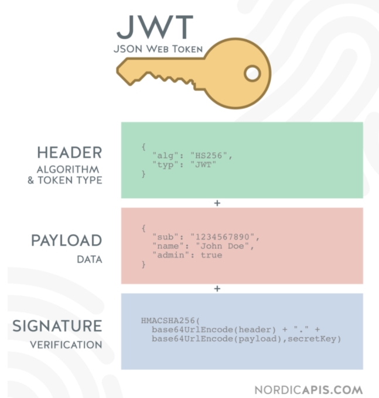

## 토큰 방식의 등장

1. 등장 배경
    1. 시스템의 규모가 커지면서 서버 기반의 인증방식에서 문제가 생기기 시작.
    2. 위와 같은 문제를 해결하기 위해 토큰 기반의 인증 방식 등장

### 서버 기반의 인증 시스템

1. 특성
    1. 세션 유지: 서버 측에서 사용자의 정보 기억 
    2. stateful: 클라이언트가 요청할 시에 상태를 계속해서 유지, 정보를 서비스에 이용. 
        
        EX) 사용자가 로그인을 요청 시, 세션에 사용자의 정보를 저장해 둠. 서비스를 제공할 때마다 이 세션에 저장된 정보를 사용.
        
        

        
2. 문제점
    1. 세션
        1. 이용자가 많을 경우 서버의 RAM이 과부하
        2. 데이터베이스 과부하
        3. 확장이 용이하지 않음: 서버 확장 시 세션을 분산시키는 시스템을 설계해야함.
        4. CORS(Cross-Origin Resource Sharing)
            - 웹 어플리케이션에서 세션을 관리할 때 많은 경우 사용되는 쿠키는 단일 도메인 + 서브 도메인에서만 작동하도록 설계됨. 따라서 쿠키를 여러 도메인에서 관리하는 것이 번거로움

## 토큰 기반의 인증 시스템

1. 원리: stateless
    1. 인증받은 사용자들에게 토큰을 발급함.
    2. 서버에 요청을 할 시 헤더에 토큰을 함께 보내 유효성 검사를 진행
    3. 사용자의 인증 정보를 서버 or 세션에 유지하지 않음
    
    EX) 로그인 하는 경우
    
    
    
    1. 사용자가 로그인
    2. 서버가 해당 정보 검증
    3. 정확할 시에 토큰을 발급, 이때 토큰은 signed 토큰으로, 해당 토큰이 서버에서 정상적으로 발급된 토큰임을 증명하는 signature을 가진단 의미이다.
    
    ### 토큰 기반 인증 시스템의 이점
    
    1. Stateless ⇒ Scalability
        1. 토큰을 부여한 이후에 서버에 부담을 주는 경우가 없음. 완전히 stateless 한 상태를 유지
        2. stateless한 상태를 유지하기 때문에 확장에도 문제가 없음. 
            
            ex) 사용자 정보가 서버의 세션에 저장된 경우, 서버를 확장해 분산 처리를 할 때, 사용자가 처음 로그인 하며 연결된 서버로만 요청을 하도록 설정해야함. 
            
            하지만 토큰을 이용할 경우 확장된 서버와 상관없이 이용 가능
            
    2. 보안성
        1. 쿠키를 전달하지 않음 = 쿠키에 의한 취약점이 사라짐
        
        cf) 토큰에 의한 보안성 문제
        
        토큰에 유효기간을 설정함으로써 해결하고자 함. ⇒ access token
        
        하지만 access token의 유효기간을 짧게 설정할 경우 사용자의 로그인 빈도가 늘어나는 불편이 생김 ⇒ refresh token의 등장
        
    3. Extensibility(확장성)
        
        cf) scalability  = 시스템의 확장성 ↔ extensibility 로그인 정보가 사용되는 분야의 확장
        
        제한된 선택권을 가진 토큰 발급 가능
        
    4. 여러 플랫폼 및 도메인
        1. 토큰 이용 시엔 어떤 디바이스, 도메인이든 토큰의 유효성 검사를 진행한 후 요청을 할 수 있음. 
        2. asset 파일은 CDN(컨텐츠 전송 네트워츠, content distribution network)에서 제공, 서버 측에선 API만 다루도록 설계 가능.
        
    
    ### Access Token vs Refresh Token
    
    1. 공통점 
        1. 형태가 같은 JWT
        2. 발급 시기: 로그인 완료 시 발급
    2. 차이점
        1. 역할
            1. access token
                - 비교적 짧은 유효기간
                - api 요청시마다 http 통신을 통해 노출됨
            2. refresh token
                - 긴 유효기간 ⇒ access token이 만료 됐을 때 새로 발급해줌.
                - access token 만료 시에만 네트워크 통신으로 통해 서버로 보내짐 → 탈취의 위험성이 적음 ⇒ 보안성이 비교적 좋음
                - payload에 어떠한 정보도 저장하지 않음. 유저가 가지고 있던 토큰과 DB를 비교해 변조되었는지, 만료되었는지 여부를 확인
        - 토큰 인증 방식 설계
        
        

## JWT

1. 의미: JSON 포맷을 이용해 self-contained한 방식으로 사용자에 대한 속성을 저장하는 Claim 기반의 web token
2. 구조

- HEADER: 로그인 정보에 해당하는 부분을 암호화시키는데, 이를 해독하는 알고리즘 정보가 들어가 있음
- PAYLOAD: 담을 내용
- SIGNATURE: 로그인 정보(ID + PASSWORD)
1. 사용 방식

1. 목적
    1. STATLESS 한 상태 유지
    2. 안정성 있는 정보 교환 가능

## 참고
[[Server] 토큰 기반 인증 VS 서버(세션) 기반 인증](https://mangkyu.tistory.com/55)
[Token 인증 방식이란?](https://velog.io/@hoo00nn/Token-%EC%9D%B8%EC%A6%9D-%EB%B0%A9%EC%8B%9D%EC%9D%B4%EB%9E%80)
[JWT란?](https://velog.io/@geunwoobaek/JWT%EB%9E%80)