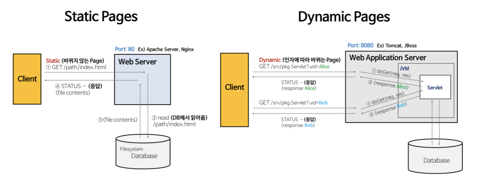
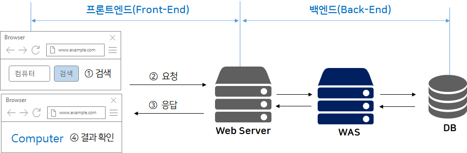

# 만춘님 chochoq

# Client와 Server가 통신할 때

Static Page(정적 페이지)

- 항상 동일한 페이지를 반환한다.
(저장된 img, html, css, js 등 변하지않는 페이지)

Dynamic Page(동적 페이지)

- 사용자가 보내는 내용의 맞게 동적인 콘텐츠를 반환한다.
    

# Web Server

### 웹서버의 개념

- 웹서버도 소프트웨어의 개념 중 하나이다.
- 하드웨어
Web Server가 설치되어있는 컴퓨터.
- 소프트웨어
    
    웹 브라우저 클라이언트로부터 HTTP요청을 받아 정적인 컨텐츠(html, css, js 등)을 제공하는 컴퓨터 프로그램
    

### 웹서버의 기능

- 클라이언트의(WEB)  요청을 서비스하는 기능을 담당한다.
- 브라우저가 읽을 수 있는 파일인 정적인 컨텐츠(html, css, js, img 등)
- 보안 , 아팟치 보안설정
    
    작동하는 형태 Reverse Proxy
    

> **리버스 프록시(reverse proxy)**
컴퓨터 네트워크에서 클라이언트를 대신해서 한 대 이상의 서버로부터 자원을 추출하는 프록시 서버의 일종이다.
> 

> 포워드 프록시(forword proxy)
> 
- 캐싱
    
    한번 꺼내온 것을 저장해 이후에 다시 꺼낼 때 로딩없이 받아올수 있다.
    
- 로드밸런싱
    
    분산해서 ..
    서비스가 끊김없이 이용할수있다.
    

- 아파치, Ngin X가 대표적이지만 각 웹 서버마다 사용방식이 다르다.

### **아파치**

1. 다양하고 검증된 기능이 필요로 하는 서비스
2. 사용해온 기간이 길고 안정성이 있다.
3. **컨텍스트 스위칭**
4. 이벤트 방식을 추가 함

### **NginX**

1. 성능과 가벼움을 중시하는 서비스
2. Event Driven

was의 과부하를 막기위해 장애극복기능을 

---

# WAS (Web Application Server)

### was의 개념

- DB조회나 다양한 로직 처리를 요구하는 동적인 컨텐츠를 제공하기 위해 만들어진 Web application Server
- HTTP를 통해 컴퓨터 장치에 애플리케션을 수행해주는 미들웨어(소프트웨어엔진)이다.

### was의 역할

- WAS = Web Server + Web Container
- Web Server 기능들을 구조적으로 분리하여 처리하고자하는 목적으로 제시된다.

- tomcat, JBoss, Jeus, Web Sphere, node.js

### Tomcat

- 현재는 스프링부트에 내장된 웹서버로 많이 사용함

### Node.js

---

## data base

테이블 형태와 테이블 형태가 아닌 nosql이 존재  
정보를 담을 수 있는 모든형식이 되는건감..

>💡 회사에서 사용하는 것은 **Ngin X, node.js, mySql**

다양한 구조를 가질 수 있다.

was - web server? (이거 이해 잘 못했음)

아팟치....보안을 위한것??

## 로드밸런싱

---

[[Web] Web Server와 WAS의 차이와 웹 서비스 구조 - Heee's Development Blog](https://gmlwjd9405.github.io/2018/10/27/webserver-vs-was.html)

[OKKY | Node.js(Express)는 WAS(Web Application Server) 인가요?](https://okky.kr/article/761129)

[아파치, NginX, 톰캣이 뭔가요? (+ 웹서버, WAS, 로드밸런싱, 프록시)](https://youtu.be/Zimhvf2B7Es)