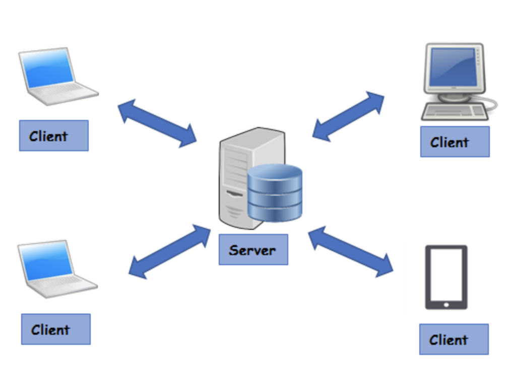
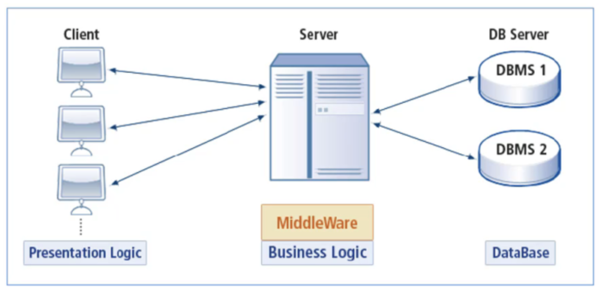
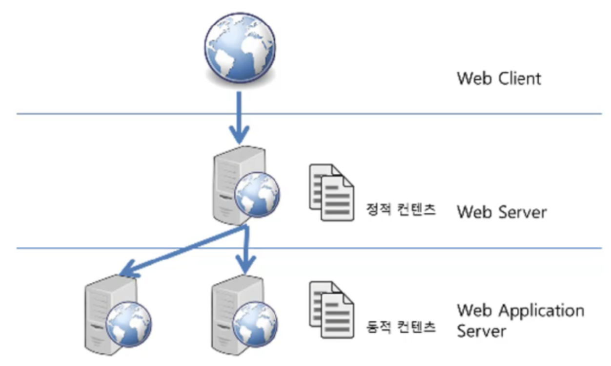

# 알고리즘알고싶따님 yeGenieee

# Client, Server, DB, WAS

## 1. Client 와 Server 구조

[이미지 출처] : [https://www.omnisci.com/technical-glossary/client-server](https://www.omnisci.com/technical-glossary/client-server)

### Client

- 서비스를 제공하는 서버에게 정보를 요청하는 역할

### Server

- 클라이언트의 요청에 대한 결과를 만들어서 응답(전송)해주는 역할
- 서비스를 제공

클라이언트는 서비스를 제공하는 서버에게 정보를 요청하여 응답 받은 결과를 사용한다.

## 2. Web Server와 Web Application Server

### Web Server

- 소프트웨어와 하드웨어로 구분됨
    - 소프트웨어 웹 서버
        - 브라우저 클라이언트로부터 HTTP 요청을 받아들이고, HTML 등의 웹 페이지 문서에 반응하는 컴퓨터 프로그램
    - 하드웨어 웹 서버
        - Web 서버가 설치되어 있는 컴퓨터
- **HTTP** Protocol을 기반으로 **클라이언트가 요청하는 HTML 문서나 각종 Resource를 전달하는 역할**
- 웹 브라우저나 웹 크롤러가 요청하는 리소스는 컴퓨터에 저장되어 있는 static 데이터이거나 동적인 결과일 수 있다.

> **static 컨텐츠**  
    - HTML, CSS, JavaScript와 같이 서버에 저장된 파일을 의미한다  
    - 웹 서버는 파일 경로와 일치하는 파일 컨텐츠를 반환한다  
**동적 컨텐츠**  
    - 웹 서버에 의해 실행되는 프로그램에 의해 만들어진 결과물을 의미한다

### Web Server Software 종류

- 가장 많이 사용하는 웹 서버는 Apache, Nginx, Microsoft, Google 웹 서버가 있다

## 3. DBMS와 Middleware

### DBMS (Database Management System)

- 데이터베이스를 관리하는 시스템
- 다수의 사용자들이 데이터베이스 내의 데이터를 접근할 수 있도록 해주는 소프트웨어
- ex) MySQL, MariaDB, Oracle, PostgreSQL
- 보통 서버 형태로 서비스를 제공
    - 이렇게 제공 시의 문제점
        - client에 로직이 많아지고, 이에 따라 클라이언트 프로그램의 크기가 커진다는 문제점
        - 로직이 변경될 때마다 클라이언트가 매번 배포되어야 하는 문제점
        - 대부분의 로직이 클라이언트에 있어서 보안이 나쁘다
    - 해결
        - MiddleWare 의 등장

### MiddleWare

- 비즈니스 로직을 클라이언트와 DBMS 사이의 미들웨어 서버에서 동작하도록 함으로써 클라이언트는 입력과 출력만 담당하도록 한다

1. 클라이언트는 단순히 중앙에 있는 미들웨어 서버에게 요청
2. 미들웨어 서버는 주요 로직 실행
3. 데이터를 조작할 일이 있으면, DBMS에게 부탁
4. DBMS를 통해 받은 데이터를 클라이언트에게 전달
- 클라이언트는 복잡한 로직을 담당할 필요가 없어져 크기가 매우 작아짐
- 프로그램 로직이 변경되어도 클라이언트의 재배포 없이, 미들웨어 서버만 배포하면 된다.

## 4. WAS (Web Application Server)

- 일종의 미들웨어로, 웹 클라이언트(보통 웹 브라우저)의 요청 중 보통 웹 어플리케이션이 동작하도록 지원하는 목적을 가진다.
- 최초에는 브라우저가 정적인 데이터만 보여주었는데, 웹이 널리 사용되면서, 웹에서 데이터를 입력하고 조회하는 등 동적인 기능이 필요해짐

### WAS의 주요 기능

1. 프로그램 실행 환경과 데이터베이스 접속 기능 제공
2. 여러 개의 트랜잭션 관리
3. 업무를 처리하는 비즈니스 로직 수행

## 5. Web Server vs WAS

- WAS도 보통 자체적으로 웹 서버 기능을 내장하고 있다.
- 현재는 WAS가 가지고 있는 웹 서버도 정적인 컨텐츠를 처리하는데, 있어서 성능상 큰 차이가 없지만, 규모가 커질수록 웹 서버와 WAS를 분리한다.
- 왜?
    - **장애 극복 기능 (failover)** 으로
    - 만약, WAS에서 동작하는 프로그램의 오작동이 있을 경우, WAS를 재시작해야 하는 경우가 생기는데, 문제가 있는 WAS 재시작할 때, 앞 단의 웹 서버에서 문제가 있는 WAS를 이용하지 못하도록 하면, 해당 웹 어플리케이션을 사용하는 이용자는 장애가 있었는지도 모른다는 장점을 가진다.

### Web Server

- 주로 정적인 컨텐츠를 웹 브라우저에게 전송하는 역할을 한다.

### WAS

- 프로그램의 동적인 결과를 웹 브라우저에게 전송하는 역할을 한다.